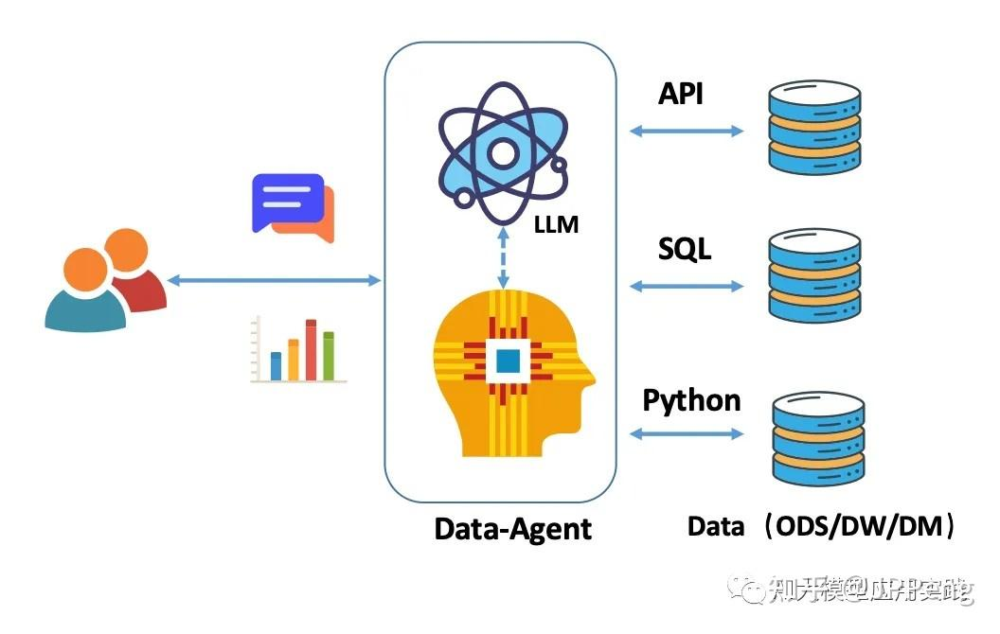
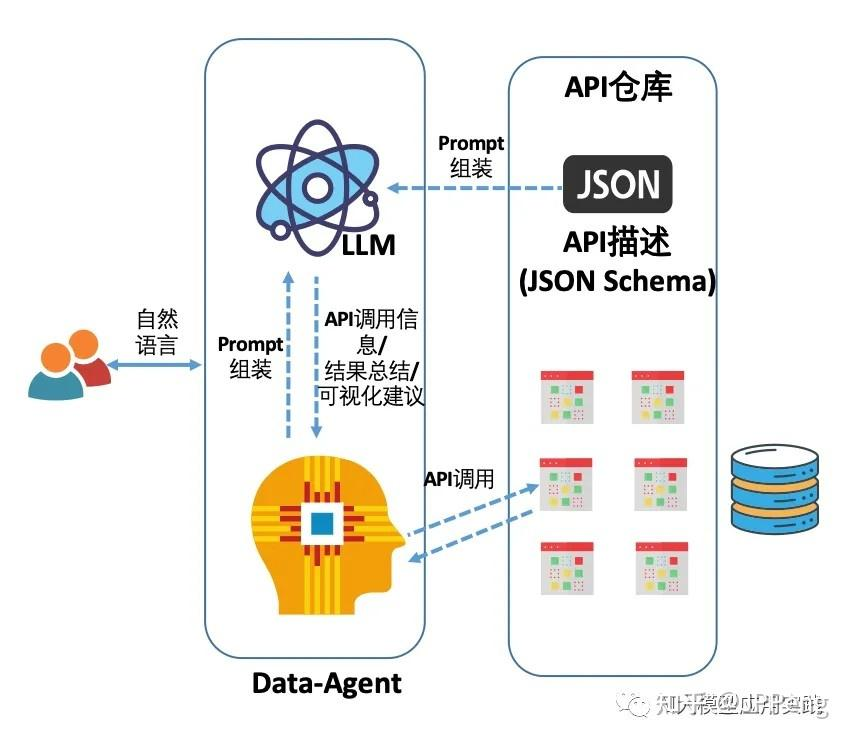
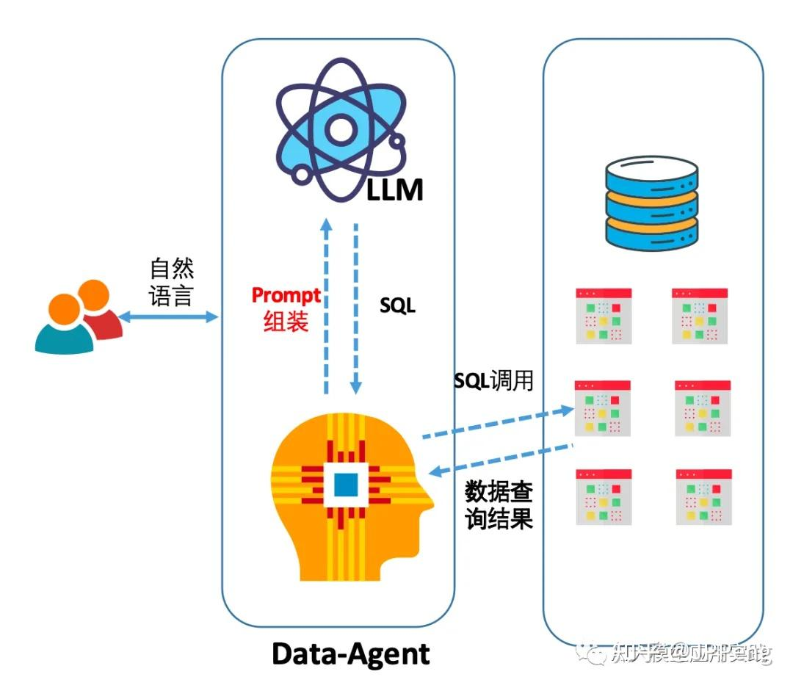
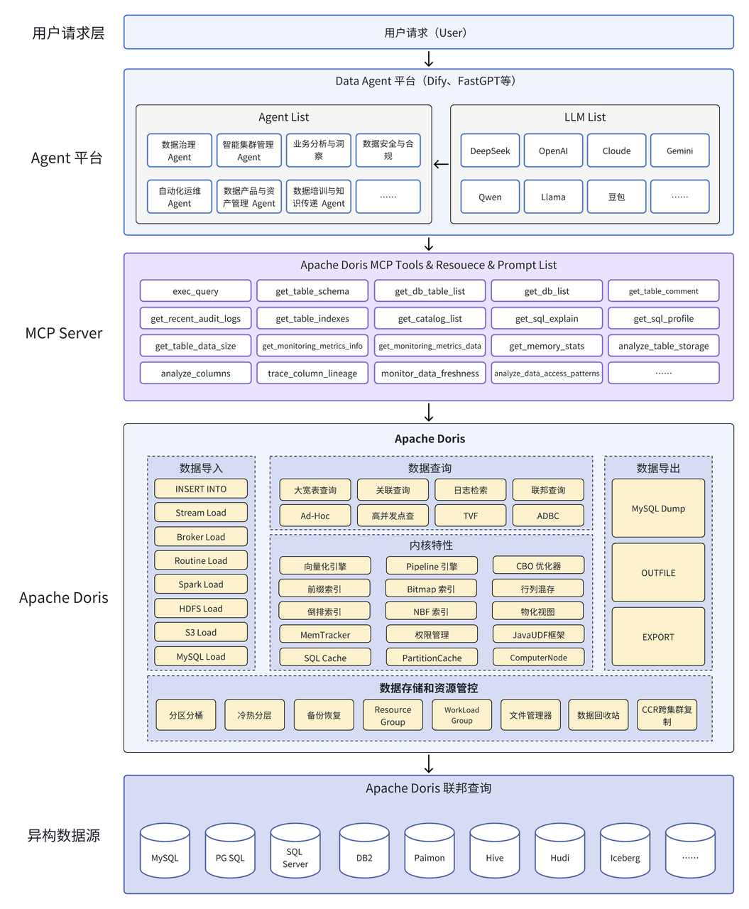

## Data Agent（数据智能体）
    Data Agent=大模型推理能力+数据处理引擎+业务知识图谱+自主决策机制
    模型上下文协议（Model Context Protocol，MCP）通过 MCP 协议，AI Agent 可以实现智能工具调用，根据运维场景自动选择和组合多个监控、诊断、治理工具，形成完整的运维治理工作流。
    MCP 协议支持上下文感知。

    利用Dify、Langchain、SpringAI等框架和平台
    基于Streamlit+LangChain+DashScope+DeepSeek的智能化数据分析助手

    AI核心概念
    • 提示（Prompt）
    • 模型增强（The Augmented LLM）
    • 顾问（Advisors）
    • 检索（Retrieval）
    • 记忆（ChatMemory）
    • 工具（Tool）
    • 评估（Evaluation）
    • 可观测性（Observability）
    • 模型上下文协议（MCP）
        • MCP 客户端
        • MCP 服务器
    • MCP 和安全

    召回率（Recall），也称为灵敏度（Sensitivity）或真正例率（True Positive Rate），是用于评估二分类模型性能的指标之一。召回率衡量了模型正确识别正例的能力，即在所有实际正例中，模型成功识别的比例。
    召回率的取值范围在0到1之间，值越接近1表示模型在识别正例方面的性能越好。

## Dify和Ollama区别
    Dify 是一款开源的大语言模型(LLM) 应用开发平台。它融合了后端即服务和 LLMOps 的理念，使开发者可以快速搭建生产级的生成式 AI 应用。
    两个开源工具，结合使用可实现本地部署AI知识库和大型语言模型管理。
    Dify‌：提供AI应用开发平台，支持低代码配置、模型管理及可观察性功能，可快速搭建从开发到生产的完整流程。
    Ollama‌：本地推理框架，可运行OpenAI gpt-oss、DeepSeek等开源语言模型，适用于文本生成、问答等场景。

    典型应用场景
    企业知识库：整合内部数据与外部模型，通过低代码工具快速构建AI应用。
    本地运算优化：避免依赖云端服务，降低延迟并增强数据隐私保护。

## 大模型能力
    大模型实现数据分析的技术途径基本还是以三种方式为主：自然语言转API、自然语言转SQL、以及自然语言转代码。

## 构建Data Agent三种基础技术方案

#### 自然语言转数据分析的API，text2API

#### 自然语言转关系数据库SQL，text2SQL-目前最受关注的一种大模型能力

#### 自然语言转数据分析的语言代码，即text2Code(即代码解释器方案)

## 私有化方案
    Ollama+DeepSeek+Dify构建私有AI Agent

## AI Agent
    工作原理：AI Agent 通过生成式 AI 理解用户请求，结合 RAG 获取实时信息，自动分解任务（如查数据→调用 API→反馈结果），最终执行操作并生成响应。
    
    应用示例：
    智能客服：自动处理用户的查询并生成响应。
    自动化任务执行：根据指令调用外部 API 来完成任务，如预订机票、查询天气等。

    MCP(Model Context Protocol) 模型上下文协议
    基于 RAG（检索增强生成） 的 Text2SQL 应用是企业 LLM 应用落地的热门方向之一

## 基于 Apache Doris Data Agent 智能体平台全面架构如下图所示：

    Text2SQL（NL2sql）
    智能数据查询系统（NL2SQL）
    AIGC（Artificial Intelligence Generation Code）
    Chat2DB是一个AI原生的数据库客户端工具。你可以把它理解为：Navicat+大模型的结合体。
    Text2SQL（有时也被称为NL2SQL，即Natural Language to SQL）是一种技术或过程，它能够将自然语言的查询语句转换成结构化查询语言（SQL）的命令。
    
    Text2SQL开源项目 Chat2DB/DB-GPT/SQL Chat/SQLCoder/LLaMA C/DB-GPT
    Text2SQL的任务涵盖以下几个步骤：
    输入分析：用户以自然语言的形式输入问题，比如“找出平均工资高于整体平均工资的部门名称”。
    语义解析：系统对输入的自然语言问题进行解析，将其转化为数据库中的结构化查询语句。
    SQL生成：依据解析的结果，生成与之对应的SQL语句，例如“SELECT department_name FROM departments WHERE average_salary > (SELECT AVG(salary) FROM employees)” 。
    执行与反馈：系统执行SQL查询操作，并返回相应结果，同时可能会对结果进行进一步的解释或分析。
    
    AI+BI——“ChatBI”（智能问数系统）
