## Data Agent（数据智能体）
    Data Agent=大模型推理能力+数据处理引擎+业务知识图谱+自主决策机制
    模型上下文协议（Model Context Protocol，MCP）通过 MCP 协议，AI Agent 可以实现智能工具调用，
    根据运维场景自动选择和组合多个监控、诊断、治理工具，形成完整的运维治理工作流。
    MCP 协议支持上下文感知。

    利用Dify、Langchain(Langchain4J)、SpringAI等框架和平台
    基于Streamlit+LangChain+DashScope+DeepSeek的智能化数据分析助手

    AI核心概念:
    提示（Prompt）
    模型增强（The Augmented LLM）
    顾问（Advisors）
    检索（Retrieval）
    记忆（ChatMemory）
    工具（Tool）
    评估（Evaluation）
    可观测性（Observability）
    模型上下文协议（MCP）
        MCP 客户端
        MCP 服务器
    MCP 和安全

    召回率（Recall），也称为灵敏度（Sensitivity）或真正例率（True Positive Rate），是用于评估二分类模型性能的指标之一。
    召回率衡量了模型正确识别正例的能力，即在所有实际正例中，模型成功识别的比例。召回率的取值范围在0到1之间，值越接近1表示模型在识别正例方面的性能越好。

    提示词 Prompt:Prompt就是你向AI发出的指令。分为两种：
    系统提示词：设定AI的人设、行为规则（如“你是一个机器人，每次回复完要滴一声”）
    用户提示词：用户每次输入的具体问题

    提示词工程（Prompt Engineering）‌：管的是“说什么”，主要靠优化指令文本，让模型听懂你的要求，但稳定性较差 。
    ‌上下文工程（Context Engineering）‌：管的是“知道什么”，通过给模型注入文档、历史记录等信息，让它了解背景，但受限于信息窗口大小 。
    ‌驾驭工程（Harness Engineering）‌：管的是“在什么环境里做事”，它不只看模型本身，而是构建一套包含工具、规则、反馈的完整系统，确保 AI 能持续可靠地完成任务 。

## AI目前能做的开源项目：RAG、智能体、知识库、智能问数

## NL2SQL 核心引擎
Schema召回(向量检索) → SQL生成(大模型推理) → 校验与执行(自愈循环)

Schema 智能召回核心流程：自然语言 → Schema 向量检索 → 语义匹配 → 召回排序
实现要点：
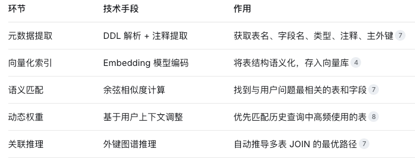
实现
首选 Spring AI Alibaba NL2SQL(spring-ai-alibaba-starter-nl2sql)
1. 初始化 Schema 到向量库(启动时调用一次，或在表结构变更后重新调用)
2. 执行 NL2SQL 查询

## Multi-Agent(多智能体系统)
    多 Agent 系统(Multi-Agent System)就是让多个 AI Agent 各自负责一块,通过分工和协作,完成一个单 Agent 啃不动的复杂任务。
    多 Agent = 设计出一套"谁负责什么、谁向谁汇报、谁能调用谁" 的协作结构,然后让多个 Agent 在这个结构里运转
    多Agent Java系统，Spring AI Alibaba是最自然的选择——Java原生、A2A+Nacos服务发现、生产级可观测性。
    多智能体系统允许多个Agent协同工作，StateGraph 用于构建复杂的有状态工作流。
    Nacos 3.1.0 引入 A2A 了注册中心功能，提供了轻量化的 Agent 服务注册与发现能力；Spring AI Alibaba 通过集成 Nacos，
    提供了开箱即用的 Agent 注册、Agent 发现与负载均衡能力，让开发者能够快速构建使用 A2A 标准协议通信的分布式多智能体系统。

## A2A 协议
    A2A(Agent-to-Agent)是由Google于2025年4月推出的开放协议，定义了不同AI智能体之间相互发现、通信和协作的标准方式。
    MCP解决Agent调工具，A2A解决Agent找Agent,两者合力让AI智能体真正实现"跨平台协作"。
    A2A基于HTTP+JSON设计，无需改造现有系统。任何有Web接口的Agent都能快速接入，降低协作门槛。
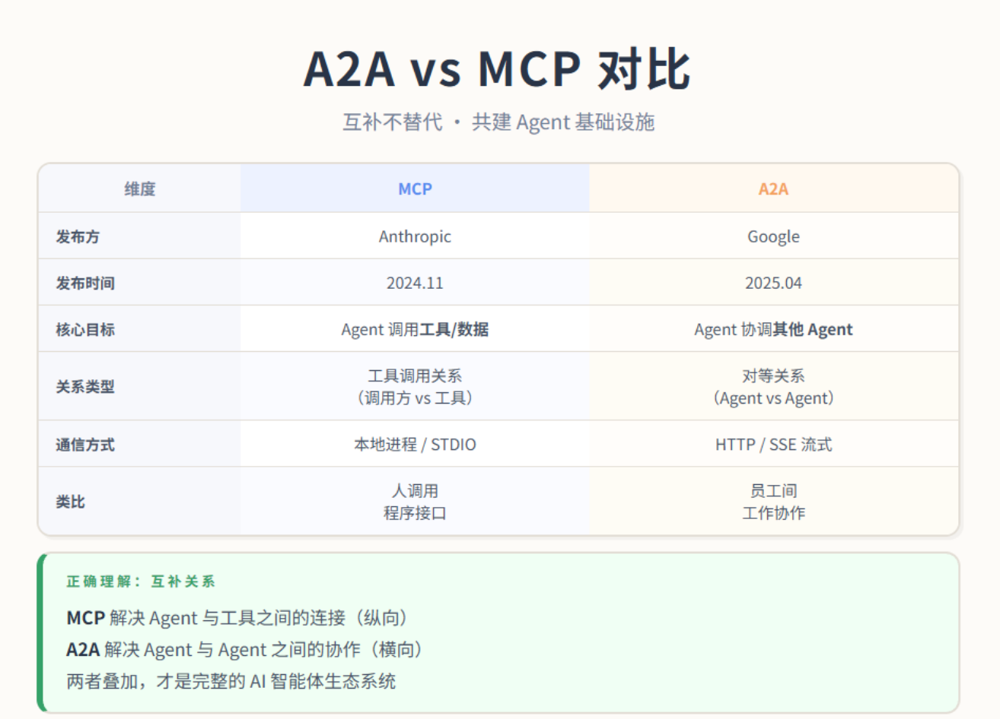
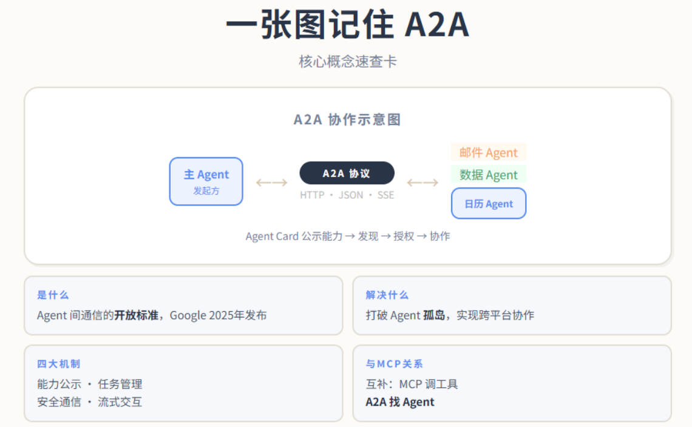

## Spring AI Alibaba 中的 Multi-agent 模式
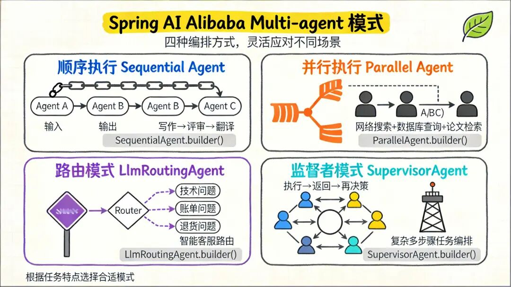

## Spring AI Alibaba + Nacos 的实现方案示意图
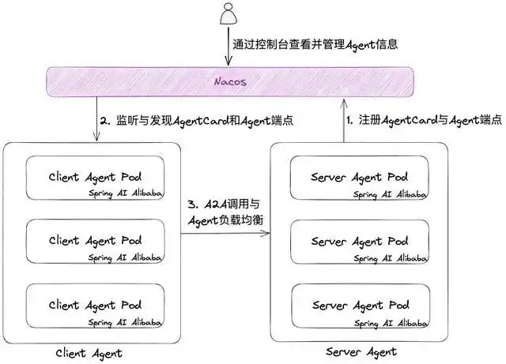

    Server Agent 在启动时，会将 Agent 信息与端点信息注册到 Nacos 中；Client Agent 监听并获取 Agent 信息，同时发现对应 Agent 
    的端点列表；在需要访问 Server Agent 时，会通过负载均衡选取 Agent 端点，并采用 A2A 协议进行通信。
    基于Spring AI Alibaba + Nacos 的分布式 Multi-Agent

## Spring AI Aliababa和AgentScope-Java总体对比
    这两个都是阿里巴巴开源的AI框架
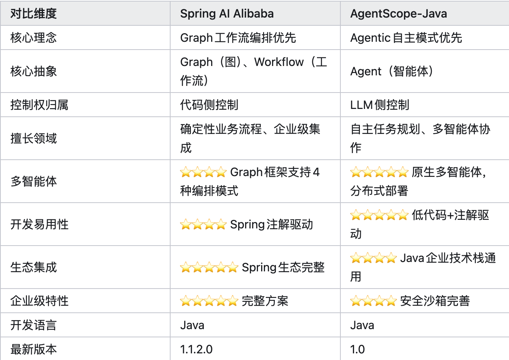
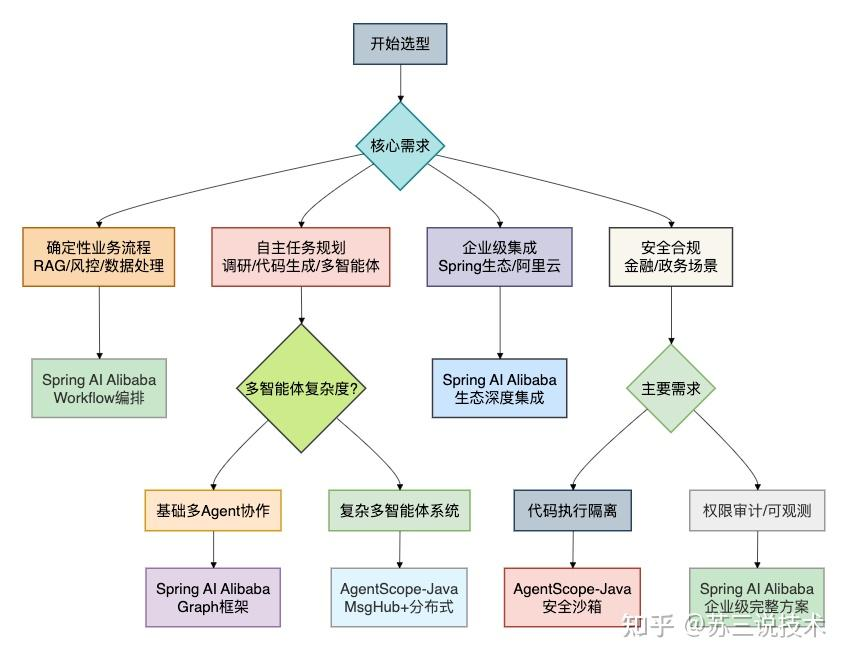

## 多 Agent 协作如何做扩展
    场景:当业务从“一个智能客服”升级到“客服 + 风控 + 售后 + 知识专员”时，建议采用两种模式：
    模式一：Supervisor + Worker
    一个主 Agent 负责拆解任务，多个子 Agent 负责执行。
    优点：
    • 结构清晰
    • 易于权限隔离
    • 适合复杂任务分工
    模式二：事件驱动协作
    通过 Kafka 传递任务事件，各 Agent 订阅自己负责的话题。
    优点：
    • 解耦更强
    • 更适合长流程、异步任务
    • 易于扩展和削峰
    但要注意：
    • 事件必须带幂等键
    • 每个 Agent 的输出必须结构化
    • 不能把 LLM 自由文本直接作为下游协议

## Multi-agent 扩展应用场景
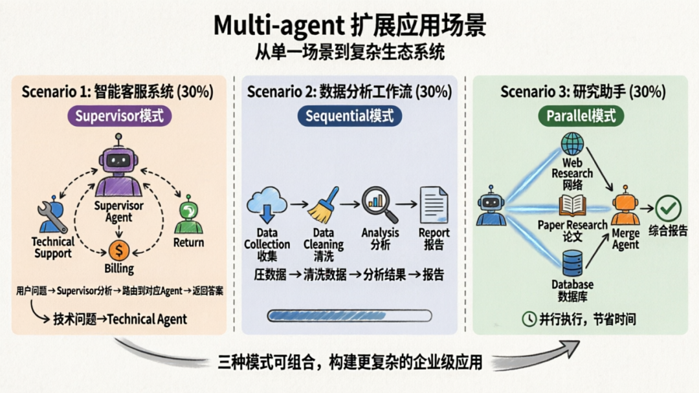

    智能客服系统-监督
    Supervisor Agent├── Technical Support Agent (技术问题)├── Billing Agent (账单问题)└── Return Agent (退货问题)
   
    数据分析工作流-顺序执行模式
    Sequential Agent├── Data Collection Agent (数据收集)├── Data Cleaning Agent (数据清洗)├── Analysis Agent (数据分析)└── Report Agent (报告生成)
   
    研究助手-并行
    Parallel Agent├── Web Research Agent (网络搜索)├── Paper Research Agent (论文检索)└── Database Agent (数据库查询)

## Spring AI ReAct
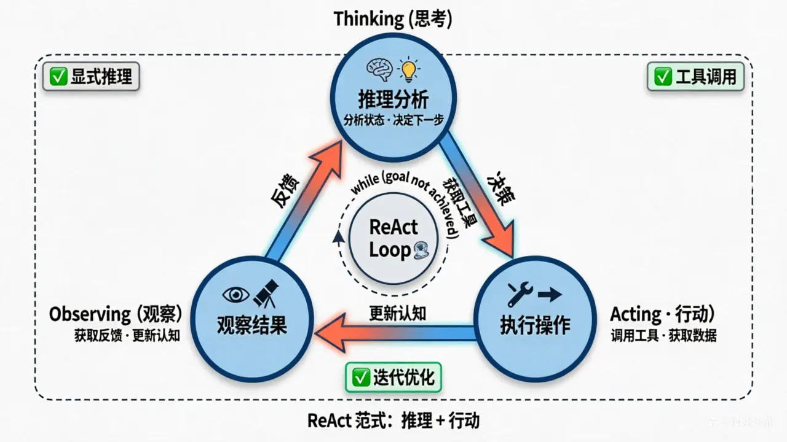
ReAct 核心循环流程图 - Thinking(思考) → Acting(行动) → Observing(观察) 顺时针闭环，展示智能体的基础运行模型
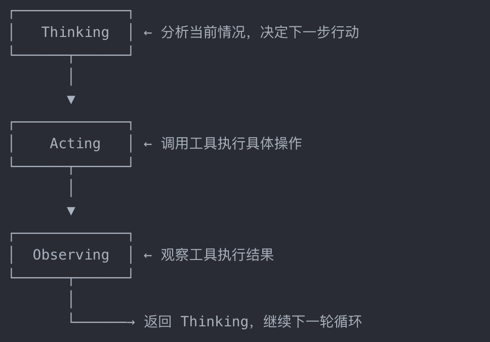
ReAct（推理和行动 Reasoning  and Acting）是一种基于大语言模型的智能体框架。它通过融合推理与行动，让大模型能够像人类一样 “边思考边行动”，高效解决复杂任务。
ReAct =Reasoning + Acting 它不是让模型直接生成一个答案，而是让模型在任务执行中不断经历以下循环：
理解目标 -> 推理下一步 -> 调用工具 -> 观察结果 -> 修正策略 -> 继续执行

ReAct 的正确姿势不是让模型自由发挥，而是：
•由模型负责推理与选择
•由系统负责约束边界与执行治理
也就是说：
• 模型决定“查什么”“先做什么”“失败后换什么”
• 平台决定“哪些工具可用”“哪些操作需要审批”“哪些参数必须校验”“哪些动作必须幂等”

## LangChain简介
    LangChain就等价于数据库领域的JDBC
    
    为什么要用 Langchain？
    数据连接：Langchain 允许你将大型语言模型连接到你自己的数据源，比如数据库、PDF文件或其他文档。这意味着你可以使模型从你的私有数据中提取信息。
    行动执行：不仅可以提取信息，Langchain 还可以帮助你根据这些信息执行特定操作，如发送邮件。无需硬编码：它提供了灵活的方式来动态生成查询，避免了硬编码的需求。
    
    LangChain‌：适合需要快速接入大模型的Python开发者，支持OpenAI、Anthropic等15+热门模型，适合企业级应用开发。
    LangChain4j‌：适合Java开发者，可接入Gemini、Claude等模型，并通过多代理机制实现混合模型调用，适用于Spring Boot等企业级架构。

## Dify和Ollama区别
    Dify 是一款开源的大语言模型(LLM) 应用开发平台。它融合了后端即服务和 LLMOps 的理念，使开发者可以快速搭建生产级的生成式 AI 应用。
    两个开源工具，结合使用可实现本地部署AI知识库和大型语言模型管理。
    Dify‌：提供AI应用开发平台，支持低代码配置、模型管理及可观察性功能，可快速搭建从开发到生产的完整流程。
    Ollama‌：本地推理框架，可运行OpenAI gpt-oss、DeepSeek等开源语言模型，适用于文本生成、问答等场景。

    典型应用场景
    企业知识库：整合内部数据与外部模型，通过低代码工具快速构建AI应用。
    本地运算优化：避免依赖云端服务，降低延迟并增强数据隐私保护。

## 大模型能力
    大模型实现数据分析的技术途径基本还是以三种方式为主：自然语言转API、自然语言转SQL、以及自然语言转代码。

## 构建Data Agent三种基础技术方案
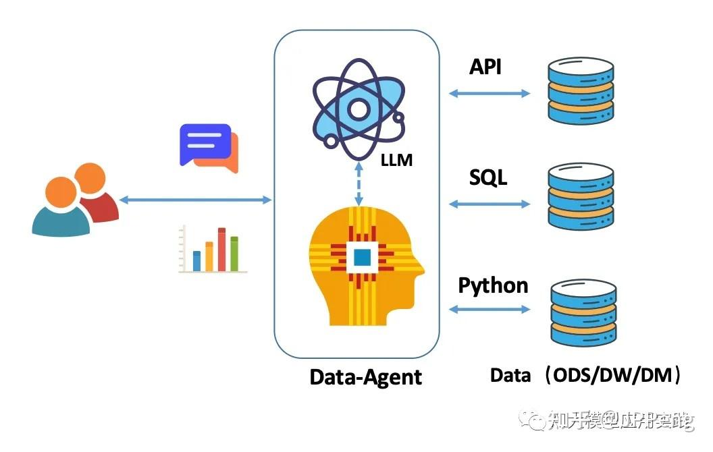

#### 自然语言转数据分析的API，text2API
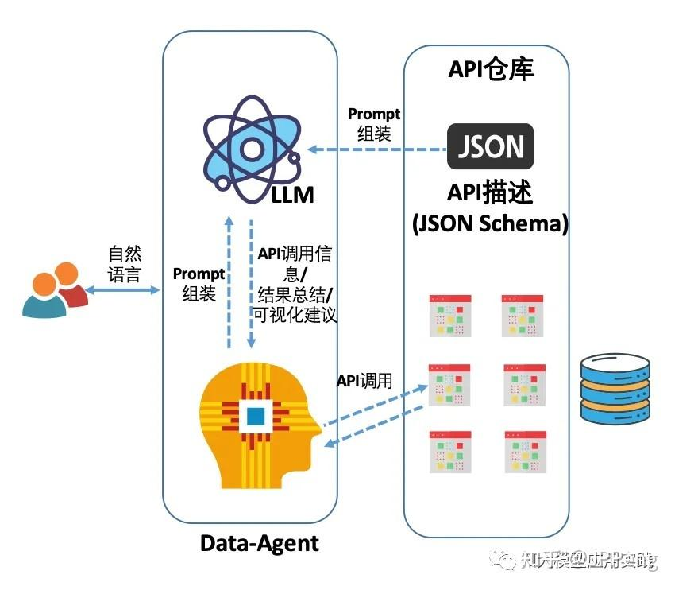

#### 自然语言转关系数据库SQL，text2SQL-目前最受关注的一种大模型能力
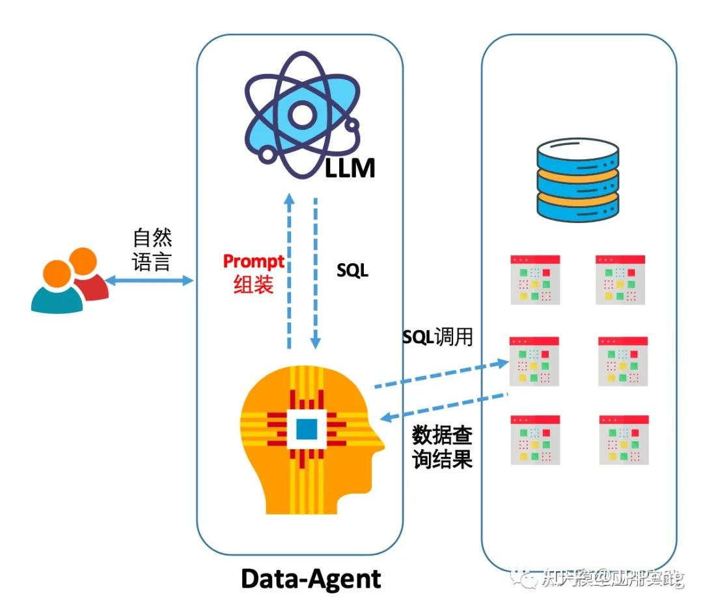

#### 自然语言转数据分析的语言代码，即text2Code(即代码解释器方案)

## 私有化方案
    Ollama+DeepSeek+Dify构建私有AI Agent

## AI Agent
    工作原理：AI Agent 通过生成式 AI 理解用户请求，结合 RAG 获取实时信息，自动分解任务（如查数据→调用 API→反馈结果），最终执行操作并生成响应。
    
    应用示例：
    智能客服：自动处理用户的查询并生成响应。
    自动化任务执行：根据指令调用外部 API 来完成任务，如预订机票、查询天气等。

    MCP(Model Context Protocol) 模型上下文协议
    基于 RAG（Retrieval-augmented Generation 检索增强生成） 的 Text2SQL 应用是企业 LLM 应用落地的热门方向之一

## agent分层架构
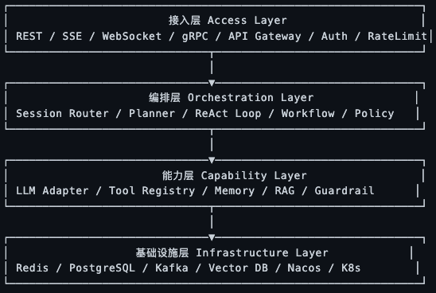

    接入层:负责协议适配、租户鉴权、限流、请求校验、流式输出。
    建议能力：
    • 网关统一鉴权
    • SSE 或 WebSocket 流式返回
    • 用户级 / 租户级限流
    • 请求级 traceId 注入
    
    编排层:这是 Agent 系统的核心，不做业务细节，但决定执行路径。
    典型职责：
    • 加载会话上下文
    • 选择执行策略：直接回答、工具调用、RAG 检索、工作流执行
    • 控制 ReAct/Plan-Execute 循环深度
    • 统一处理超时、失败、补偿和降级
    
    能力层:能力层提供“可插拔能力”
    LLM Adapter：屏蔽不同模型供应商 API 差异
    Tool Registry：工具注册、参数校验、执行隔离
    Memory：短期记忆、长期记忆、摘要压缩
    RAG：检索、过滤、重排、引用拼装
    Guardrail：敏感词、越权、内容安全、输出约束
    
    基础设施层:不直接感知业务语义，但决定系统上限。
    •Redis：热会话、限流计数器、幂等键、短期缓存
    •PostgreSQL：消息历史、审计日志、任务状态、长期记忆
    •Kafka：异步事件、任务拆分、多 Agent 协作
    •Vector DB / pgvector：向量召回
    •Kubernetes：弹性伸缩、灰度发布、故障转移

## Multi-Agent系统（MAS）-多智能体
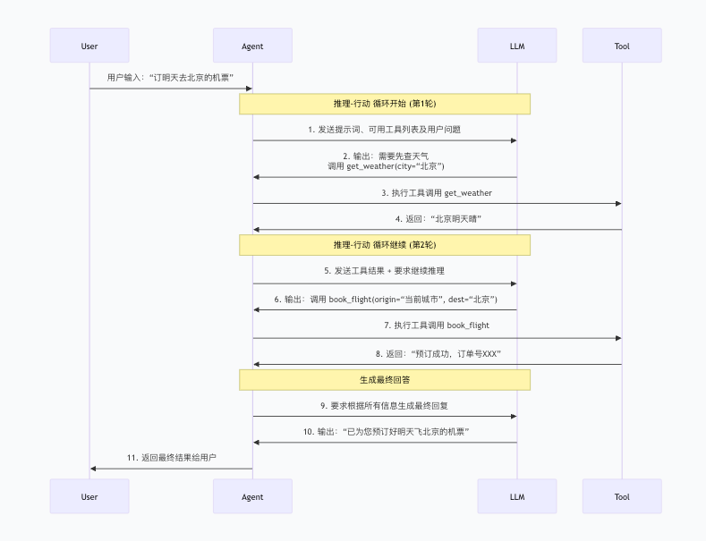
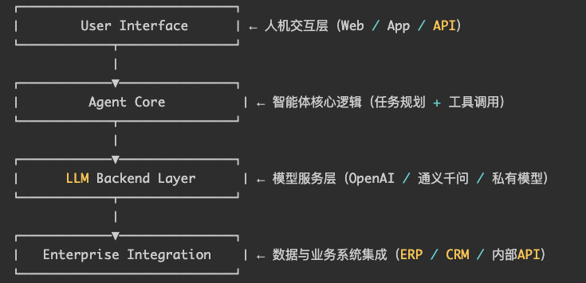
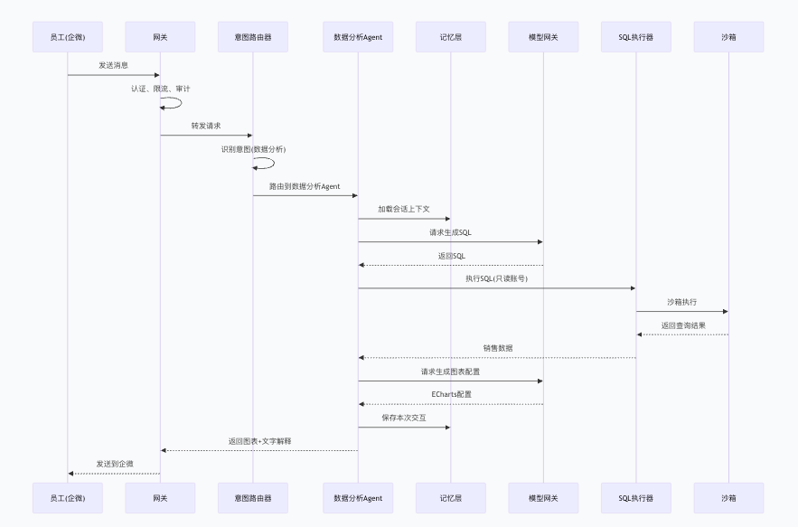

## 基于 Apache Doris Data Agent 智能体平台全面架构如下图所示：
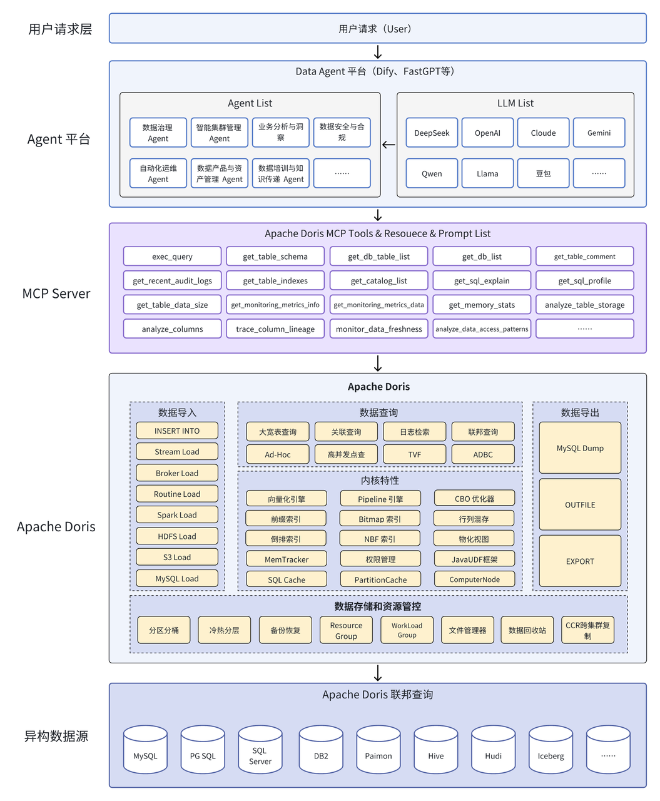

    Text2SQL（NL2sql）
    智能数据查询系统（NL2SQL）
    AIGC（Artificial Intelligence Generation Code）
    Chat2DB是一个AI原生的数据库客户端工具。你可以把它理解为：Navicat+大模型的结合体。
    Text2SQL（有时也被称为NL2SQL，即Natural Language to SQL）是一种技术或过程，它能够将自然语言的查询语句转换成结构化查询语言（SQL）的命令。
    
    Text2SQL开源项目 Chat2DB/DB-GPT/SQL Chat/SQLCoder/LLaMA C/DB-GPT
    Text2SQL的任务涵盖以下几个步骤：
    输入分析：用户以自然语言的形式输入问题，比如“找出平均工资高于整体平均工资的部门名称”。
    语义解析：系统对输入的自然语言问题进行解析，将其转化为数据库中的结构化查询语句。
    SQL生成：依据解析的结果，生成与之对应的SQL语句，例如“SELECT department_name FROM departments WHERE average_salary > (SELECT AVG(salary) FROM employees)” 。
    执行与反馈：系统执行SQL查询操作，并返回相应结果，同时可能会对结果进行进一步的解释或分析。
    
    AI+BI——“ChatBI”（智能问数系统）

## agent智能体开发方式
    纯代码:langchain、llamaindex;langchain4j、spring ai、java
    低代码:coze、dify、n8n等. 实现方式:1.直接发布 2.使用代码调用生成的智能体

    Python生态系统:
    LangChain 通用大模型应用开发框架,侧重应用流程编排,构建复杂NLP应用的首选框架(如文档问答（RAG）)
    LangGraph 复杂工作流管理框架,专为解决复杂工作流问题而设计,复杂Agent的终极武器。
    LlamaIndex 专注数据索引检索,数据密集型应用中表现卓越(如企业知识库问答)
    
    Java生态:
    Spring AI Java生态的大模型集成框架,Java企业应用快速AI化
    Spring AI Alibaba 基于 Spring AI 构建，并在此基础上提供了Graph 引擎、多智能体编排、可视化调试（Studio/Admin）及与阿里云基础设施的深度集成等增强功能
    LangChain4j Java版LangChain，LLM 编排框架
    Spring AI Alibaba Graph 多智能体框架

    LangChain4j vs Spring AI
    LangChain4j 更适合：快速验证 AI 场景、构建 Agent/RAG 原型、对 Spring 生态绑定要求不高、希望用较少抽象快速打通链路。
    Spring AI 更适合：已有 Spring Boot / Spring Cloud / Spring Security / Micrometer 技术栈，强调统一配置、治理、可观测性、企业集成与长期维护。
    从架构视角看：
        LangChain4j 偏向“AI 能力编排框架”。
        Spring AI 偏向“AI 能力接入 Spring 体系的企业集成框架”。
    从组织效率看：
        小团队、探索期、业务未定型时，LangChain4j 往往更快。
        大团队、平台化、合规要求高时，Spring AI 更容易纳入统一治理。
    一句话概括：LangChain4j 赢在 AI 编排体验，Spring AI 赢在企业工程化整合。

## langchain+ Milvus向量数据库构建知识库
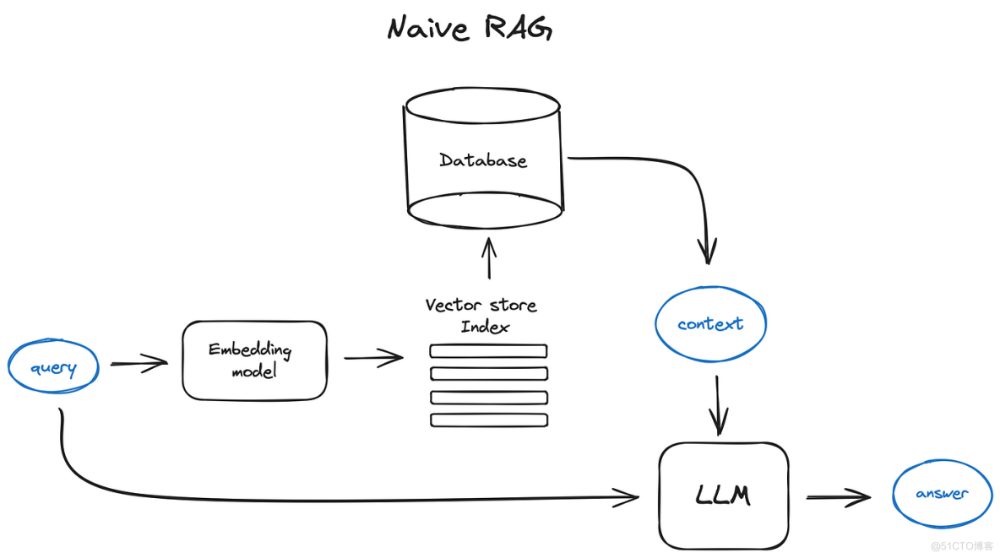

## RAG（检索增强生成，Retrieval-Augmented Generation）核心思路
    用户提问 → 从知识库中检索相关片段 → 把片段 + 问题一起交给大模型 → 大模型基于上下文回答
### 技术架构
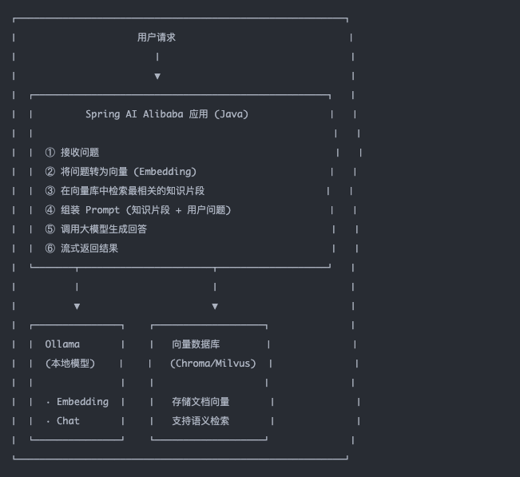

### 组件选型
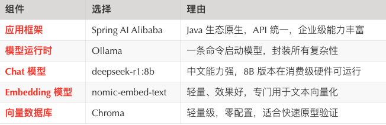

### 知识库初始化——将文档变为向量
    RAG 的第一步是文档"喂"给系统。原始文档 → 文本提取 → 文本分块 → 向量化 → 存入向量库

### RAG 完整流程
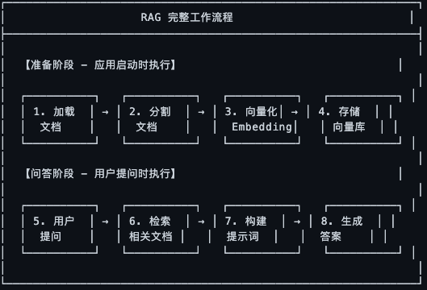

### RAG 应用，本质上就是三件事
    把文档变成向量——读取、分块、Embedding、存储
    把问题变成答案——检索相关片段，组装 Prompt，调用模型
    把答案交给用户——流式输出，实时响应

### RAG文档切分技巧及关键点
    文本分块（按 Token 切分，避免单个块过大）
    关于分块策略：分块大小直接影响检索效果。块太小→上下文不足；块太大→引入噪音。一般建议 500-1000 Token，重叠 10-20%。对于代码文档，建议按函数/类边界切分；对于问答文档，可以按问答对切分。
    
    文档切分（Chunking），目标很简单：把长文档拆成较小的块（Chunk）

    1. 按句子切分
    这是最符合人类直觉的方法。以句号、问号等自然句子边界进行切割，能最大程度保持单句的语义完整性。适合文风规范、句子结构清晰的新闻、报告等。

    2. 按固定字符数切分
    设定一个固定的字符长度（比如200字），像切香肠一样均匀切割。优点是简单粗暴、速度极快。但致命缺点是极易在句子中间“腰斩”，破坏语义。它更适合处理日志文件、代码或格式固定的数据流，因为这些内容本身结构性不强，或按固定长度产出。

    3. 固定字符数切分 + 重叠窗口
    这是对方法2的重要升级。在切分时，让相邻的两个块之间保留一部分重叠的字符（比如重叠50字）。这样，即使切割点不幸落在句子中间，关键信息也能在下一个块中得以保留，确保了上下文的连贯性。这是目前最常用、效果最稳定的基础方法之一。

    4. 递归切分法
    这是一种更智能的动态策略。它不会一次性切完，而是像用一套“组合刀具”分层处理：先尝试用双换行(\n\n)来分大段，如果分出来的块还是太大，再用单换行(\n）分，接着用空格分，最后用字符分。如此递归，直到每个块都接近预设的大小。这种方法能更好地尊重文档的原始结构（如段落），是LangChain等框架中的默认主力。

    5. 语义切分
    这是前沿的探索方向。它利用嵌入模型（Embedding）来理解文本的语义，在意思发生转变的地方进行切割。例如，从“介绍背景”切换到“具体方案”时自动分块。这种方法最能保持语义连贯，但对算力和技术有更高要求。
   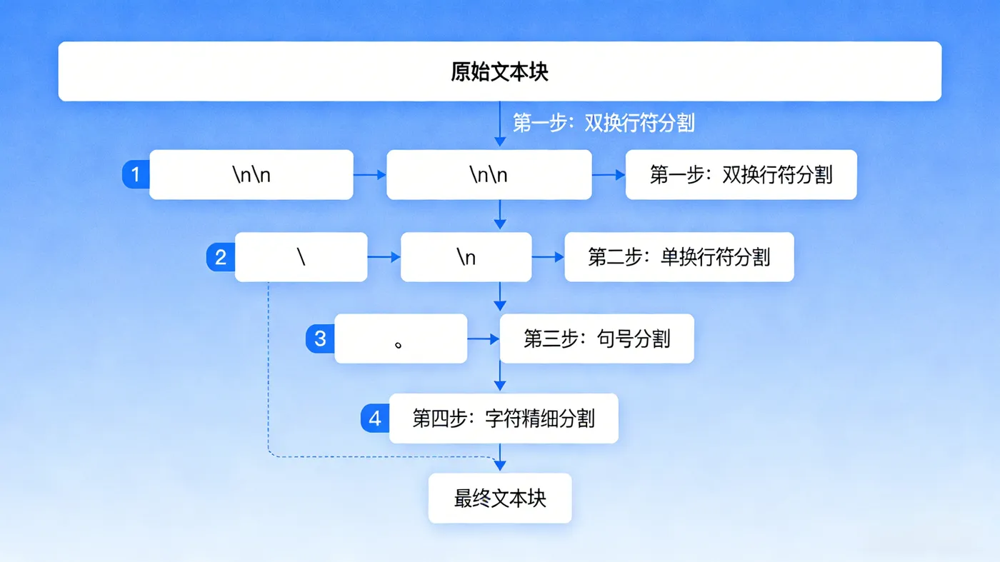

    关键调整参数：
    chunk_size：通常设置在128-512个字符（或token）之间。需要平衡：太小则信息碎片化，太大则检索精度下降。
    chunk_overlap：通常为chunk_size的10%-20%。这是保证语义连贯的“安全绳”。
    separators：根据文档语言和类型调整。中文文档可加入中文标点。

## 文档切割策略对比
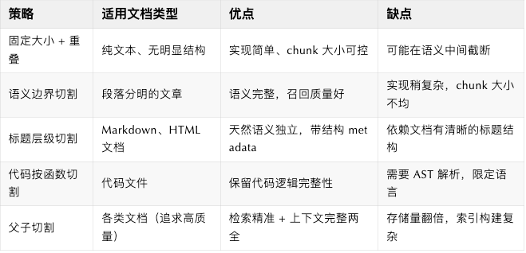

## 不同场景的文档切分实战案例
    （一）案例 1：企业智能客服 FAQ 知识库
    文档类型：短文本 FAQ（每个问题 + 回答约 150-300 字）；
    切分方法：固定长度切分；
    核心参数：片段长度 200 字，重叠长度 20 字；
    优化点：为每个片段添加元数据 “问题类型”（如 “退款咨询”“产品功能”“售后政策”），检索时按类型过滤。
    （二）案例 2：产品说明书（结构化文档）
    文档类型：有章节结构的长文档（含产品参数、使用步骤、注意事项）；
    切分方法：语义结构化切分；
    核心参数：按章节 / 段落拆分，章节标题作为元数据，过长段落（超过 600 字）按 500 字拆分，重叠长度 50 字；
    优化点：将产品参数单独拆分为短片段，标注元数据 “参数类型”，提升精准检索效率。
    （三）案例 3：企业综合知识库（混合类型文档）
    文档类型：包含 FAQ、产品说明书、技术文档、会议纪要等；
    切分方法：混合切分；
    核心参数：先按语义结构拆分，基础片段长度 300-500 字，过长片段按 600 字拆分，重叠长度 30-60 字，过滤少于 50 字的片段；
    优化点：统一添加元数据 “文档类型”“主题标签”，支持多维度检索过滤。

## Spring AI 和 LangChain4j 区别
    Agent 编排能力仍弱于 LangChain4j。

## 对话模型（ChatModel）
    Spring AI聊天记忆之DB存储，实现长期记忆介质:Redis 存储和JDBC存储(适配MySQL、PostgreSQL等数据库)

## 什么是向量（Embedding）
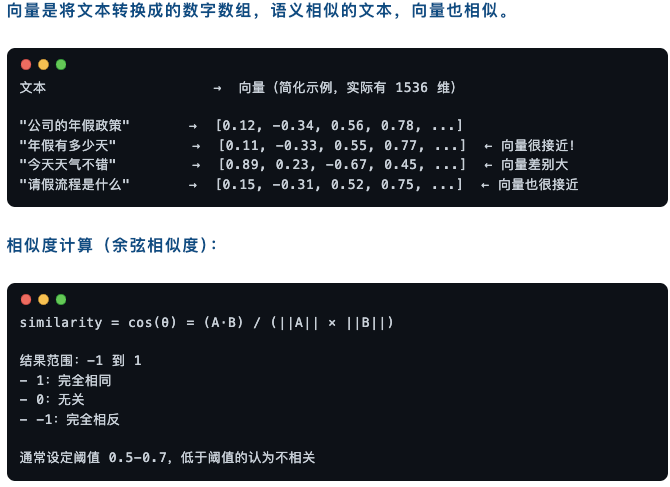

## 为什么文档不能直接存
    一是向量模型有输入长度限制，二是整篇文档压缩成一个向量会丢失细节。然后说清楚怎么切：固定大小加重叠是最基础的，语义边界切割更智能，代码和表格要特殊处理，父子切割可以兼顾检索精度和上下文完整。

## 文档分割策略
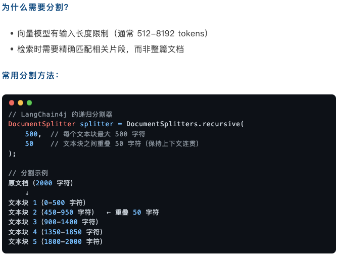

    你实际用的什么策略:固定大小加重叠做兜底，对结构化文档用语义边界切割，对高质量要求的场景用父子切割

## 检索与生成
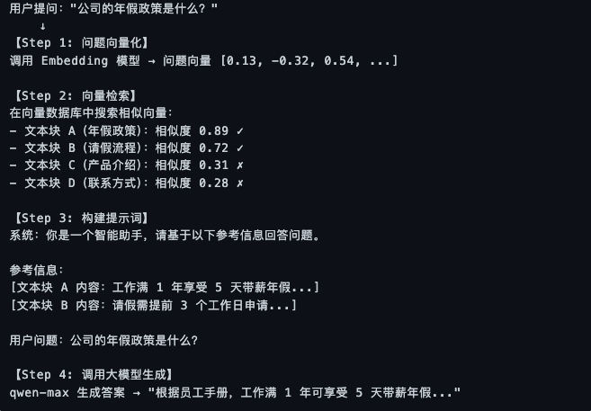

## LangChain4j 框架介绍
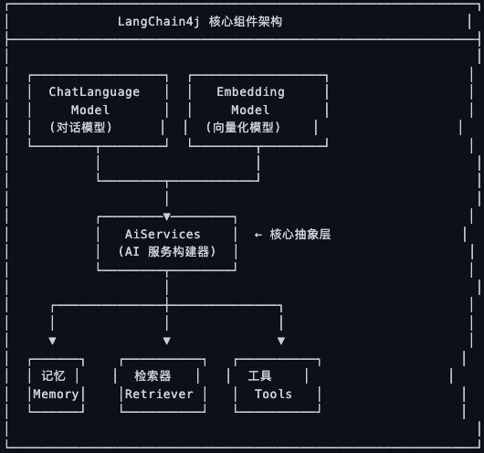

## 什么是 Ollama
    Ollama 是一个本地运行大语言模型的工具,Spring Boot 3 集成Spring AI + Ollama(依赖spring-ai-starter-model-ollama) 
    为企业提供了构建私有化 AI应用的完整解决方案，既保护了数据隐私，又降低了长期运营成本。建议从 7B 量化模型切入，逐步迭代到更复杂的应用场景。

    借助Ollama（本地模型运行时）+DeepSeek 开源模型+Spring AI Alibaba（Java AI 开发框架），可以在自己的笔记本上完成从模型部署到应用开发的完整闭环。
    核心理念很简单：Ollama 负责在本地跑模型，Spring AI Alibaba 负责用 Java 调用它。两者之间通过标准 HTTP 接口通信，与调用云端 API 的代码几乎没有区别。
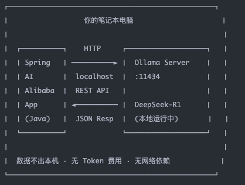

## 企业私有大模型部署，可选择Ollama或者vLLM
    vLLM 是一个快速、易于使用的 LLM 推理和服务库。
    1.Ollama 更适合于开发和测试阶段。
    2.vLLM 则更加适合用于生产环境的部署。

    Ollama与vLLM都是针对大语言模型（LLM）部署和推理的开源框架，但它们在设计目标、技术特点和适用场景上有显著的差异
    Ollama ： 主要面向本地轻量化部署，利用Docker容器技术简化模型的运行流程，使用户能够以较少的配置迅速启动模型，非常适合个人开发者或资源受限的环境。
    vLLM ： 注重于高性能推理与服务器扩展，支持多机多卡的分布式部署，通过优化GPU资源利用率和内存管理技术（例如PagedAttention），在高并发场景中显著提升吞吐量。

    适用场景
    Ollama
    轻量级应用 ： 适合在个人电脑、移动设备或单机环境中进行少量并发推理，如本地开发、原型验证或实时交互。
    快速实验 ：便于研究者或爱好者快速切换和测试不同模型（例如Llama系列）。
   
    vLLM
    高并发服务 ： 特别适合需要处理大量请求的生产环境（如API服务、聊天机器人），并支持在流量高峰时进行分布式扩展。
    资源密集型任务 ：在多GPU集群中表现优异，适合企业级应用或需要低延迟、高吞吐的场景。
   
    性能对比
    吞吐量 ： vLLM因采用连续批处理和内存优化，吞吐量显著高于Ollama，尤其在高并发环境下差距明显。
    资源占用 ： Ollama在单机环境中资源占用较低，启动快速，而vLLM需要更多的初始配置，但能更高效地利用多卡资源。
    延迟 ： Ollama在实时响应需求上延迟更低，而vLLM通过批处理优化能够在吞吐量与延迟之间达到平衡。

    结论:
    Ollama 适合 50人以下团队或PoC（概念验证）阶段，快速启动且资源占用低；
    vLLM是200人以上企业生产环境首选，尤其在金融、客服等需高并发的场景。
    Ollama 是「快速上手的实验利器」，vLLM 是「企业级服务的生产引擎」

## 向量检索：语义匹配，靠 Embedding
    它的思路是这样的：
    先用一个 Embedding 模型把每段文本转成一个高维数字向量（比如 1024 维的浮点数列表），这个向量可以理解成这段文本在「语义空间」里的坐标。
    语义相近的文本，坐标就靠近；语义不相关的，坐标就离得远。好比给每段文字在地图上钉了个钉子，意思越相近的钉子挨得越近。用户查询来了，也转成向量，
    然后去找最近的几个钉子。
    向量检索的优势是语义理解能力强，能跨越同义词、近义词、不同表达方式的障碍；但它的劣势是对精确词汇不敏感——产品型号「Pro Max 256GB」、人名、
    版本号这类词，在 Embedding 空间里可能彼此距离并不近，向量检索容易把它们混淆在一起
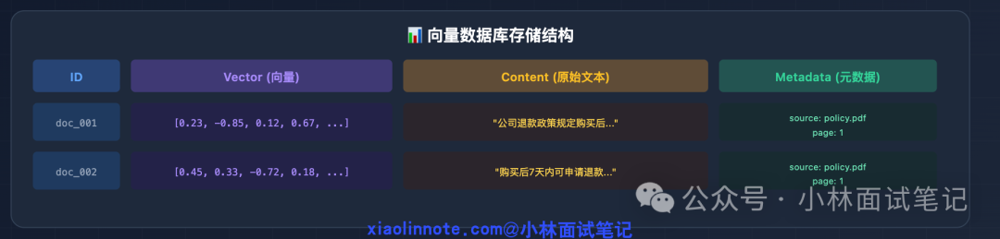

## 关键词检索（BM25）和向量检索区别
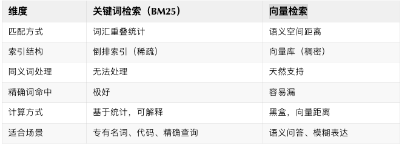

## 混合检索（Hybrid Search）：两路都跑，合并取长补短
    同时跑向量检索和 BM25，各自召回一批候选，然后用 RRF（Reciprocal Rank Fusion，互倒排名融合）算法把两路结果合并排序。
    关键词检索（BM25）靠词频统计，精确匹配强但同义词没辙；向量检索靠语义空间距离，语义理解强但精确词容易漏。正确的做法不是二选一，
    而是混合检索——两路并行召回，用 RRF 融合排序，取长补短。
    两路检索可以并行执行，总延迟取两路中的最大值而不是两者相加，几乎没有额外的时间代价，但召回质量比单路明显更好。生产环境的 RAG 系统很少
    只用纯向量检索，混合检索已经成为行业默认做法。

## 混合检索架构
    生产级 RAG 同时利用稠密向量和稀疏向量：
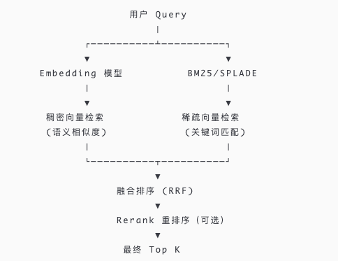

## 向量存储流程
    在 RAG 场景里：文本 → Embedding 模型 → 变成一串浮点数（向量）→ 存进去。
    用户提问时，问题也变成向量，然后找语义最接近的文本片段。

## 向量查询流程
    用户问题 -> 向量化 -> 在向量库里找相似的 chunk -> 取出 chunk 的原文 -> 塞进 prompt -> LLM 生成答案。向量只在「找」的时候用，LLM 最终读的是原文。
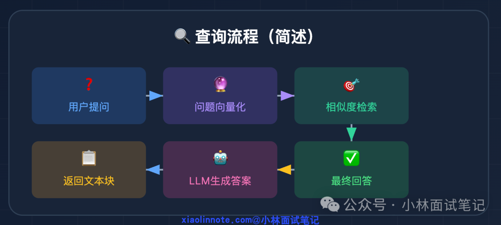

## 多模态数据处理
    除了纯文本内容，现代RAG系统还需处理包含图片、图表等的多模态文档。对于图片信息，通常采用OCR（Optical Character Recognition，光学字符识别）
    技术提取图片中的文字，或使用图像理解模型生成图片的场景描述，再将这些文本信息转化为切片参与检索流程。

## 表格与结构化处理
    在实际文档处理中，表格和Markdown标题是常见的难点。直接按字符切分容易破坏表格结构，导致检索到错乱的数据。针对Markdown文档，一种有效的策略是
    去除正文中的标题符号，将其作为元数据（Metadata）存储，从而保持切片内容的纯净度。对于表格数据，则需要根据其长度采取不同的处理方案。

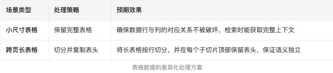

    综上所述，构建高效的RAG系统需要根据文档的特性和检索需求，灵活选择切片策略。通过递归切片保证基础覆盖率，结合语义切片提升精准度，并针对表格等特殊结构实施
    定制化处理，能够最大程度地还原文档信息价值。部分开发者反馈，在实际操作中，调整切片重叠比例和优化表格解析逻辑是提升系统性能的关键步骤。

## Milvus简介
    Milvus 是一款开源的向量数据库，专为海量向量数据的存储、索引和
    相似性搜索而设计。它支持多种索引类型和距离计算方式，能够处理
    十亿级向量数据。

## RAG技术选型
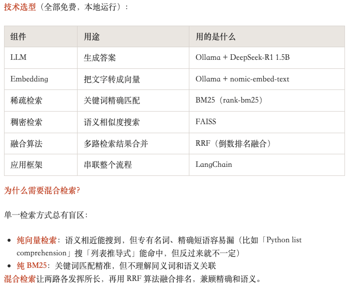

## 混合检索流程图解
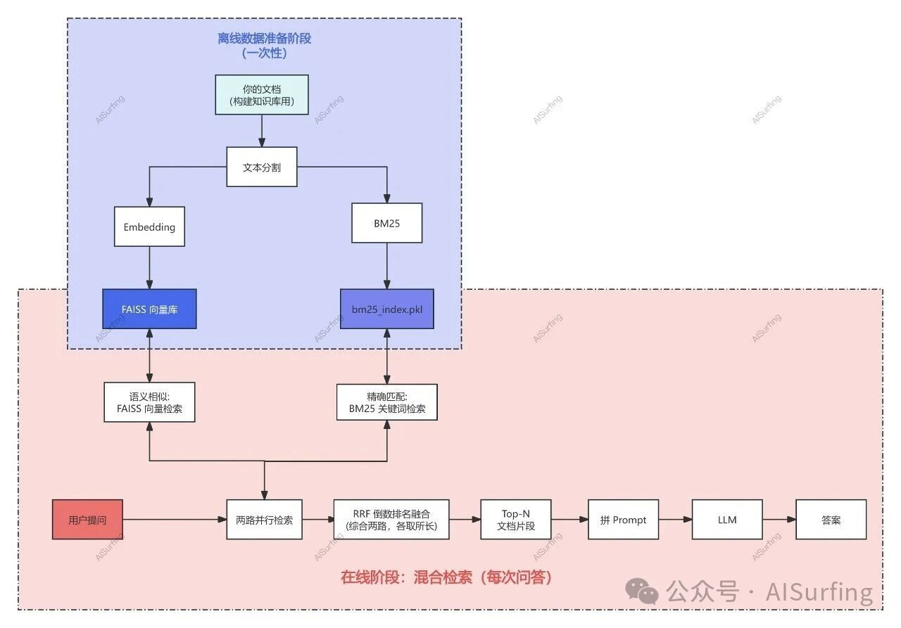

    该流程先离线构建文档向量库与 BM25 索引，在线问答时并行语义检索与关键词检索，经 RRF 融合后将 Top-5 片段输入 LLM 生成最终答案。

## RAG 检索链路
    系统流程： 用户问题 → 召回（top_k） → 过滤（Score阈值） → 重排（Rerank） → 再过滤（重排阈值） → 拼接上下文 → 大模型生成

## RAG图片检索
重点:OCR+图片版面分析+向量化
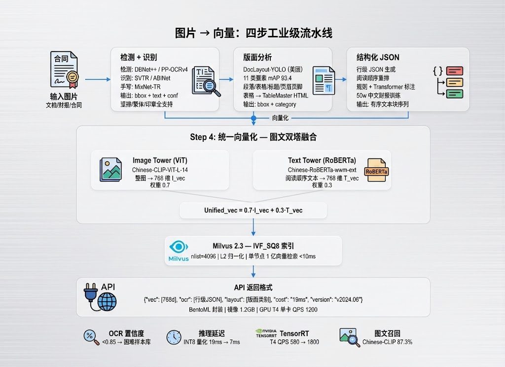
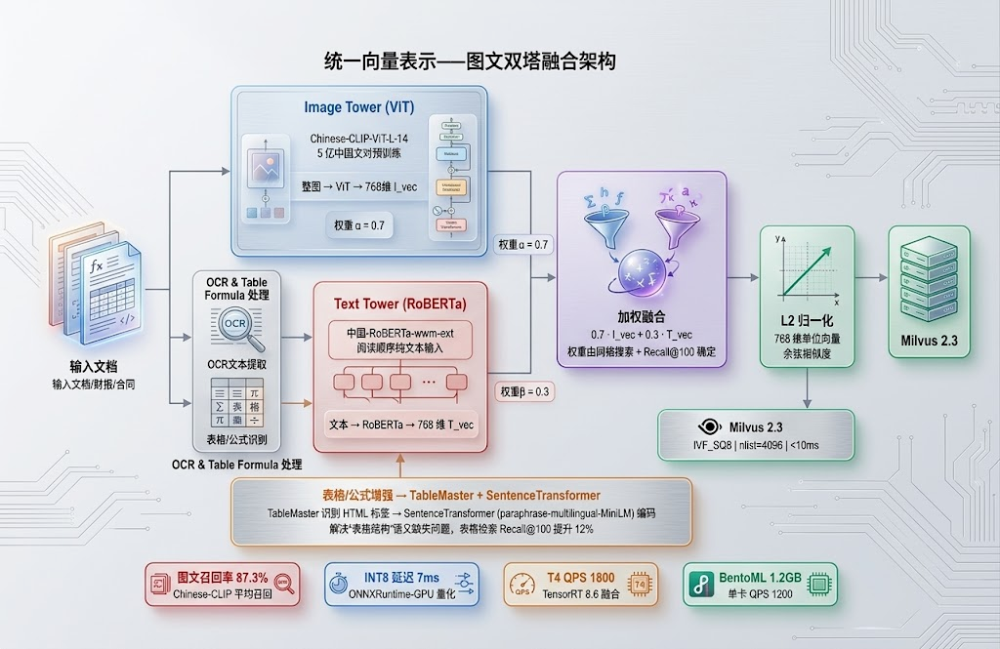

## RAG知识库更新策略
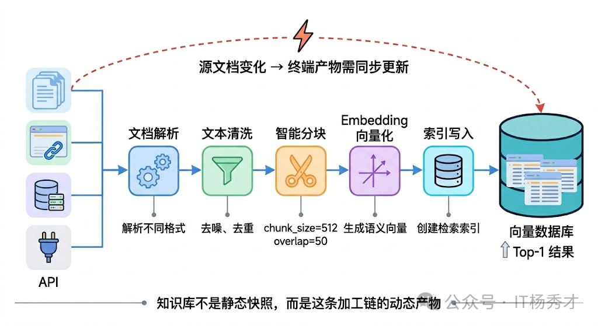
什么时候更新（触发机制）
定时全量重建
增量更新(实际项目中常见方案)
1.基于文件哈希的检测是最通用的方案。对每个源文档计算内容哈希（比如 MD5 或 SHA256），存到一张元数据表里。每次更新时重新计算哈希，和上一次比较——哈希变了就说明内容变了，需要重新处理；哈希没变就跳过。这种方式不依赖任何外部系统，适用面最广。
2.基于事件驱动的检测更实时。如果你的文档源头是一个 CMS 系统或者 Wiki 平台，通常可以通过 Webhook 或者消息队列拿到文档创建/修改/删除的事件通知。收到通知后立即触发对应文档的更新处理，做到分钟级甚至秒级的准实时更新。这种方式延迟最低，但需要源头系统支持事件推送，而且要处理好事件的幂等性和顺序性问题。
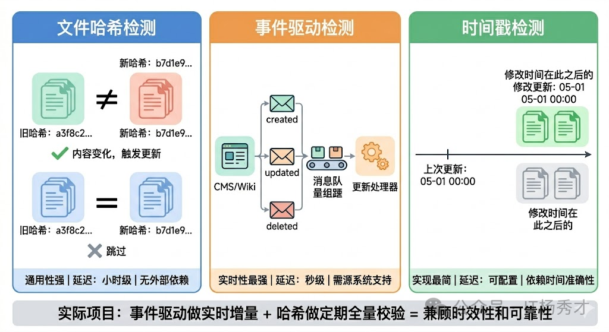

增量更新的粒度控制
实际经验:除非文档量特别大或者单文档特别长，否则文档级更新就够用了。
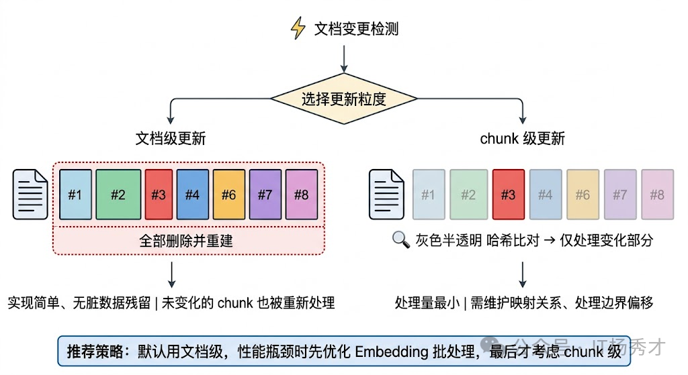
元数据追踪。每个 chunk 在写入向量数据库时，都应该携带足够的元数据——至少包括：源文档 ID、源文档的内容哈希、chunk 在文档中的位置索引、写入时间、Embedding 模型版本。有了这些元数据，增量更新时才能准确定位"这个文档对应的 chunk 有哪些"，也方便后续做数据审计和问题排查。

## Neo4j图数据库
    图数据库数据模型的主要构建模块是：
    节点
    关系
    属性
    标签
    数据浏览器

## 项目场景(企业有场景，只要是重复性，固定场景都可以自己搭建，不是省钱，关键自己了解自己需求才是真的。)
    合同审查 Agent(合同审查系统，拆成 6 个 Agent 或节点)
    文档解析 Agent 读取 PDF、Word、TXT 合同内容 合同文件 合同纯文本 
    合同分类 Agent 判断合同属于哪一类  合同文本  合同类型 
    条款提取 Agent提取关键条款 合同文本 + 合同类型 条款 JSON 
    风险匹配 Agent对照规则库识别风险 条款 JSON + 风险规则库 风险清单 
    报告生成 Agent  生成合同审阅报告 条款摘要 + 风险清单 审阅报告 
    人工复核节点 提醒法务确认关键风险 审阅报告 最终审阅意见 
    
    Agent 分工越清楚，系统越稳定。不要指望一个 Prompt 同时完成“读合同、提条款、判风险、写报告、给结论”。
    更好的方式是：每一步都结构化输出，下一步只处理上一步的结果。

