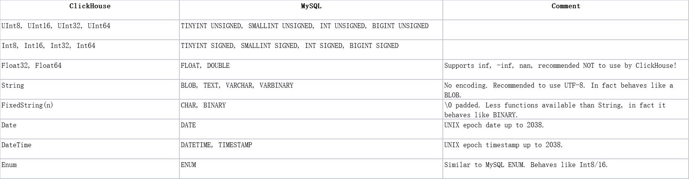

## Clickhouse使用技巧
### mysql与clickhouse的字段类型对应表

### clickhouse数据类型
    数据类型没有boolean其他基本和hive一样,详细的看官网 https://clickhouse.tech/docs/en/sql-reference/data-types/int-uint/

### clickhouse引擎
    clickhouse有很多引擎,最常用的是MergeTree家族 还有Distributed引擎
    
    ReplacingMergeTree是MergeTree的一个变种，它存储特性完全继承MergeTree，只是多了一个去重的功能。 
    尽管MergeTree可以设置主键，但是primary key其实没有唯一约束的功能。如果你想处理掉重复的数据，
    可以借助这个ReplacingMergeTree。

    指定表引擎：
    ENGINE = ReplacingMergeTree([ver])
    参数：ver，版本列。版本列的类型为UInt*、Date或DateTime。可选参数。
    合并的时候，ReplacingTree从所有相同主键的行中选择一行留下：如果ver未指定，选择最后一条。如果指定了ver列，选择ver值最大的版本。

### clickhouse 创建表
> clickhouse可以创建本地表,分布式表,集群表

    create table test()为本地表
    
    CREATE TABLE image_label_all AS image_label ENGINE = Distributed(distable, monchickey, image_label, rand()) 分布式表
    
    create table test on cluster()为集群表
    
    建表语句,使用ReplicatedMergeTree引擎
    CREATE TABLE metro.metro_mdw_pcg (
     storekey Int32, 
     custkey Int32,  
    cardholderkey Int32,  
    pcg_main_cat_id Int32,  
    pcg_main_cat_desc String,  
    count Int32,  
    quartly String
    ) ENGINE = ReplicatedMergeTree('/clickhouse/tables/metro/metro_mdw_pcg', '{replica}') PARTITION BY (quartly, pcg_main_cat_id) 
    ORDER BY (storekey, custkey, cardholderkey)
    
    ReplicatedMergeTree(复制表)引擎，可以针对相同主键的数据进行去重，
    它能够在合并分区时删除重复的数据。常使用这种引擎实现真正存储数据,由于是分布式建表的,
    数据分布在集群的各个机器中,直接查表数据查不全,所以要用到Distributed。
    
    Distributed相当于视图,不真正存储数据,用来查数据,速度快、数据全。
    Distributed表引擎是分布式表的代名词，它自身不存储任何数据，数据都分散
    存储在某一个分片上，能够自动路由数据至集群中的各个节点，所以Distributed表
    引擎需要和其他数据表引擎一起协同工作。
    
    Distributed(cluster_name,database_name,table_name[,sharding_key])
    各个参数的含义分别如下：
    cluster_name：集群名称，与集群配置中的自定义名称相对应。
    database_name：数据库名称
    table_name：表名称
    sharding_key：可选的，用于分片的key值，在数据写入的过程中，
    分布式表会依据分片key的规则，将数据分布到各个节点的本地表。
    
### MergeTree原理
    MergeTree引擎是Clickhouse表引擎中最重要, 最强大的引擎.
    MergeTree引擎族中的引擎被设计用于将大量数据写入表中. 这些数据被快速的写入每个表的每个part, 
    然后在Clickhouse底层会进行多个parts的合并(merge). 这种形式的处理比在插入过程中不断重写存储中的数据要高效得多.
    
    主要的功能点:
    存储按主键(primary key)排序的数据.
    这允许用户可以创建一个小型的稀疏索引, 有利于更快的在表中找到索要的数据.
    
    如果partitioning key被设置, 分片(partitions)可以被使用.
    Clickhouse支持某些带分区的操作, 对于同一份数据进行处理, 带有分区的操作会比一般操作更有效. 
    当在查询语句中指定了分区后, Clickhouse会根据分区信息来进行数据的切分, 这样极大程度上提升了查询的性能.
    
    数据副本机制支持(Replication)
    ReplicatedMergeTree引擎提供了数据副本机制.
    
    支持数据采样
    如果必要, 可以在表中设置数据采样方式.
    
### clickhouse数据操作
    增加可以使用insert;
    不能修改,也不能指定删除;
    可以删除分区,会删除对应的数据 我使用--help看了一下有truncate table,但是没有具体使用过,如果要全部删除数据可以删除表,然后在建表查数据
    可以使用脚本操作

    Clickhouse通过alter方式实现更新、删除。语法为：
    ALTER TABLE [db.]table DELETE WHERE filter_expr
    ALTER TABLE [db.]table UPDATE column1 = expr1 [, ...] WHERE filter_expr
        
### 数据查询
    clickhouse的查询sql表单查询基本和标准sql一样,也支持limit分页,但是inner join的查询写法不一样,而且我用4亿+2000万inner join的速度很慢
    两个sql对比inner join要花费将近一分钟,使用in子查询仅3秒,建议都使用in查询,clickhouse的单表查询速度很快,3亿数据count distinct仅1秒左右
    
### ClickHouse优点 
    1.为了高效的使用CPU，数据不仅仅按列存储，同时还按向量进行处理；
    2.数据压缩空间大，减少IO；处理单查询高吞吐量每台服务器每秒最多数十亿行；
    3.索引非B树结构，不需要满足最左原则；只要过滤条件在索引列中包含即可；即使在使用的数据不在索引中，由于各种并行处理机制ClickHouse全表扫描的速度也很快；
    4.写入速度非常快，50-200M/s，对于大量的数据更新非常适用；
    5.压缩性好：相对mysql压缩10倍
    
### ClickHouse缺点
    1.不支持事务，不支持真正的删除/更新；
    2.不支持高并发，官方建议qps为100，可以通过修改配置文件增加连接数，但是在服务器足够好的情况下；
    3.SQL满足日常使用80%以上的语法，join写法比较特殊；最新版已支持类似SQL的join，但性能不好,不建议使用；
    4.尽量做1000条以上批量的写入，避免逐行insert或小批量的insert操作，因为ClickHouse底层会不断的做异步的数据合并，会影响查询性能，这个在做实时数据写入的时候要尽量避开；
    5.Clickhouse快是因为采用了并行处理机制，即使一个查询，也会用服务器一半的CPU去执行，所以ClickHouse不能支持高并发的使用场景，默认单查询使用CPU核数为服务器核数的一半，安装时会自动识别服务器核数，可以通过配置文件修改该参数。
    全量数据导入：数据导入临时表 -> 导入完成后，将原表改名为tmp1 -> 将临时表改名为正式表 -> 删除原表
    增量数据导入：增量数据导入临时表 -> 将原数据除增量外的也导入临时表 -> 导入完成后，将原表改名为tmp1-> 将临时表改成正式表-> 删除原数据表
    6.只支持自己的协议（没有MySQL协议支持）
    
### clickhouse有哪些特性？
    列式数据库管理系统、数据压缩、数据的磁盘存储、多核心并行处理、多服务器分布式处理、支持SQL、实时的数据更新、索引、适合在线查询、支持数据复制和数据完整性
    
    并行计算
    列式存储
    数据压缩

### 向量引擎
    为了高效的使用CPU，数据不仅仅按列存储，同时还按向量(列的一部分)进行处理，这样可以更加高效地使用CPU。
    每列的数据存储在一起，可以认为这些数据是以数组的方式存储的，基于这样的特征，当该列数据需要进行某一同样操作，
    可以使用SIMD进一步提升计算效率，即便运算的机器上不支持SIMD, 也可以通过一个循环来高效完成对这个数据块各个值的计算。

    SIMD (Single Instruction Multiple Data) 即单条指令操作多条数据——原理即在CPU寄存器层面实现数据的并行操作
    ClickHouse目前使用SSE4.2指令集实现向量化执行

#### 向量化执行引擎的优势：
    向量化执行引擎可以减少节点间的调度，提高CPU的利用率
    因为列存数据，同一列的数据放在一起，导致向量化执行引擎在执行的时候拥有了更多的机会能够利用当前硬件与编译的新优化特征
    因为列存数据存储将同类型的类似数据放在一起使得压缩比能够达到更高，这样可以拉近一些磁盘IO能力与计算能力的差距
    
### clickhouse使用场景是什么？
    绝大多数是读请求，数据以相当大的批次(>1000行)更新，而不是单行更新;或者根本没有更新。已添加到数据库的数据不能修改。
    对于读取，从数据库中提取相当多的行，但只提取列的一小部分。 宽表，即每个表包含着大量的列 查询相对较少(通常每台服务器每秒查询数百次或更少)
    对于简单查询，允许延迟大约50毫秒 列中的数据相对较小：数字和短字符串(例如，每个URL 60个字节)
    处理单个查询时需要高吞吐量(每台服务器每秒可达数十亿行) 事务不是必须的 对数据一致性要求低 每个查询有一个大表。除了他以外，其他的都很小。
    查询结果明显小于源数据。换句话说，数据经过过滤或聚合，因此结果适合于单个服务器的RAM中
    
### 为什么要使用Clickhouse
    一、介绍
    ClickHouse是一个面向列存储的OLAP分析数据库，以其强大的分析速度而闻名。
    
    二、ClickHouse、tidb与mysql：
    ClickHouse是当前查询速度比较快的数据库，非常适合用来分析数据(OLAP)，适合数据量特别大的场景，
    但目前只支持insert,不支持update和delete；
    tidb和mysql是行数据库，适合用来做数据的增删改操作(OLTP)，tidb目前是mysql的替代品，基本兼容mysql协议，
    在数据量特别大的场景tidb比mysql效率高很多，但在查询方面tidb比ClickHouse差很多。
    
    三、ClickHouse与Elasticsearch:
    (1)Elasticsearch最擅长的主要是完全搜索场景（where过滤后的记录数较少），支持全文检索，
    ClickHouse凭借极致的列存和向量化计算,适合大规模数据的分析场景下（where过滤后的记录数较多）;
    
    (2)Elasticsearch的并发处理能力立足于内存Cache,ClickHouse的立足于磁盘吞吐，
    ClickHouse更加适合低成本、大数据量的分析场景，它能够充分利用磁盘的带宽能力。
    数据导入和存储成本上，ClickHouse更加具有绝对的优势。
    
## 什么是MPP
    MPP (Massively Parallel Processing)，即大规模并行处理。简单来说，MPP是将任务并行的分散到
    多个服务器和节点上，在每个节点上计算完成后，将各自部分的结果汇总在一起得到最终的结果(与Hadoop相似)。
    
    MPP数据库是一款Shared Nothing架构的分布式并行结构化数据库集群，具备高性能、高可用、高扩展特性，
    可以为超大规模数据管理提供高性价比的通用计算平台，并广泛地用于支撑各类数据仓库系统、BI系统和决策支持系统

### shared nothing架构
    Shared nothing(SN)架构（shared nothing architecture）是一种分布式计算架构。这种架构中的每一个节点（ node）都是独立、自给的，而且整个系统中没有单点竞争。
    在一个纯Shared Nothing系统中，通过简单地增加一些廉价的计算机做为系统的节点却可以获取几乎无限的扩展。
    Shared nothing系统通常需要将他的数据分布在多个节点的不同数据库中（不同的计算机处理不同的用户和查询）或者要求每个节点通过使用某些协调协议来保留它自己的应用程序数据备份 ，这通常被成为数据库Sharding。

### 数据库架构设计的三种模式：share nothing , share everythong , share disk
    Shared Everthting:一般是针对单个主机，完全透明共享CPU/MEMORY/IO，并行处理能力是最差的，典型的代表SQLServer
    Shared Disk：各个处理单元使用自己的私有 CPU和Memory，共享磁盘系统。典型的代表Oracle Rac， 它是数据共享，可通过增加节点来提高并行处理的能力，扩展能力较好。其类似于SMP（对称多处理）模式，但是当存储器接口达到饱和的时候，增加节点并不能获得更高的性能 。
    Shared Nothing：各个处理单元都有自己私有的CPU/内存/硬盘等，不存在共享资源，类似于MPP（大规模并行处理）模式，各处理单元之间通过协议通信，并行处理和扩展能力更好。典型代表DB2 DPF和Hadoop ，各节点相互独立，各自处理自己的数据，处理后的结果可能向上层汇总或在节点间流转。
    我们常说的 Sharding 其实就是Share Nothing架构，它是把某个表从物理存储上被水平分割，并分配给多台服务器（或多个实例），每台服务器可以独立工作，具备共同的schema，比如MySQL Proxy和Google的各种架构，只需增加服务器数就可以增加处理能力和容量。
