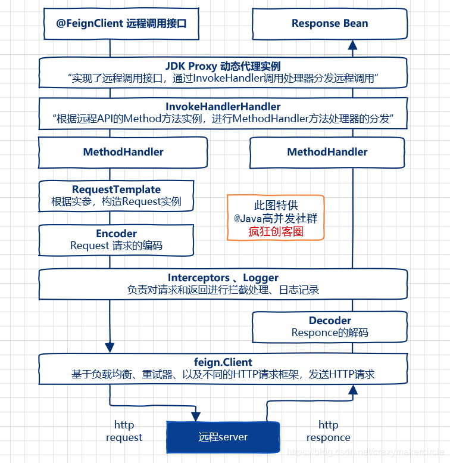

## Spring Cloud Feign 原理步骤
    a.通过主类上的EnableFeignClients注解开启FeignClient；
    b.根据Feign的规则实现接口，并加上FeignClient注解，供调用的地方注入调用；
    c.程序启动后，会扫描所有FeignClient注解的类，并将这些信息注入到IOC容器中；
    d.当b中接口被调用时，通过jdk代理，以及反射（Spring处理注解的方式），来生成具体的RequestTemplate
    e.RequestTemplate生成Request
    f.Request交给httpclient处理，这里的httpclient可以是OkHttp，也可以是HttpUrlConnection或者HttpClient
    g.最后Client被封装到LoadBalanceClient类，这个类结合Ribbon实现负载均衡
    
## Feign远程调用的基本流程
    Feign远程调用，核心就是通过一系列的封装和处理，将以JAVA注解的方式定义的远程调用API接口，最终转换成HTTP的请求形式，
    然后将HTTP的请求的响应结果，解码成JAVA Bean，返回给调用者。Feign远程调用的基本流程，大致如下图所示。
    
    从下图可以看到，Feign通过处理注解，将请求模板化，当实际调用的时候，传入参数，根据参数再应用到请求上，进而转化成真正的Request请求。
    通过Feign以及JAVA的动态代理机制，使得Java 开发人员，可以不用通过HTTP框架去封装HTTP请求报文的方式，完成远程服务的HTTP调用。

## Feign远程调用的重要组件
    在微服务启动时，Feign会进行包扫描，对加@FeignClient注解的接口，按照注解的规则，创建远程接口的本地JDK Proxy代理实例。
    然后，将这些本地Proxy代理实例，注入到Spring IOC容器中。当远程接口的方法被调用，由Proxy代理实例去完成真正的远程访问，并且返回结果。

