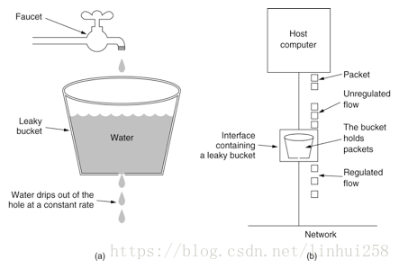
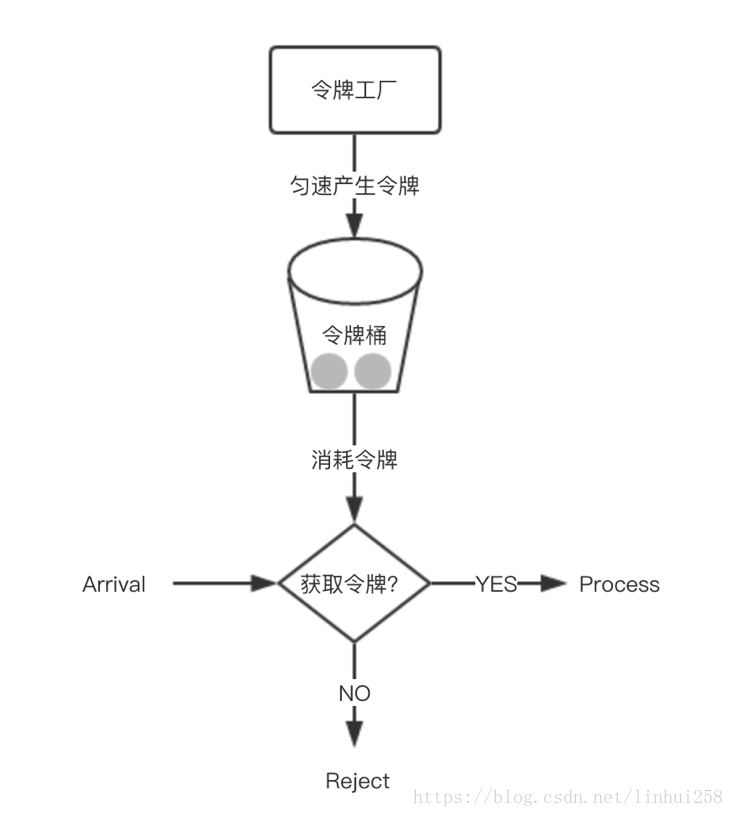

## Hystrix的现状--官方社区已死
    Hystrix 当前已经进入为维护阶段，Netflix 认为Hystrix的定位和使命在功能上，当前已经完全满足了既有的内部系统，所以后期不再有新的开发和新的特性出现。团队由于精力的原因，在Github上，不再review issue,不再接受Merge request,也不再发布新的版本，版本定格在1.5.8。

## 简介
    Hystrix是Netflix开源的一款容错系统，能帮助使用者写出具备强大的容错能力和鲁棒性的程序。

    在分布式环境中，不可避免地有许多服务依赖将失败，尤其现在流行的微服务。 Hystrix是一个库，可以通过线程隔离、熔断、服务降级等措施来帮助您控制这些分布式服务之间的交互。
> Hystrix可以做到以下事情：

* 通过控制延迟和故障来保障第三方服务调用的可靠性
* 在复杂的分布式系统中防止级联故障，防止雪崩
* 快速失败、快速恢复
* 优雅降级
* 提供近时时监控、报警和操作控制

> 为什么用Hystrix？什么情况下用？

    分布式系统中，或者说微服务，各个系统错综复杂，一个系统依赖的服务比较多，而且会有多级依赖。当其中某一个服务出现问题，在高并发的情况下都有可能导致整个系统的瘫痪，蝴蝶效应在这里表现明显。
    也许你会问为什么会这样？如上图，假如服务I出现较严重延迟，这时上层应用访问量tps比较大时， 首先上层应用资源会被占满，并且一般网络请求（http/rpc）都有重试机制，服务I的压力会更大，严重时则会导致应用宕机。

> Hystrix处理流程

>> Hystrix整个工作流程如下：

* 构造一个 HystrixCommand或HystrixObservableCommand对象，用于封装请求，并在构造方法配置请求被执行需要的参数；
* 执行命令，Hystrix提供了4种执行命令的方法，后面详述；
* 判断是否使用缓存响应请求，若启用了缓存，且缓存可用，直接使用缓存响应请求。Hystrix支持请求缓存，但需要用户自定义启动；
* 判断熔断器是否打开，如果打开，跳到第8步；
* 判断线程池/队列/信号量是否已满，已满则跳到第8步；
* 执行HystrixObservableCommand.construct()或HystrixCommand.run()，如果执行失败或者超时，跳到第8步；否则，跳到第9步；
* 统计熔断器监控指标；
* 走Fallback备用逻辑
* 返回请求响应

从流程图上可知道，第5步线程池/队列/信号量已满时，还会执行第7步逻辑，更新熔断器统计信息，而第6步无论成功与否，都会更新熔断器统计信息。

> Hystrix容错

Hystrix的容错主要是通过添加容许延迟和容错方法，帮助控制这些分布式服务之间的交互。 还通过隔离服务之间的访问点，阻止它们之间的级联故障以及提供回退选项来实现这一点，从而提高系统的整体弹性。Hystrix主要提供了以下几种容错方法：
* 资源隔离
* 熔断
* 降级

> 限流算法

>> 常见的限流算法有：计数器、漏桶、令牌桶。
>>> 计数器算法

    采用计数器实现限流有点简单粗暴，一般我们会限制一秒钟的能够通过的请求数，比如限流qps为100，算法的实现思路就是从第一个请求进来开始计时，在接下去的1s内，每来一个请求，就把计数加1，如果累加的数字达到了100，那么后续的请求就会被全部拒绝。等到1s结束后，把计数恢复成0，重新开始计数。
    具体的实现可以是这样的：对于每次服务调用，可以通过 AtomicLong#incrementAndGet()方法来给计数器加1并返回最新值，通过这个最新值和阈值进行比较。
    这种实现方式，相信大家都知道有一个弊端：如果我在单位时间1s内的前10ms，已经通过了100个请求，那后面的990ms，只能眼巴巴的把请求拒绝，我们把这种现象称为“突刺现象”

>>> 漏桶算法

    为了消除"突刺现象"，可以采用漏桶算法实现限流，漏桶算法这个名字就很形象，算法内部有一个容器，类似生活用到的漏斗，当请求进来时，相当于水倒入漏斗，然后从下端小口慢慢匀速的流出。不管上面流量多大，下面流出的速度始终保持不变。
    不管服务调用方多么不稳定，通过漏桶算法进行限流，每10毫秒处理一次请求。因为处理的速度是固定的，请求进来的速度是未知的，可能突然进来很多请求，没来得及处理的请求就先放在桶里，既然是个桶，肯定是有容量上限，如果桶满了，那么新进来的请求就丢弃。
    在算法实现方面，可以准备一个队列，用来保存请求，另外通过一个线程池定期从队列中获取请求并执行，可以一次性获取多个并发执行。
    这种算法，在使用过后也存在弊端：无法应对短时间的突发流量。

>>> 令牌桶算法

    从某种意义上讲，令牌桶算法是对漏桶算法的一种改进，桶算法能够限制请求调用的速率，而令牌桶算法能够在限制调用的平均速率的同时还允许一定程度的突发调用。
    在令牌桶算法中，存在一个桶，用来存放固定数量的令牌。算法中存在一种机制，以一定的速率往桶中放令牌。每次请求调用需要先获取令牌，只有拿到令牌，才有机会继续执行，否则选择等待可用的令牌、或者直接拒绝。
    放令牌这个动作是持续不断的进行，如果桶中令牌数达到上限，就丢弃令牌，所以就存在这种情况，桶中一直有大量的可用令牌，这时进来的请求就可以直接拿到令牌执行，比如设置qps为100，那么限流器初始化完成一秒后，桶中就已经有100个令牌了，这时服务还没完全启动好，等启动完成对外提供服务时，该限流器可以抵挡瞬时的100个请求。所以，只有桶中没有令牌时，请求才会进行等待，最后相当于以一定的速率执行。
   

> 总结

* Hystrix 是基于单机应用的熔断限流框架
* 根据熔断器的滑动窗口判断当前请求是否可以执行
* 线程竞争实现“半关闭”状态，拿一个请求试试是否可以关闭熔断器
* 线程池隔离将请求丢到线程池中运行，限流依靠线程池拒绝策略
* 信号量隔离在当前线程中运行，限流依靠并发请求数
* 当信号量竞争失败/线程池队列满，就进入限流模式，执行 Fallback
* 当熔断器开启，就熔断请求，执行 Fallback
* 整个框架采用的 RxJava 的编程模式，回调函数满天飞