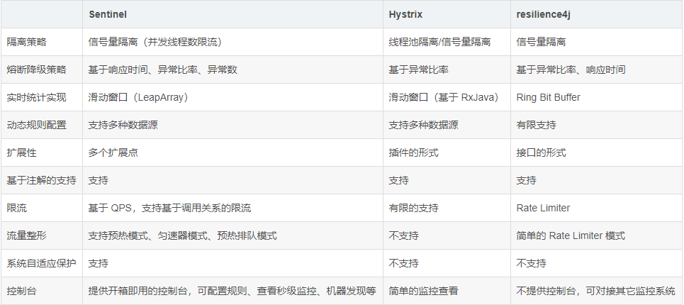

## Sentinel 简介
    是阿里巴巴开源的一款断路器实现，目前在Spring Cloud的孵化器项目Spring Cloud Alibaba中，预计Spring Cloud H系列中可以孵化完成。
    尽管Sentinel尚未在Spring Cloud项目中孵化完成，但Sentinel本身在阿里内部已经被大规模采用，非常稳定。因此可以作为一个较好的替代品。

## 常见的限流方式
    限制总并发数（如数据库连接池、线程池）、
    限制瞬时并发数（nginx的limit_conn模块，用来限制瞬时并发连接数）、
    限制时间窗口内的平均速率（如Guava的RateLimiter、nginx的limit_req模块，限制每秒的平均速率）；
    其他的还有限制远程接口调用速率、限制MQ的消费速率。另外还可以根据网络连接数、网络流量、CPU或内存负载等来限流。
    
## 服务熔断和服务降级的区别
    1.服务熔断：假设服务宕机或者在单位时间内调用服务失败的次数过多，即服务降级的次数太多，
    那么则服务熔断。 并且熔断以后会跳过正常的方法，会直接调用fallback方法，即所谓“服务熔断后不可用”。 
    类似于家里常见的保险丝，当达到最大服务访问后，会直接拒绝访问，拉闸限电，然后调用服务降级的fallback方法，返回友好提示。
    
    2.服务降级：不管在什么情况下，服务降级的流程都是先调用正常的方法，再调用fallback的方法。 
    也就是服务器繁忙，请稍后再试，不让客户端等待并立刻返回一个友好提示。
    
