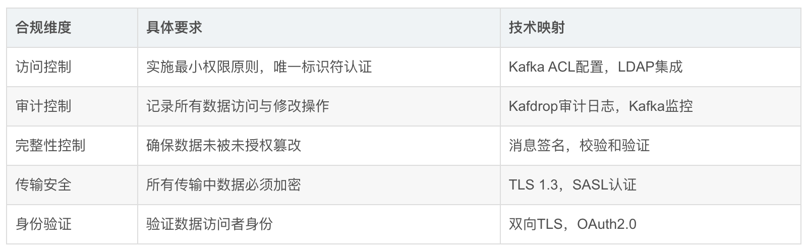

## datax简介
DataX二次开发——新增hivereader、hivewriter

## Datastage和Informatica介绍
    Datastage IBM公司的商业软件,最专业的ETL工具,价格不菲,适合大规模的ETL应用。
    Informatica 商业软件,相当专业的ETL工具.价格上比Datastage便宜一点,适合大规模的ETL应用。

## HIPAA
    （Health Insurance Portability and Accountability Act）健康保险流通与责任法案
    HIPAA对医疗数据处理的核心要求

## HIPAA与GDPR的核心要求
    HIPAA（美国健康保险可移植性和责任法案）
    HIPAA 主要针对医疗数据的隐私和安全，其核心要求包括：
    
    访问控制：仅授权用户访问受保护的健康信息（PHI）。
    数据加密：传输和存储中的 PHI 必须加密。
    审计日志：记录所有对 PHI 的访问和操作。
    
    GDPR（通用数据保护条例）
    GDPR 的核心原则包括：
    
    数据最小化：仅收集和处理完成特定目的所必需的数据。
    透明性：向数据主体明确说明数据的用途。
    用户同意：处理个人数据需获得用户的明确同意。