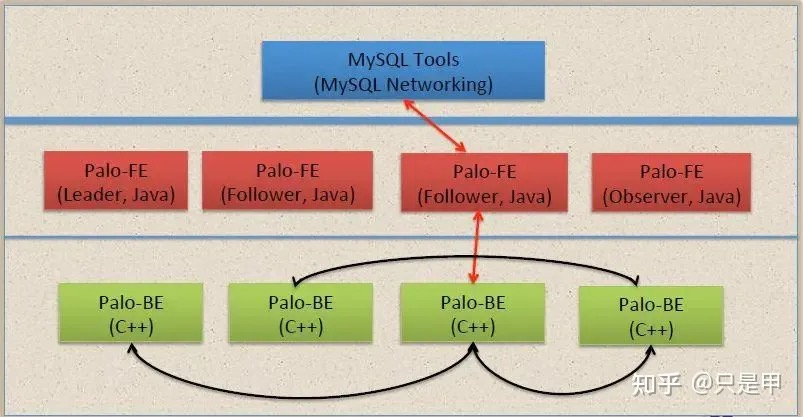
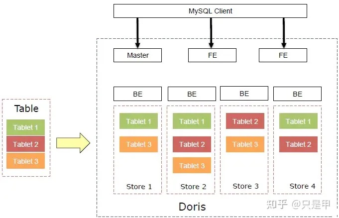
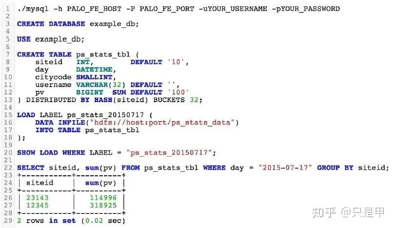
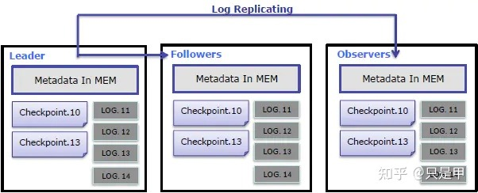
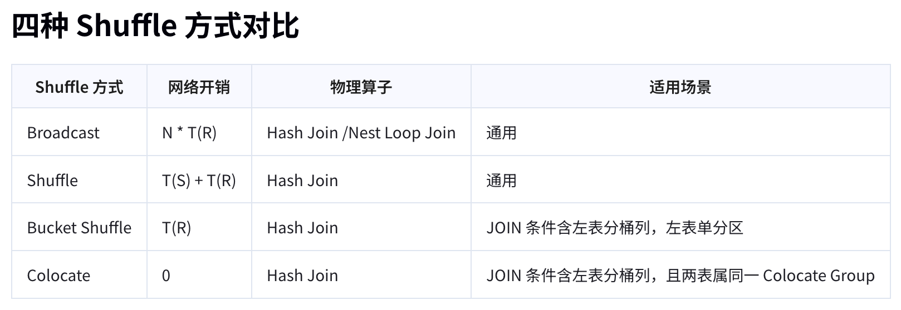

## Doris简介
    Apache Doris是一个基于MPP架构的高性能、实时分析型数据库，以极速易用的特点被人们所熟知，
    仅需亚秒级响应时间即可返回海量数据下的查询结果，不仅可以支持高并发的点查询场景，也能支持高吞吐的复杂分析场景。
    基于此，Apache Doris能够较好的满足报表分析、即席查询、统一数仓构建、数据湖联邦查询加速等使用场景，
    用户可以在此之上构建用户行为分析、AB实验平台、日志检索分析、用户画像分析、订单分析等应用。

### 使用场景

### Doris整体架构

    Doris的整体架构和TiDB类似，借助MySQL协议，用户使用任意MySQL的ODBC/JDBC以及MySQL的客户端，
    都可以直接访问Doris。Doris中的模块包括FE和BE两类：FE主要负责元数据的管理、存储，以及查询的解析等；
    一个用户请求经过FE解析、规划后，具体的执行计划会发送给BE，BE则会完成查询的具体执行。
    BE节点主要负责数据的存储、以及查询计划的执行。目前平台的FE部分主要使用Java，BE部分主要使用C++。

### Doris数据分布

    如果从表的角度来看数据结构，用户的一张Table会拆成多个Tablet，Tablet会存成多副本，存储在不同的BE中，
    从而保证数据的高可用和高可靠。

### Doris的使用方式
    Doris的使用方式和MySQL类似，创建database，创建table，导入数据、执行查询等。

### Doris数据可靠性
    元数据使用Memory+Checkpoint+Journal (分别是什么？)，使用BTBJE(类似于Raft)协议实现高可用性和高可靠性。
    Doris内部自行管理数据的多副本和自动修复。保证数据的高可用、高可靠。在服务器宕机的情况下，服务依然可用，数据也不会丢失。

### 支持MPP
    MPP即Massively Parallel Processing，大规模并行处理，即海量数据并发查询。

### Kafka消息队列加载-类似clickhouse
    Doris内部支持订阅Kafka数据流，实现直接对接Kafka：
    用户数据源经Kafka消息队列收集后，可以依次进入到Doris中，通过Doris做报表展示和决策分析等工作。

### Doris其他特性
    原子性——即一批数据要么都生效，要么都不生效。
    支持单机多盘
    向量化执行
    UDF (User Defined Function用户自定义函数)
    内置HLL类型，快速计算UV

### 核心特性
    支持高并发的点查询和复杂的大吞吐查询
    支持事务和幂等性导入数据
    Doris的join性能比较好，ck的单表查询性能好。

### Clickhouse VS Doris
    ck优点：
    查询速度快，利用多核并行处理单个查询

    列式存储+压缩，节省空间
    内置数较多（例如IP转化，URL分析等，预估计算/HyperLoglog等）；
   
    缺点：
    不支持事务
    不支持UPDATE/DELETE操作
    聚合结果必须小于一台机器的内存大小，否则失败
   
    比较
    Doris支持Array，Clickhouse支持Array/嵌套类型/枚举类型等。
    Doris支持事务和幂等性导入数据，Clickhouse不支持。
    Doris的join性能比较好，Clickhouse的单表查询性能好。

### 技术选型
    Doris更优的方面
    1.使用更简单，如建表更简单，SQL标准支持更好，Join性能更好，导数功能更强大
    2.运维更简单，如灵活的扩缩容能力，故障节点自动恢复，社区提供的支持更好
    3.分布式更强，支持事务和幂等性导入数据，物化视图自动聚合，查询自动路由，全面元数据管理

    ClickHouse更优的方面
    1.性能更佳，导入性能和单表查询性能更好，同时可靠性更好
    2.功能丰富，非常多的表引擎，更多类型和函数支持，更好的聚合函数以及庞大的优化参数选项
    3.集群管理工具更多，更好多租户和配额管理，灵活的集群管理，方便的集群间迁移工具

    那么两者之间如何选择呢？
    1.业务场景复杂数据规模巨大，希望投入研发力量做定制开发，选ClickHouse
    2.希望一站式的分析解决方案，少量投入研发资源，选择Doris

### Doris中的JOIN物理实现(doris为什么join性能好)
    Doris支持两种JOIN的物理实现方式：Hash Join和Nest Loop Join。
    Hash Join： 在右表上根据等值JOIN列构建一个哈希表，左表的数据以流式方式通过该哈希表进行JOIN计算。
    这种方法的局限性在于它仅适用于等值JOIN条件的情况。
    Nest Loop Join： 通过两层循环，以左表驱动，对左表的每一行逐一遍历右表的每一行，进行join条件判断。
    适用于所有JOIN场景，包括处理Hash Join无法胜任的情况，比如涉及大于或小于比较条件的查询，
    或是需要执行笛卡尔积运算的场景。但相比Hash Join，Nest Loop Join在性能上可能会有所不及。

    Doris Hash Join的实现方式
    作为分布式MPP数据库，Apache Doris在Hash Join过程中需要进行数据的Shuffle，进行拆分调度，以确保JOIN结果的正确性。以下是几种数据Shuffle方式：
    Broadcast Join(广播)
    Partition Shuffle Join(分区)
    Bucket Shuffle Join(分桶)
    Colocate Join(共置)

### Doris监控和告警
    可以使用Prometheus和Grafana进行监控和采集

