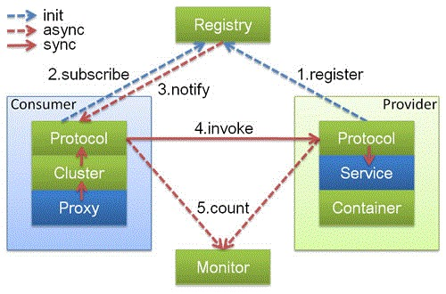
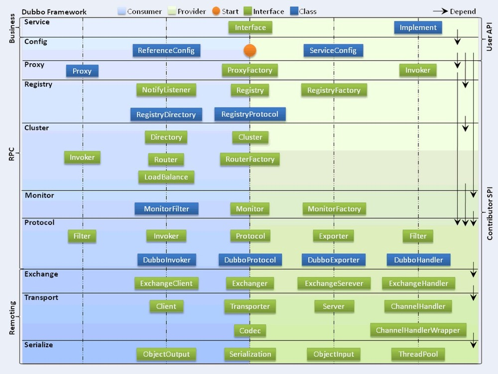

## SPI机制
> JDK SPI和Dubbo SPI的区别：

    JDK SPI会一次性实例化所有配置的实例：如果某些实例在程序中并不需要，那将会是极大的浪费。Dubbo SPI只会实例化需要的类。
    Dubbo SPI还支持IOC（注入其他的实例）
    Dubbo SPI的灵活性更强，功能也更加强大。

    dubbo在原有的spi基础上主要有以下的改变,
    1.配置文件采用键值对配置的方式，使用起来更加灵活和简单 
    2.增强了原本SPI的功能，使得SPI具备ioc和aop的功能，这在原本的java中spi是不支持的。
    dubbo的spi是通过ExtensionLoader来解析的，通过ExtensionLoader来加载指定的实现类，配置文件的路径在META-INF/dubbo路径下

    jdk SPI使用ServiceLoader.load()
    Dubbo SPI使用ExtensionLoader解析

> dubbo注册源码分析
> 负载均衡
> 序列化

## Dubbo的底层实现原理和机制
    Dubbo是一个RPC框架，SOA框架
    Dubbo缺省协议采用单一长连接和NIO异步通讯，适合于小数据量大并发的服务调用，以及服务消费者机器数远大于服务提供者机器数的情况。
    
    作为RPC：支持各种传输协议，如dubbo,hession,json,fastjson，底层采用mina,netty长连接进行传输！典型的provider和cusomer模式
    作为SOA：具有服务治理功能，提供服务的注册和发现！用zookeeper实现注册中心！启动时候服务端会把所有接口注册到注册中心，
    并且订阅configurators,服务消费端订阅provide，configurators,routers,订阅变更时，zk会推送providers,configuators，routers,
    启动时注册长连接，进行通讯！proveider和cusomer启动后，后台启动定时器，发送统计数据到monitor（监控中心）！
    提供各种容错机制和负载均衡策略！
    
## 服务调用

    上图中，蓝色的表示与业务有交互，绿色的表示只对Dubbo内部交互。上述图所描述的调用流程如下：
    
    1.服务提供方发布服务到服务注册中心；
    2.服务消费方从服务注册中心订阅服务；
    3.服务消费方调用已经注册的可用服务；
    4.节点角色说明：
    
    Provider: 暴露服务的服务提供方。
    Consumer: 调用远程服务的服务消费方。
    Registry: 服务注册与发现的注册中心。
    Monitor: 统计服务的调用次调和调用时间的监控中心。
    Container: 服务运行容器。
    
    调用关系说明：
    0. 服务容器负责启动，加载，运行服务提供者。
    1. 服务提供者在启动时，向注册中心注册自己提供的服务。
    2. 服务消费者在启动时，向注册中心订阅自己所需的服务。
    3. 注册中心返回服务提供者地址列表给消费者，如果有变更，注册中心将基于长连接推送变更数据给消费者。
    4. 服务消费者，从提供者地址列表中，基于软负载均衡算法，选一台提供者进行调用，如果调用失败，再选另一台调用。
    5. 服务消费者和提供者，在内存中累计调用次数和调用时间，定时每分钟发送一次统计数据到监控中心。
    
## 协议支持
    Dubbo支持多种协议，如下所示：
    
    Dubbo协议
    Hessian协议
    HTTP协议
    RMI协议
    WebService协议
    Thrift协议
    Memcached协议
    Redis协议
    
## 总体架构

    Dubbo框架设计一共划分了10个层，最上面的Service层是留给实际想要使用Dubbo开发分布式服务的开发者实现业务逻辑的接口层。
    图中左边淡蓝背景的为服务消费方使用的接口，右边淡绿色背景的为服务提供方使用的接口， 位于中轴线上的为双方都用到的接口。
    下面，结合Dubbo官方文档，我们分别理解一下框架分层架构中，各个层次的设计要点：
    
    1.服务接口层（Service）：该层是与实际业务逻辑相关的，根据服务提供方和服务消费方的业务设计对应的接口和实现。
    2.配置层（Config）：对外配置接口，以ServiceConfig和ReferenceConfig为中心，可以直接new配置类，也可以通过spring解析配置生成配置类。
    3.服务代理层（Proxy）：服务接口透明代理，生成服务的客户端Stub和服务器端Skeleton，以ServiceProxy为中心，扩展接口为ProxyFactory。
    4.服务注册层（Registry）：封装服务地址的注册与发现，以服务URL为中心，扩展接口为RegistryFactory、Registry和RegistryService。可能没有服务注册中心，此时服务提供方直接暴露服务。
    5.集群层（Cluster）：封装多个提供者的路由及负载均衡，并桥接注册中心，以Invoker为中心，扩展接口为Cluster、Directory、Router和LoadBalance。将多个服务提供方组合为一个服务提供方，实现对服务消费方来透明，只需要与一个服务提供方进行交互。
    6.监控层（Monitor）：RPC调用次数和调用时间监控，以Statistics为中心，扩展接口为MonitorFactory、Monitor和MonitorService。
    7.远程调用层（Protocol）：封将RPC调用，以Invocation和Result为中心，扩展接口为Protocol、Invoker和Exporter。Protocol是服务域，它是Invoker暴露和引用的主功能入口，它负责Invoker的生命周期管理。Invoker是实体域，它是Dubbo的核心模型，其它模型都向它靠扰，或转换成它，它代表一个可执行体，可向它发起invoke调用，它有可能是一个本地的实现，也可能是一个远程的实现，也可能一个集群实现。
    8.信息交换层（Exchange）：封装请求响应模式，同步转异步，以Request和Response为中心，扩展接口为Exchanger、ExchangeChannel、ExchangeClient和ExchangeServer。
    9.网络传输层（Transport）：抽象mina和netty为统一接口，以Message为中心，扩展接口为Channel、Transporter、Client、Server和Codec。
    10.数据序列化层（Serialize）：可复用的一些工具，扩展接口为Serialization、 ObjectInput、ObjectOutput和ThreadPool。

## 负载均衡算法
    1、轮询法
    将请求按顺序轮流地分配到后端服务器上，它均衡地对待后端的每一台服务器，而不关心服务器实际的连接数和当前的系统负载。
    
    2、随机法
    通过系统的随机算法，根据后端服务器的列表大小值来随机选取其中的一台服务器进行访问。由概率统计理论可以得知，随着客户端调用服务端的次数增多，
    其实际效果越来越接近于平均分配调用量到后端的每一台服务器，也就是轮询的结果。
    
    3、源地址哈希法
    源地址哈希的思想是根据获取客户端的IP地址，通过哈希函数计算得到的一个数值，
    用该数值对服务器列表的大小进行取模运算，得到的结果便是客户端要访问服务器的序号。
    采用源地址哈希法进行负载均衡，同一IP地址的客户端，当后端服务器列表不变时，它每次都会映射到同一台后端服务器进行访问。
    
    4、加权轮询法
    不同的后端服务器可能机器的配置和当前系统的负载并不相同，因此它们的抗压能力也不相同。
    给配置高、负载低的机器配置更高的权重，让其处理更多的请；而配置低、负载高的机器，给其分配较低的权重，
    降低其系统负载，加权轮询能很好地处理这一问题，并将请求顺序且按照权重分配到后端。
    
    5、加权随机法
    与加权轮询法一样，加权随机法也根据后端机器的配置，系统的负载分配不同的权重。
    不同的是，它是按照权重随机请求后端服务器，而非顺序。
    
    6、最小连接数法
    最小连接数算法比较灵活和智能，由于后端服务器的配置不尽相同，对于请求的处理有快有慢，它是根据后端服务器当前的连接情况，动态地选取其中当前
    积压连接数最少的一台服务器来处理当前的请求，尽可能地提高后端服务的利用效率，将负责合理地分流到每一台服务器。
