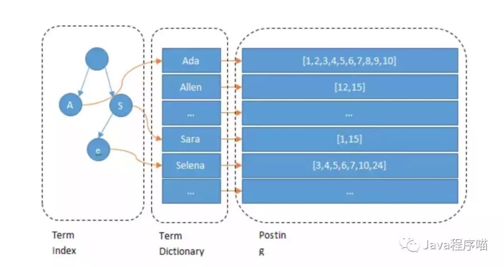

## Elasticsearch为什么这么快
    倒排索引的数据结构

    如上图所示：
    Lucene 的倒排索，增加了最左边的一层「字典树」term index，它不存储所有的单词，只存储单词前缀，通过字典树找到单词所在的块，
    也就是单词的大概位置，再在块里二分查找，找到对应的单词，再找到单词对应的文档列表。

    Term Index以树的形式保存在内存中，运用了FST（finite state transducers）+压缩公共前缀方法极大的节省了内存，
    通过Term Index查询到Term Dictionary所在的block再去磁盘上找term减少了IO次数
    
    Term Dictionary排序后通过二分法将检索的时间复杂度从原来N降低为logN
    
    详细 
    https://mp.weixin.qq.com/s?__biz=MzAxNjEyMjUyNg==&mid=2247483665&idx=1&sn=ab34e6b5094b21551791714f3451ff1d&chksm=9bf8d6e0ac8f5ff6b4f7bd9af7d6a76c5628a1321276df1cf55070c8d9246fedcafc24a6db8c&mpshare=1&scene=1&srcid=&sharer_sharetime=1584977319252&sharer_shareid=65022ec60cc63b548026c0fc9296ef1a&exportkey=AQCKC4gsVg%2buNtumlY1vVrA=&pass_ticket=vrjYoZ5rRmNJaLRTHI%2bWsnhqdTnYwpdj/gCZ19JosjQ6Y5TWTAueutylYUj7FiNQ#rd