## Flink编程模型
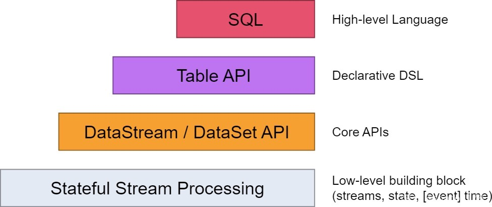

    Flink编程API有DataStream、DataSet、Table、SQL，每种API的抽象级别如图所示。
    最底层的Stateful Stream Processing是flink内部核心API，一般我们不会用到。
    之上就是我们常用的DataStream和DataSet API，分别代表流式和批处理的API，但随着Flink的批流一体，
    已经基本都是用DataStream来代替DataSet来使用了。在此之上就是Table API，可以像操作数据库表一样来进行关联、
    统计、聚合等操作。最上层就是我们比较熟悉的SQL语句了，可以用简单的SQL语句完成数据的处理操作

## Flink Join实现

## Flink实现了高吞吐，低延迟，高性能兼具实时流式计算框架。

## flink实时数仓优势
    丰富的API，Flink提供极为丰富的多层次API，包括Stream API、Table API及Flink SQL；
    生态完善，实时数仓的用途广泛，Flink支持多种存储（HDFS、ES、Hbase等）；
    批流一体，Flink已经在将流计算和批计算的API进行统一。

## flink应用于场景：
    我们在选择一个新的技术框架的时候，首先考虑的是他的应用场景，
    再牛逼的框架没有应用场景也是一无是处，当然牛逼的框架大多都是基于某一个或者
    某一类应用场景而产生，而flink主要应用于以下三个场景

>> 事件驱动型应用
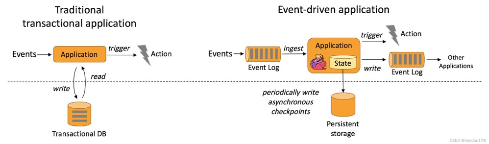
根据到来的数据和事件条件触发计算的流程操作。

    定义：事件驱动型应用是一类具有状态的应用，该应用会根据事件流中的事件触发计算、更新状态或进行外部系统操作。
    关键词：事件 ---->状态---->外部系统
    每条数据（事件）触发变化
    例如：金融反欺诈，实施推荐，实施规则报警
  
>> 数据分析型应用
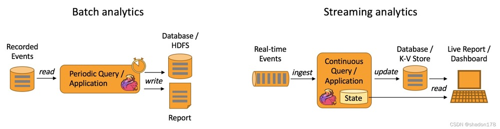
流式计算和批处理
 
    数据分析型应用是从原始数据中提取有价值的信息和指标，关键词：原始数据（集）、提取（过滤分析）
    它的主要应用在于对数据集进行操作，重在分析
    典行的数据分析型应用比如今年的疫情，我们会统计每天每地上传的信息，然后展示在包括支付宝等平台。

>> 数据管道ETL
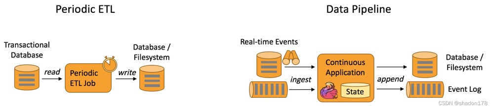
也是我们常说的ETL工具，也是目前我做数据抽取经常用到的工具。

## 事件驱动型应用和数据分析型应用有何本质区别？
    数据触发计算会派发新的动作（状态/消息）
    数据只是分析不派生新的动作（只是输出结果）
    
## 为什么要选择Flink
	Hadoop-MapReduce - 离线计算，吞吐量很大，但是计算时间就很长。
	Spark： 流批统一的计算框架。
	Spark与Flink
			两者都是流批统一的计算框架
			Spark是以小批量的方式来处理流式数据。
			Flink是以流式数据的方式来处理批量数据。
			
## Flink中的窗口和时间
    窗口和时间是Flink中的核心概念之一。在实际生产环境中，对数据流上的聚合需要由窗口来划定范围，
    比如“计算过去的5分钟”或者“最后100个元素的和”。

    Flink支持了多种窗口模型比如滚动窗口（Tumbling Window）、滑动窗口（Sliding Window）及会话窗口（Session Window）等。

    下图展示了 Flink 支持的多种窗口模型：
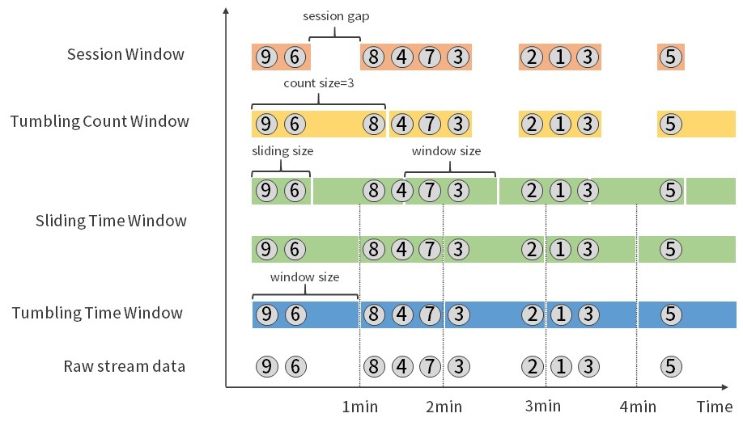

    同时，Flink支持了事件时间（Event Time）、摄取时间（Ingestion Time）和处理时间（Processing Time）
    三种时间语义用来满足实际生产中对于时间的特殊需求。
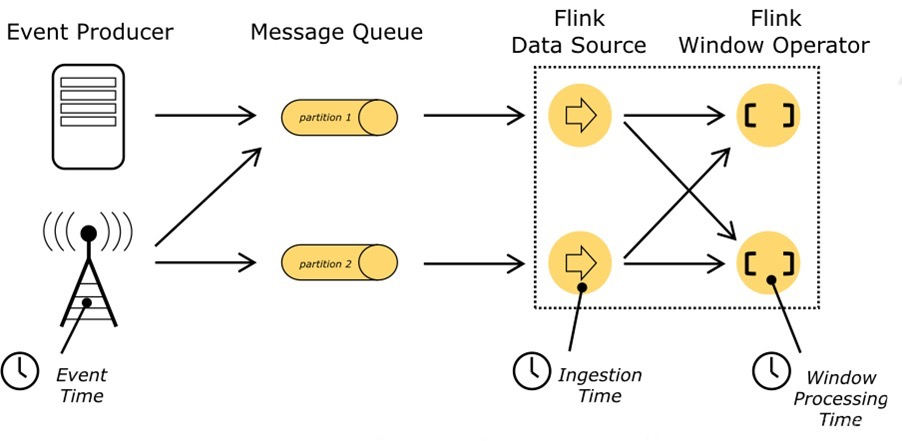

    Flink自身还支持了有状态的算子操作、容错机制、Checkpoint、Exactly-once语义等更多高级特性，
    来支持用户在不同的业务场景中的需求。
    
## Flink处理乱序数据（watermark + allowLateNess + sideOutPut）
    watermark本质上是一个时间戳，且是动态变化的，会根据当前最大（新）事件时间产生。
    watermark = 进入Flink窗口的最大的事件时间(maxEventTime)— 指定的延迟时间(t)
    
    allowLateNess是将窗口关闭时间再延迟一段时间。
    sideOutPut是最后兜底操作，当指定窗口已经彻底关闭后，就会把所有过期延迟数据放到侧输出流，让用户决定如何处理。
    
## Flink的Checkpoint详解-保证数据的在分布式环境下的一致性
    当一个任务在运行过程中出现故障时，可以根据Checkpoint的信息恢复到故障之前的某一状态，
    然后从该状态恢复任务的运行。 在Flink中，Checkpoint机制采用的是chandy-lamport（分布式快照）算法，
    通过Checkpoint机制，保证了Flink程序内部的Exactly Once语义。
    
## flink实时数仓流图
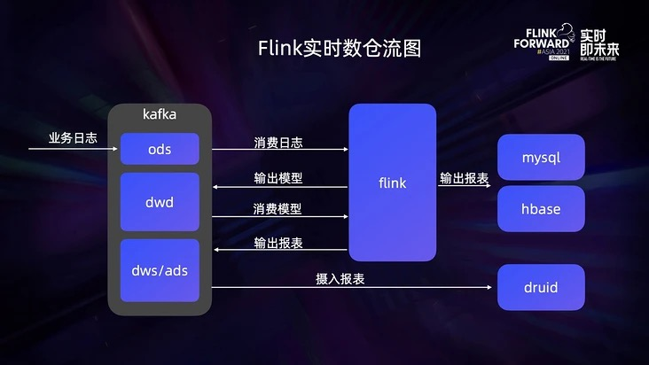

    由上图可见，ODS的业务日志收集到Kafka中，Flink从Kafka中消费业务日志，清洗处理后将业务模型再回写到Kafka中。
    然后再基于Flink去消费Kafka中的模型，提取维度和指标，统计后输出报表。有些报表会直接写到sql或HBase中，
    还有一些报表会回写到Kafka中，再由Druid从Kafka中主动摄取这部分报表数据。
    在整个数据流图中Flink是核心的计算引擎，负责清洗日志、统计报表。
    
## flink如何管理内存
    Flink 并不是将大量对象存在堆上，而是将对象都序列化到一个预分配的内存块上，这个内存块叫做 MemorySegment。
    此外，Flink 大量的使用了堆外内存。如果需要处理的数据超出了内存限制，则会将部分数据存储到硬盘上。
    Flink 为了直接操作二进制数据实现了自己的序列化框架。

    Flink 中的 Worker 名叫 TaskManager，是用来运行用户代码的 JVM 进程。TaskManager 的堆内存主要被分成了三个部分：
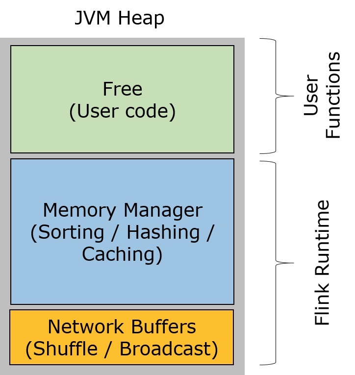

    Network Buffers: 一定数量的32KB大小的 buffer，主要用于数据的网络传输。在 TaskManager 启动的时候就会分配。默认数量是 2048 个，可以通过 taskmanager.network.numberOfBuffers 来配置。（阅读这篇文章了解更多Network Buffer的管理）
    Memory Manager Pool: 这是一个由 MemoryManager 管理的，由众多MemorySegment组成的超大集合。Flink 中的算法（如 sort/shuffle/join）会向这个内存池申请 MemorySegment，将序列化后的数据存于其中，使用完后释放回内存池。默认情况下，池子占了堆内存的 70% 的大小。
    Remaining (Free) Heap: 这部分的内存是留给用户代码以及 TaskManager 的数据结构使用的。因为这些数据结构一般都很小，所以基本上这些内存都是给用户代码使用的。从GC的角度来看，可以把这里看成的新生代，也就是说这里主要都是由用户代码生成的短期对象。

    注意：Memory Manager Pool 主要在Batch模式下使用。在Steaming模式下，该池子不会预分配内存，也不会向该池子请求内存块。也就是说该部分的内存都是可以给用户代码使用的。不过社区是打算在 Streaming 模式下也能将该池子利用起来。
    Flink 采用类似 DBMS 的 sort 和 join 算法，直接操作二进制数据，从而使序列化/反序列化带来的开销达到最小。所以 Flink 的内部实现更像 C/C++ 而非 Java。如果需要处理的数据超出了内存限制，则会将部分数据存储到硬盘上。如果要操作多块MemorySegment就像操作一块大的连续内存一样，Flink会使用逻辑视图（AbstractPagedInputView）来方便操作。

## Flink 内存管理有以下几点好处
    减少GC压力
    避免了OOM
    节省内存空间
    高效的二进制操作 & 缓存友好的计算

## Flink如何隔离多个作业任务
    Flink使用Slot来隔离多个作业任务。TaskManager将计算资源划分为多个Slot,每个Slot独享给其分配的计算资源(如内存)，这种静态的资源管理方式有利于任务间的资源隔离。
    TaskManager可以配置成单Slot模式，这样这个worker上运行的任务就独占了整个JVM进程；同一个JVM进程上的多个任务可以共享TCP连接、心跳和数据。
    Flink不允许属于同一个作业的任务共享同一个slot,但允许属于同一个作业的不同任务共享同一个Slot。因此同一个作业的所有任务可共享一个slot。

## 大数据架构方式
    大数据架构有五种，它们分别是传统的大数据架构、流式架构、Kappa架构、Lambda架构、Unifield架构

## 基本组件栈
    Flink的软件架构遵循着分层的架构设计理念，在降低耦合度的同时，为上层用户构建Flink应用提供了丰富且友好的接口，整个架构体系分为了三层：

    API&Libraries层：提供了支持流计算和批计算的接口
    Runtime核心层：主要对上层不同接口提供基础服务，也是Flink框架的核心，支持分布式Strem作业的执行、JobGraph到ExecutionGraph的映射转换、任务调度等。将DataStream和DataSet转成统一可执行的Task Operator，达到在流式引擎下同时处理批量计算和流式计算的目的。
    物理部署层：主要设计Flink的部署方式，目前只支持多种部署方式：本地、集群、云、k8s等
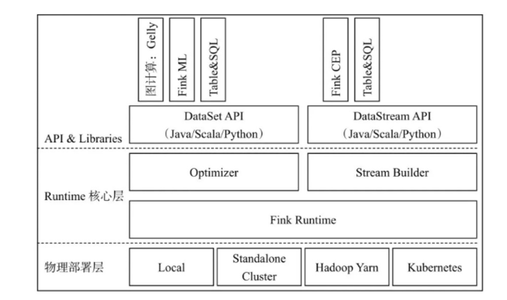

## 基本架构图
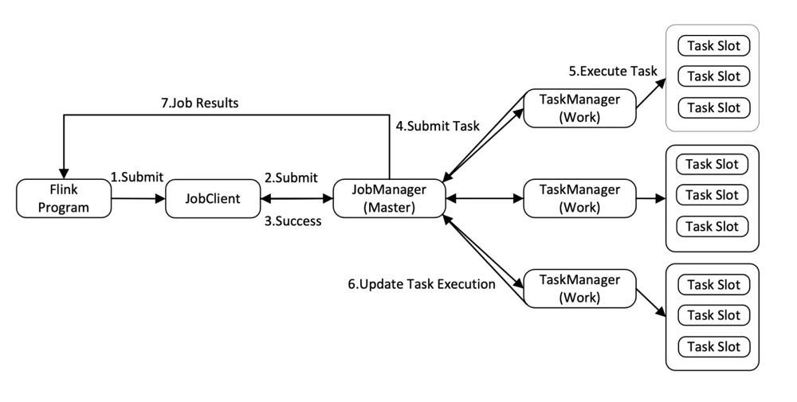
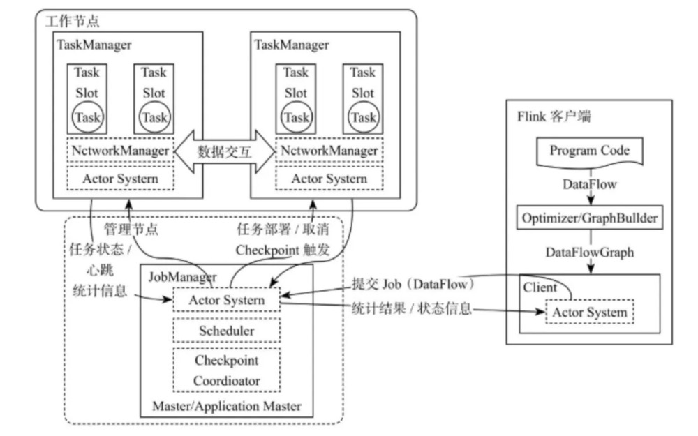

    Flink系统架构设计如上图所示，可以看出Flink整个系统主要由两个组件组成，分别为JobManager和TaskManager, 
    Flink架构也遵循Master-Slave架构设计原则， JobManager为Master节点，TaskManager为Worker（Slave）节点。
    所有组件之间的通信都是借助于Akka Framework，包括任务的状态以及Checkpoint触发等信息。

