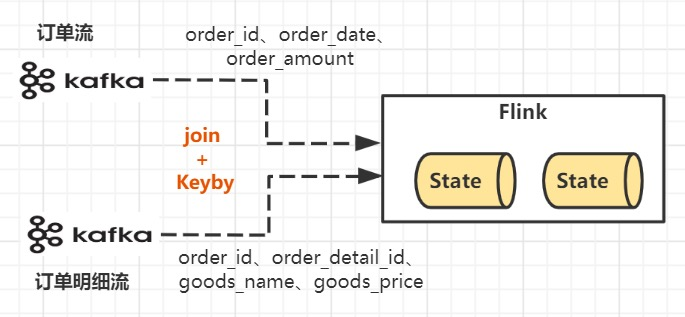
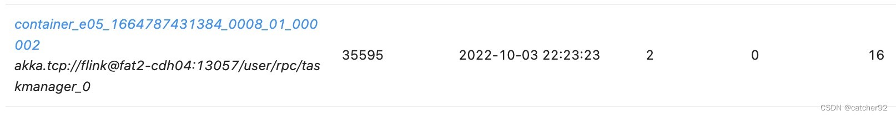
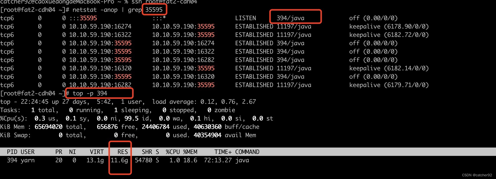
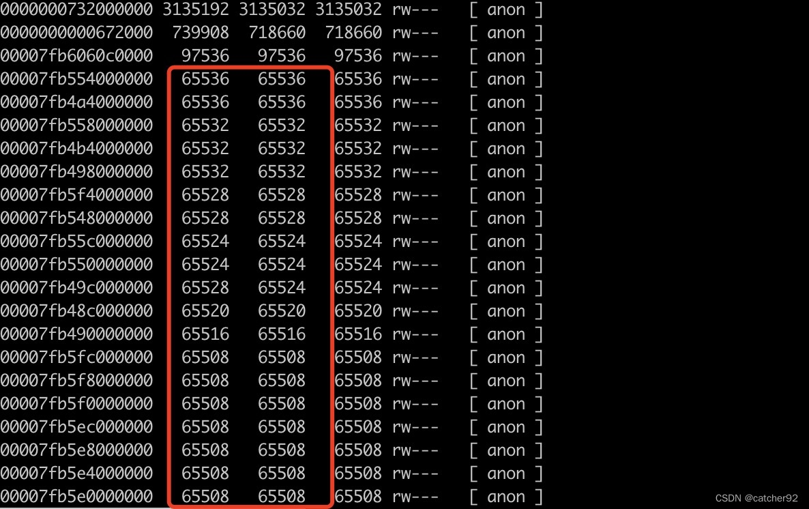
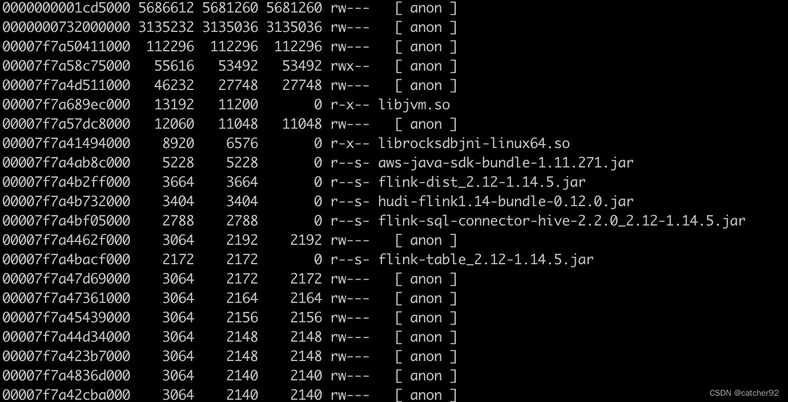

## Flink编程模型

    Flink编程API有DataStream、DataSet、Table、SQL，每种API的抽象级别如图所示。
    最底层的Stateful Stream Processing是flink内部核心API，一般我们不会用到。
    之上就是我们常用的DataStream和DataSet API，分别代表流式和批处理的API，但随着Flink的批流一体，
    已经基本都是用DataStream来代替DataSet来使用了。在此之上就是Table API，可以像操作数据库表一样来进行关联、
    统计、聚合等操作。最上层就是我们比较熟悉的SQL语句了，可以用简单的SQL语句完成数据的处理操作

## Flink Join实现机制
    Flink是通过State状态来缓存等待join的实时流
    Flink双流JOIN主要分为两大类。一类是基于原生State的Connect算子操作，另一类是基于窗口的JOIN操作。其中基于窗口的JOIN可细分为window join和interval join两种。
    实现原理：底层原理依赖Flink的State状态存储，通过将数据存储到State中进行关联join, 最终输出结果。

## Flink实现了高吞吐，低延迟，高性能兼具实时流式计算框架。

## flink实时数仓优势
    丰富的API，Flink提供极为丰富的多层次API，包括Stream API、Table API及Flink SQL；
    生态完善，实时数仓的用途广泛，Flink支持多种存储（HDFS、ES、Hbase等）；
    批流一体，Flink已经在将流计算和批计算的API进行统一。

## flink应用于场景：
    我们在选择一个新的技术框架的时候，首先考虑的是他的应用场景，
    再牛逼的框架没有应用场景也是一无是处，当然牛逼的框架大多都是基于某一个或者
    某一类应用场景而产生，而flink主要应用于以下三个场景

>> 事件驱动型应用

根据到来的数据和事件条件触发计算的流程操作。

    定义：事件驱动型应用是一类具有状态的应用，该应用会根据事件流中的事件触发计算、更新状态或进行外部系统操作。
    关键词：事件 ---->状态---->外部系统
    每条数据（事件）触发变化
    例如：金融反欺诈，实时推荐，实施规则报警
  
>> 数据分析型应用

流式计算和批处理
 
    数据分析型应用是从原始数据中提取有价值的信息和指标，关键词：原始数据（集）、提取（过滤分析）
    它的主要应用在于对数据集进行操作，重在分析
    典行的数据分析型应用比如今年的疫情，我们会统计每天每地上传的信息，然后展示在包括支付宝等平台。

>> 数据管道ETL

也是我们常说的ETL工具，也是目前我做数据抽取经常用到的工具。

## 事件驱动型应用和数据分析型应用有何本质区别？
    数据触发计算会派发新的动作（状态/消息）
    数据只是分析不派生新的动作（只是输出结果）
    
## 为什么要选择Flink
	Hadoop-MapReduce - 离线计算，吞吐量很大，但是计算时间就很长。
	Spark： 流批统一的计算框架。
	Spark与Flink
			两者都是流批统一的计算框架
			Spark是以小批量的方式来处理流式数据。
			Flink是以流式数据的方式来处理批量数据。
			
## Flink中的窗口和时间
    窗口和时间是Flink中的核心概念之一。在实际生产环境中，对数据流上的聚合需要由窗口来划定范围，
    比如“计算过去的5分钟”或者“最后100个元素的和”。

    Flink支持了多种窗口模型比如滚动窗口（Tumbling Window）、滑动窗口（Sliding Window）及会话窗口（Session Window）等。

    下图展示了 Flink 支持的多种窗口模型：

    同时，Flink支持了事件时间（Event Time）、摄取时间（Ingestion Time）和处理时间（Processing Time）
    三种时间语义用来满足实际生产中对于时间的特殊需求。

    Flink自身还支持了有状态的算子操作、容错机制、Checkpoint、Exactly-once语义等更多高级特性，
    来支持用户在不同的业务场景中的需求。
    
## Flink处理乱序数据（watermark + allowLateNess + sideOutPut）
    watermark本质上是一个时间戳，且是动态变化的，会根据当前最大（新）事件时间产生。
    watermark = 进入Flink窗口的最大的事件时间(maxEventTime)— 指定的延迟时间(t)
    
    allowLateNess是将窗口关闭时间再延迟一段时间。
    sideOutPut是最后兜底操作，当指定窗口已经彻底关闭后，就会把所有过期延迟数据放到侧输出流，让用户决定如何处理。
    
## Flink的Checkpoint详解-保证数据的在分布式环境下的一致性
    当一个任务在运行过程中出现故障时，可以根据Checkpoint的信息恢复到故障之前的某一状态，
    然后从该状态恢复任务的运行。 在Flink中，Checkpoint机制采用的是chandy-lamport（分布式快照）算法，
    通过Checkpoint机制，保证了Flink程序内部的Exactly Once语义。
    
## flink实时数仓流图

    由上图可见，ODS的业务日志收集到Kafka中，Flink从Kafka中消费业务日志，清洗处理后将业务模型再回写到Kafka中。
    然后再基于Flink去消费Kafka中的模型，提取维度和指标，统计后输出报表。有些报表会直接写到sql或HBase中，
    还有一些报表会回写到Kafka中，再由Druid从Kafka中主动摄取这部分报表数据。
    在整个数据流图中Flink是核心的计算引擎，负责清洗日志、统计报表。
    
## flink如何管理内存
    Flink并不是将大量对象存在堆上，而是将对象都序列化到一个预分配的内存块上。
    此外，Flink大量的使用了堆外内存。如果需要处理的数据超出了内存限制，则会将部分数据存储到硬盘上。
    Flink为了直接操作二进制数据实现了自己的序列化框架。

    Flink中的Worker名叫TaskManager，是用来运行用户代码的JVM进程。TaskManager的堆内存主要被分成了三个部分：

    Network Buffers: 一定数量的32KB大小的 buffer，主要用于数据的网络传输。在TaskManager启动的时候就会分配。默认数量是2048个，可以通过taskmanager.network.numberOfBuffers来配置。（阅读这篇文章了解更多Network Buffer的管理）
    Memory Manager Pool: 这是一个由 MemoryManage管理的，由众多MemorySegment组成的超大集合。Flink 中的算法（如 sort/shuffle/join）会向这个内存池申请 MemorySegment，将序列化后的数据存于其中，使用完后释放回内存池。默认情况下，池子占了堆内存的 70% 的大小。
    Remaining (Free) Heap: 这部分的内存是留给用户代码以及TaskManager的数据结构使用的。因为这些数据结构一般都很小，所以基本上这些内存都是给用户代码使用的。从GC的角度来看，可以把这里看成的新生代，也就是说这里主要都是由用户代码生成的短期对象。

    注意：Memory Manager Pool主要在Batch模式下使用。在Steaming模式下，该池子不会预分配内存，也不会向该池子请求内存块。也就是说该部分的内存都是可以给用户代码使用的。不过社区是打算在Streaming模式下也能将该池子利用起来。
    Flink采用类似DBMS的sort和join算法，直接操作二进制数据，从而使序列化/反序列化带来的开销达到最小。所以Flink的内部实现更像C/C++而非Java。如果需要处理的数据超出了内存限制，则会将部分数据存储到硬盘上。如果要操作多块MemorySegment就像操作一块大的连续内存一样，Flink会使用逻辑视图（AbstractPagedInputView）来方便操作。

## Flink 内存管理有以下几点好处
    减少GC压力
    避免了OOM
    节省内存空间
    高效的二进制操作 & 缓存友好的计算

## Flink如何隔离多个作业任务
    Flink使用Slot来隔离多个作业任务。TaskManager将计算资源划分为多个Slot,每个Slot独享给其分配的计算资源(如内存)，这种静态的资源管理方式有利于任务间的资源隔离。
    TaskManager可以配置成单Slot模式，这样这个worker上运行的任务就独占了整个JVM进程；同一个JVM进程上的多个任务可以共享TCP连接、心跳和数据。
    Flink不允许属于同一个作业的任务共享同一个slot,但允许属于同一个作业的不同任务共享同一个Slot。因此同一个作业的所有任务可共享一个slot。

## 大数据架构方式
    大数据架构有五种，它们分别是传统的大数据架构、流式架构、Kappa架构、Lambda架构、Unifield架构

## 基本组件栈
    Flink的软件架构遵循着分层的架构设计理念，在降低耦合度的同时，为上层用户构建Flink应用提供了丰富且友好的接口，整个架构体系分为了三层：

    API&Libraries层：提供了支持流计算和批计算的接口
    Runtime核心层：主要对上层不同接口提供基础服务，也是Flink框架的核心，支持分布式Strem作业的执行、JobGraph到ExecutionGraph的映射转换、任务调度等。将DataStream和DataSet转成统一可执行的Task Operator，达到在流式引擎下同时处理批量计算和流式计算的目的。
    物理部署层：主要设计Flink的部署方式，目前只支持多种部署方式：本地、集群、云、k8s等

## 基本架构图

    Flink系统架构设计如上图所示，可以看出Flink整个系统主要由两个组件组成，分别为JobManager和TaskManager, 
    Flink架构也遵循Master-Slave架构设计原则， JobManager为Master节点，TaskManager为Worker（Slave）节点。
    所有组件之间的通信都是借助于Akka Framework，包括任务的状态以及Checkpoint触发等信息。

## flink使用场景中的问题总结
1.内存问题导致被yarn/k8s杀掉
这种问题基本都是因为物理内存或者虚拟内存超过被yarn杀掉，可以看到如下日志:

虚拟内存超标
如果是虚拟内存超过了需要改yarn配置即可，
比如设置yarn.nodemanager.vmem-check-enabled为false关闭虚拟内存检测
或者增加yarn.nodemanager.vmem-pmem-ratio的值，默认为2.1，比如我上图中12*2.1=25.2G。
物理内存超标
物理内存超标首先需要检查自己代码是否会有内存泄漏。此处我是用的flink-sql，并未自己写代码，所以排除上述情况。
我产生上述情况的taskmanager内存参数如下：

    -Djobmanager.memory.process.size=2g \
    -Dtaskmanager.numberOfTaskSlots=2 \
    -Dtaskmanager.memory.process.size=12g \
    -Dtaskmanager.memory.managed.fraction=0.5 \
    -Dtaskmanager.memory.jvm-overhead.fraction=0.4 \
    -Dstate.backend="rocksdb" \
    -Dstate.backend.incremental="true" \
我用了rocksdb做状态后端，rocksdb做状态后端会直接用物理内存，且内存不是完全按照flink分配的managed.memory大小来使用，所以需要增加overhead的内存，我这里给了0.4的比例，但是真实起作用的overhead只有1gb，具体原因参见我的另一篇博文：flink-taskmanager内存计算 。
查看内存分配详情，通过flink-ui界面找到container的dataport端口

执行如下命令：
netstat -anop | grep xxxx
top -p xxxx
例如：

可以看到设置12g，已经使用了11.6g，使用的内存还是挺高的。
通过pmap -x 394 | sort -r -n -k3 > /data/tmp/394-pmap-sorted.txt 查看内存分配信息，结果如下图：

可以看到我这里有很多接近64M的内存，由于我这里是flink读hudi数据再写hudi，hudi数据存储在hdfs上，所以就想到了linux中Glibc Thread Arena问题，这个问题会导致申请很多大约64M的内存，解决这个问题需要同时修改yarn配置和flink程序配置。

    1.yarn配置修改yarn.nodemanager.env-whitelist配置项目，在里边新增MALLOC_ARENA_MAX。
    2.flink程序配置添加如下配置：-Dcontainerized.taskmanager.env.MALLOC_ARENA_MAX="1"
修改以后重新提交程序运行，继续看pmap结果：

已经没有大片的64M左右的内存了，所以上述改动生效。

除了上述解决办法还有个简单的解决办法，就是再次增大overhead。比如我增加如下参数 -Dtaskmanager.memory.jvm-overhead.max="4gb" 再结合-Dtaskmanager.memory.jvm-overhead.fraction=0.4设置该参数将原来1g的overhead设置为4g，此时尝试再运行程序，也没有再被kill了，程序内存高峰值8.8g，离进程的最大12g还有比较大的buffer空间，至此问题解决。

### 解决数据倾斜
    场景描述
    数据倾斜：由于数据分布不均匀，数据集中在某些SubTask上，导致部分SubTask处理数据量特别大，执行时间过长，影响了整个应用程序的执行效率。
            过多的数据集中在某些JVM（TaskManager），使得JVM的内存资源短缺，导致频繁GC。严重情况下，过长的GC导致TaskManager失联，系统崩溃。
    
    解决方式
    1.数据源的消费不均匀：调整并发度
    对于数据源消费不均匀，比如Kafka数据源，通常是通过调整数据源算子的并发度实现的。 通常情况下Source的并发度和Kafka的分区个数一样或者Kafka分区个数是Source并发度的正整数倍。
    
    2.数据分布不均匀
    通过添加随机前缀打散它们的分布，使得数据不会集中在几个Task中
    调用分区方法rebalance、rescale操作，使数据分布均匀
    自定义分区器
    聚合统计前，先进行预聚合，例如两阶段聚合（加盐局部聚合+去盐全 局聚合）

### flink 调优

### flink反压原理
    反压是分布式处理系统中经常遇到的问题，当消费者速度低于生产者的速度时，则需要消费者将信息反馈给生产者使得生产者的速度能和消费者的速度进行匹配。
    Stom在处理背压问题上简单粗暴，当下游消费者速度跟不上生产者的速度时会直接通知生产者，生产者停止生产数据，这种方式的缺点是不能实现逐级反压，且调优困难。设置的消费速率过小会导致集群吞吐量低下，速率过大会导致消费者 OOM。
    Spark Streaming为了实现反压这个功能，在原来的架构基础上构造了一个“速率控制器”，这个“速率控制器”会根据几个属性，如任务的结束时间、处理时长、处理消息的条数等计算一个速率。在实现控制数据的接收速率中用到了一个经典的算法，即“PID 算法”。
    Flink没有使用任何复杂的机制来解决反压问题，Flink在数据传输过程中使用了分布式阻塞队列。我们知道在一个阻塞队列中，当队列满了以后发送者会被天然阻塞住，这种阻塞功能相当于给这个阻塞队列提供了反压的能力。

### 内存预估参数
    jobmanager.memory.process.size=2048 JobManager JVM堆大小。该值需带一个大小单位（b/kb/mb/gb/tb）。
    taskmanager.memory.process.size=4096 TaskManager JVM堆大小。该值需带一个大小单位（b/kb/mb/gb/tb）。
    taskmanager.numberOfTaskSlots=2    单TaskManager可运行的并行任务或用户功能实例数量。建议与核数一致
    
    基于yarn集群计算内存和cpu核心数
    内存值：taskmanager.memory.process.size * 节点数 * slot数目
    CPU值：default-parallelism 之和

### 任务槽和并行度区别
    任务槽是静态概念，是指taskManager具有的并发执行能力，配置参数taskmanager.numberOfTaskSlots 即可
    并行度是动态概念，是指taskManager运行程序时实际使用的并发能力，配置参数parallelism.default 即可
    举例说明：假设一共有3个taskManager，每一个taskManager中的solt数量设置为3个，那么一共有哦9个task slot，表示集群最多能并发执行9个算子