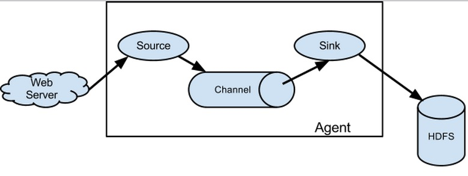

## Flume的概念

    flume是分布式的日志收集系统，它将各个服务器中的数据收集起来并送到指定的地方去，比如说送到图中的HDFS，
    简单来说flume就是收集日志的。
    
    flume的核心是把数据从数据源(source)收集过来，在将收集到的数据送到指定的目的地(sink)。
    为了保证输送的过程一定成功，在送到目的地(sink)之前，会先缓存数据(channel),待数据真正到达目的地(sink)后，
    flume在删除自己缓存的数据。 

