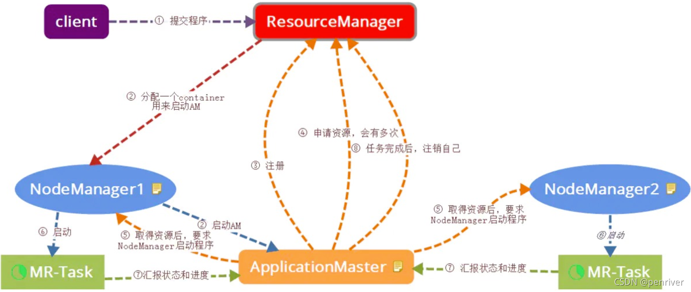

## Hadoop YARN集群搭建指南
### 一.准备工作
1.硬件要求
* 至少3台服务器（1个主节点，2个从节点）
* 每台服务器建议配置：
  + CPU: 4核以上
  + 内存: 8GB以上
  + 硬盘: 50GB以上
  
2.软件要求
* Linux操作系统（推荐CentOS 7或Ubuntu 18.04+）
* Java JDK 8或11（推荐OpenJDK）
* Hadoop 3.x版本

### 二.环境配置
1. 设置主机名和hosts文件
```` 
# 设置主机名（在各节点分别设置）
hostnamectl set-hostname master  # 主节点
hostnamectl set-hostname slave1 # 从节点1
hostnamectl set-hostname slave2 # 从节点2

# 编辑/etc/hosts文件，添加所有节点的IP和主机名映射
vi /etc/hosts

192.168.1.100 master
192.168.1.101 slave1
192.168.1.102 slave2
````
2. 配置SSH免密登录
````
在主节点上执行：
ssh-keygen -t rsa
ssh-copy-id master 
ssh-copy-id slave1
ssh-copy-id slave2
````
3. 安装Java
````
在所有节点上安装Java(略)
````

### 三、Hadoop安装与配置
1. 下载并解压Hadoop
````
在主节点上执行：
tar -zxvf hadoop-3.4.1.tar.gz
````
2. 配置环境变量
````
在所有节点上编辑~/.bashrc或/etc/profile：
export HADOOP_HOME=/usr/local/hadoop/hadoop-3.4.1
export PATH=$PATH:$HADOOP_HOME/bin:$HADOOP_HOME/sbin
export JAVA_HOME=/usr/local/java/jdk1.8.0_451

使环境变量生效：   
source /etc/profile
````
4. 配置Hadoop核心文件(可参考 https://blog.csdn.net/qq_43192537/article/details/100943468)
1) hadoop-env.sh
````
cd $HADOOP_HOME/etc/hadoop
vi hadoop-env.sh

添加/修改
export JAVA_HOME=/usr/local/java/jdk1.8.0_451
````
2) core-site.xml
   ````
   <configuration>
       <property>
           <name>fs.defaultFS</name>
           <value>hdfs://master:9000</value>
       </property>
       <property>
           <name>hadoop.tmp.dir</name>
           <value>/usr/local/hadoop/tmp</value>
       </property>
   </configuration>
   ````
3) hdfs-site.xml
   ````
   <configuration>
       <property>
           <name>dfs.replication</name>
           <value>2</value>
       </property>
       <property>
           <name>dfs.namenode.name.dir</name>
           <value>file:///usr/local/hadoop/hdfs/name</value>
       </property>
       <property>
           <name>dfs.datanode.data.dir</name>
           <value>file:///usr/local/hadoop/hdfs/data</value>
       </property>
   </configuration>
   ````
4) yarn-site.xml
   ````
   <configuration>
       <property>
           <name>yarn.nodemanager.aux-services</name>
           <value>mapreduce_shuffle</value>
       </property>
       <property>
           <name>yarn.resourcemanager.hostname</name>
           <value>master</value>
       </property>
       <property>
           <name>yarn.nodemanager.resource.cpu-vcores</name>
           <value>32</value>
       </property>
       <property>
           <name>yarn.nodemanager.resource.memory-mb</name>
           <value>1638400</value>
       </property>
   </configuration>
   ````
5) mapred-site.xml
   ````
   <configuration>
       <property>
           <name>mapreduce.framework.name</name>
           <value>yarn</value>
       </property>
   </configuration>
   ````
6) workers
   ````
   添加从节点主机名：
   slave1
   slave2
   ````

4. 将配置分发到从节点
   ````
   scp -r /usr/local/hadoop/hadoop-3.4.1 slave1:/usr/local/hadoop/
   scp -r /usr/local/hadoop/hadoop-3.4.1 slave2:/usr/local/hadoop/
   scp /etc/profile slave1:/etc/profile
   scp /etc/profile slave2:/etc/profile
   ````

### 四、启动集群
1. 格式化HDFS（仅在第一次启动时执行）
   ````
   在主节点上执行：
   hdfs namenode -format
   ````
2. 启动HDFS
   ````
   start-dfs.sh
   ````
3. 启动YARN
   ````
   start-yarn.sh
   ````
4. 验证集群状态
   ````
   # 检查HDFS
   hdfs dfsadmin -report
   
   # 检查YARN
   yarn node -list
   
   # 访问Web界面
   # HDFS: http://master:9870
   # YARN: http://master:8088
   ````
### 五、停止集群
   ````
   stop-yarn.sh
   stop-dfs.sh
   ````
### 六、常见问题解决
+ 1.端口冲突：检查9870、8088等端口是否被占用
+ 2.权限问题：确保所有节点上的hadoop目录权限一致
+ 3.SSH连接问题：检查/etc/hosts和SSH配置
+ 4.Java路径问题：确认JAVA_HOME设置正确
  
+ ````
  启动hdfs报错：Attempting to operate on hdfs namenode as root but there is no HDFS NAMENODE USER defined.
  在 vim /etc/profile 文件添加即可
  export HDFS_NAMENODE_USER=root
  export HDFS_DATANODE_USER=root
  export HDFS_SECONDARYNAMENODE_USER=root
  export YARN_RESOURCEMANAGER_USER=root
  export YARN_NODEMANAGER_USER=root
  ````

  通过以上步骤，您应该能够成功搭建一个基本的Hadoop YARN集群。根据实际需求，您可能需要进一步调整配置参数以优化集群性能。

### Flink on yarn 原理
    在Flink on YARN中，Container是一个具体的资源分配单元，用于运行Flink的任务。
    YARN（Yet Another Resource Negotiator）是Hadoop的资源管理和调度框架，它通过Container来抽象和管理资源。Container是一个虚拟化的资源单位，包含了CPU、内存和磁盘等计算资源。当Flink任务提交到YARN时，YARN会为Flink分配一个或多个Container来运行任务
    具体来说，当Flink任务运行在YARN上时，Flink客户端会首先检查所需的资源是否可用，然后上传Flink的配置和JAR文件到HDFS。接着，客户端向ResourceManager请求一个YARN容器来启动ApplicationMaster（AM）。JobManager和AM运行在同一个容器中，一旦启动成功，AM会为TaskManager生成新的Flink配置文件，并上传到HDFS。AM容器还提供Flink的Web界面服务
    AM负责向YARN申请资源，YARN分配Container给TaskManager。TaskManager向JobManager注册后，开始接收并执行任务。当TaskManager发生故障时，YARN会自动重启故障节点上的Container，从而实现高可用和自动故障恢复

### 踩坑记录
    Flink on Yarn 只需要部署一个节点 -- 在master中部署即可
    1.yarn-session模式需要先启动服务
    2.application模式不需要启动yarn-seesion，直接提交作业（自动拉起Flink集群）
    
    flink run -t yarn-application
    yarn-application: 指定 Flink 作业以 YARN 应用模式运行。
    生产环境推荐使用 yarn-application 模式

### 资源分配
    资源分配：
    JobManager 通常 1-4GB
    TaskManager 根据任务需求分配，通常 2-8GB
    每个 TaskManager 的 slot 数通常设置为机器的 CPU 核心数
    资源配置：
    生产环境建议 JM ≥4GB，TM ≥8GB
    预留 20% 内存给框架
    
    taskmanager.numberOfTaskSlots 核心计算公式：
    推荐Slot数 = TaskManager可用CPU核心数 - 1（预留系统资源）
    CPU密集型（如复杂计算）：Slot数 = 可用CPU核心数 × 0.75
    IO密集型（如Kafka读写）：可用CPU核心数 × 1.2
    
    生产环境建议：
    使用 Application 模式以获得更好的隔离性
    
    故障排查：
    检查 YARN 资源管理器确保有足够资源
    
    两种方式区别：
    session：所有作业在一个集群，集群生命周期独立于集群上运行的任何作业的生命周期，并且资源在所有作业之间共享；集群只有一个JobManager，所以JobManager容易有负载瓶颈；main方法在客户端执行；
    
    application：每个应用程序创建一个会话集群，集群的生命周期与应用的生命周期绑定在一起，集群中特定的作业之间共享资源，在应用粒度上资源隔离有保证；每个集群都有一个JobManager，所以JobManager负载均衡；main方法在集群上执行；

### 关键命令
1. yarn 命令
   ````
   查看yarn应用列表
   yarn application -list
   
   停止yarn session
   yarn application -kill <ApplicationId>
   
   查看日志
   yarn logs -applicationId <ApplicationId>
   ````

3. hdfs命令
    ````
   hdfs dfs -ls /user/xx    代表hdfs路径
   hdfs dfs -mkdir /user/xx  创建路径
   hdfs dfs -rm /user/xx     删除文件
   hdfs dfs -rm -r /user/xx     删除文件夹
   hdfs dfs -put /source/xx /target/xx  源路径拷贝至目标路径
   ````

### 参数调优
```
# 增加 TaskManager 总内存
taskmanager.memory.process.size: 4096m  # 根据需求调整

# 增加 JVM 堆内存
taskmanager.memory.task.heap.size: 2048m

# 增加托管内存(用于排序、哈希表等)
taskmanager.memory.managed.size: 1024m

# 设置网络缓冲内存
taskmanager.memory.network.min: 64mb
taskmanager.memory.network.max: 128mb

# 启用堆外内存
taskmanager.memory.off-heap: true

# 调整直接内存使用
taskmanager.memory.task.off-heap.size: 512m

# 增加框架堆外内存
taskmanager.memory.framework.off-heap.size: 256m

# 设置 JVM 本地内存限制
taskmanager.memory.jvm-metaspace.size: 256m
taskmanager.memory.jvm-overhead.min: 128m
taskmanager.memory.jvm-overhead.max: 512m
```
