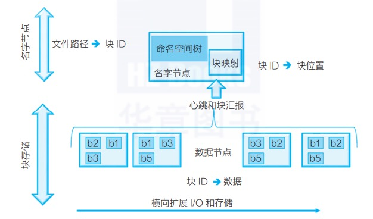

## Hadoop简介
    Hadoop就是存储海量数据和分析海量数据的工具。
    
### Hadoop
    Hadoop是由java语言编写的，在分布式服务器集群上存储海量数据并运行分布式分析应用的开源框架，其核心部件是HDFS与MapReduce。
    HDFS是一个分布式文件系统：引入存放文件元数据信息的服务器Namenode和实际存放数据的服务器Datanode，对数据进行分布式储存和读取。
    MapReduce是一个分布式计算框架：MapReduce的核心思想是把计算任务分配给集群内的服务器里执行。通过对计算任务的拆分（Map计算/Reduce计算）再根据任务调度器（JobTracker）对任务进行分布式计算。

    把HDFS理解为一个分布式的，有冗余备份的，可以动态扩展的用来存储大规模数据的大硬盘。
    把MapReduce理解成为一个计算引擎，按照MapReduce的规则编写Map计算/Reduce计算的程序，可以完成计算任务。
    HDFS文件系统和Linux文件系统、Windows文件系统可以类比并列

## 核心组件
    核心组件包括Hadoop的基础组件HDFS、MapReduce和Yarn，以及其他常用组件如：HBase、Hive、Hadoop Streaming、Zookeeper等。

## 组件介绍
    HDFS：分布式海量数据存储功能
    Yarn：提供资源调度与任务管理功能
    资源调度：根据申请的计算任务，合理分配集群中的计算节点(计算机)。
    任务管理：任务在执行过程中，负责过程监控、状态反馈、任务再调度等工作。
    MapReduce：分布式并行编程模型和计算框架。解决分布式编程门槛高的问题，基于其框架对分布式计算的抽象map和reduce，可以轻松实现分布式计算程序。
    Hive：提供数据摘要和查询的数据仓库。解决数据仓库构建问题，基于Hadoop平台的存储与计算，与传统SQL相结合，让熟悉SQL的编程人员轻松向Hadoop平台迁移。
    Streaming：解决非Java开发人员使用Hadoop平台的语言问题，使各种语言如C++、python、shell等均可以无障碍使用Hadoop平台。
    HBase：基于列式存储模型的分布式数据库。解决某些场景下，需要Hadoop平台数据及时响应的问题。
    Zookeeper：分布式协同服务。主要解决分布式下数据管理问题：统一命名、状态同步、集群管理、配置同步等。

## MapReduce介绍
    MapReduce是一种计算模型，该模型可将大型数据处理任务分解成很多单个的、可以在服务器集群中并行执行的任务。
    这些任务的计算结果可以合并在一起来计算最终的结果。

## MapReduce的工作流程

    MapReduce的工作流程大致可以分为5步，具体如下：
    1．分片、格式化数据源
    输入Map阶段的数据源，必须经过分片和格式化操作。其中：
    分片操作：指的是将源文件划分为大小相等的小数据块（Hadoop2.x中默认128M），也就是分片(split)，
    Hadoop会为每一个分片构建一个Map任务，并由该任务运行自定义的map()函数，从而处理分片里的每一条记录；
    格式化操作：将划分好的分片（split）格式化为键值对<key，value>形式的数据，其中，key代表偏移量，value代表每一行内容。
    
    2．执行MapTask
    每个Map任务都有一个内存缓冲区（缓冲区大小100M），输入的分片（split）数据经过Map任务处理后的中间结果，
    会写入内存缓冲区中。如果写入的数据达到内存缓冲的阀值（80M），会启动一个线程将内存中的溢出数据写入磁盘，
    同时不影响map中间结果继续写入缓冲区。在溢写过程中，MapReduce框架会对Key进行排序，如果中间结果比较大，
    会形成多个溢写文件，最后的缓冲区数据也会全部溢写入磁盘形成一个溢写文件，如果是多个溢写文件，则最后合并所有的溢写文件为一个文件。
    
    3．执行Shuffle过程
    MapReduce工作过程中，map阶段处理的数据如何传递给Reduce阶段，这是MapReduce框架中关键的一个过程，
    这个过程叫做Shuffle。Shuffle会将MapTask输出的处理结果数据，分发给ReduceTask，并在分发的过程中，
    对数据按key进行分区和排序。
    
    4．执行ReduceTask
    输入ReduceTask的数据流是<key，{value list}>形式，用户可以自定义reduce()方法进行逻辑处理，
    最终以<key，value>的形式输出。
    
    5．写入文件
    MapReduce框架会自动把ReduceTask生成的<key,value>传入OutputFormat的write方法，实现文件的写入操作。

## MapReduce局限性
    该模型不能直接对多张表格数据进行join()
    
## 大数据处理框架四层结构
    用户层、分布式数据并行处理层、资源管理与任务调度层、物理执行层。
    
## 数据仓库详细介绍之调度
    数仓模型解决了数据存储问题，ETL解决了数据同步集成计算问题，而调度解决的是自动化问题。

## 数据治理
    数据治理的定义：数据治理就是企业对数据的来源、质量和使用进行规范化的一整套流程。
    数据治理的目的：数据治理的目的，往大了说是为了将数据的价值最大化，将风险最小化，往小了说，主要是分为四点：
    提升数据的质量
    增强数据的安全
    确保数据的合规
    规范数据使用的流程和方法
    数据治理的范畴：数据标准、元数据管理、主数据管理、数据模型、数据分布、数据存储、数据交换、数据生命周期管理、数据质量管理、数据安全以及数据共享服务。
    对于数据治理，其最关键的工作是回归数据本身，也就是要加强元数据管理和主数据管理，从源头去治理数据，尽可能补齐数据的相关属性和信息，从而为数据治理的后续工作奠定良好的基础。

## 元数据管理
### 元数据采集服务。
    元数据采集服务提供各类适配器满足以上各类元数据的采集，并将元数据整合处理后统一
    存储于中央元数据仓库，实现元数据的统一管理。这个过程中，数据采集适配器十分重要，
    元数据采集要能够适配各种DB、各类ETL、各类DW和Report产品，同时还需要适配各类结构化或半结构化数据源。

### 元数据管理服务。
    市场上主流的元数据管理产品，基本都包括元数据查询、元模型管理、元数据维护、元数据版本管理、
    元数据对比分析、元数据适配器、元数据同步管理、元数据生命周期管理等功能。（apache atlas）

### 元数据访问服务。
    元数据访问服务是元数据管理软件提供的元数据访问的接口服务，一般支持REST或Webservice等接口协议。
    通过元数据访问服务支持企业元数据的共享，是企业数据治理的基础。

### 元数据分析服务。
    血缘分析：告诉你数据来自哪里，都经过了哪些加工。
    影响分析：告诉你数据都去了哪里，经过了哪些加工。
    冷热度分析：告诉你哪些数据是企业常用数据，哪些数据属于僵死数据。
    关联度分析：告诉你数据和其他数据的关系以及它们的关系是怎样建立的。
    数据资产地图：告诉你有哪些数据，在哪里可以找到这些数据，能用这些数据干什么。

## 数据质量管理
    数据质量评估
    1. 完整性
    2. 准确性
    3. 及时性
    4. 一致性
> 数据质量管理工具从功能上，主要包括：数据质量指标管理、数据质量规则管理、数据质量评估任务、数据质量评估报告
### 数据质量指标管理。
    通过对不同业务规则的收集、分类、抽象和概括，定义数据质量维度，这里给出了六种，
    分别是：数据唯一性、数据一致性、数据准确性、数据关联性、数据完整性、数据及时性。
    质量指标反映了数据质量不同的规格标准，也体现了高层次的指标度量的特点。

### 数据治理规则管理。
    一个数据质量规则包含了数据的评估对象，评估指标、权重和期望值等。质量规则是由业务人员
    根据各检核类别对不同的业务实体提出的数据质量的衡量标准。它是各检核类别在不同业务实体上的具体体现。

### 数据质量检核任务。
    检核任务调度模块是数据质量平台的核心，通过执行检核方法生成相应的检核结果问题数据文件，
    检核结果问题数据能够反映出用户所关心的数据质量问题。

### 数据质量分析报告。
    数据质量报告提供了一个集中展示数据质量状况的窗口，相关人员可以对数据质量问题进行查询、统计、分析，
    找到引起数据质量问题的根因，并付诸行动，从源头上解决数据质量的根本问题，实现数据质量的闭环。

## 数据安全管理
> 从应用上，数据安全的主要功能包括：身份认证与访问控制、数据合规性申请、数据分级与授权、数据脱敏、数据加密、安全审计等。
### 身份认证与访问控制。
    身份认证是为访问控制提供支撑，访问控制提供了不同身份用户访问不同信息资源提供了
    相应的安全策略。身份认证是在计算机及计算机网络系统中确认操作者身份的过程，确定用户
    是否具有对某种资源的访问和使用权限，防止攻击者假冒合法用户获得资源的访问权限，
    保证系统和数据的安全。常用身份认证的技术包括：电子签名（CA）、USB-key（智能卡）、
    静态口令，动态口令、短信密码、人脸识别、指纹识别、虹膜识别、声音识别等。

### 数据合规性申请。
    对于企业关键信息的创建和变更需要符合企业相关的数据管理流程，建立数据申请、
    审批制度，对新增的数据或变更的数据进行合法性审批。

### 数据的分级与授权。
    根据数据的来源、内容和用途对数据资产进行分类，根据数据的价值、敏感程度、
    影响范围进行敏感分级，建立敏感分级数据与用户角色的访问控制矩阵，
    对不同等级的数据分配给相应的用户角色实现分级授权。

### 数据脱敏。
    简单的数据脱敏技术就是给数据打个“马赛克”，脱敏的过程数据的含义保持不变、数据类型不变、数据的关系不变。

### 数据加密。
    数据加密技术是数据防窃取的一种安全防治技术，指将一个信息经过加密钥匙及加密函数转换，
    变成无意义的密文，而接收方则将此密文经过解密函数、解密钥匙还原成明文。

### 安全审计。
    数据安全审计是通过记录用户对数据的所有访问和操作记录日志，并通过日志的分类统计和分析，
    提供数据访问报表，支持对数据的检索和分析，支持对用户的违规访问和危险操作进行告警。

## 数据资产管理

## 数据安全
    1.保密性
    2.完整性
    3.可用性

## 阿里云odps介绍
    maxCompute(大数据计算服务，原名ODPS)是一种快速、完全托管的TB/PB级数据仓库解决方案。
    
## DolphinScheduler（海豚调度）
    DolphinScheduler(原EasyScheduler) 是一个分布式工作流任务调度系统，主要解决数据研发ETL错综复杂的依赖关系
    支持多数据源，多租户，支持重试、容错、告警等

## 资源调度器Yarn
### yarn的调度器以及它们的区别
    yarn 一共有3个类型的调度器：FIFO调度器、容量调度器、公平调度器。
    1，FIFO调度器(FIFO Scheduler)。先进先出，队列中同一时间只有一个任务在运行。该任务独占整个集群的资源。
    2，容量调度器(Capacity Scheduler)。多队列，每个队列内部先进先出，同一个队列同时间只有一个任务在运行，任务的并行度为队列的个数。
    3，公平调度器(Fair Scheduler)。同个队列同一时间有多个任务在运行，按照缺额大小分配资源启动任务。
    在生产环境中，不可能使用FIFO调度器。实际情况是，企业会分配多个队列，每个队列分配一定的资源，并行度不可能是1
    hadoop2.7.2 默认的资源调度器为容量调度器。

## Prometheus + Grafana 监控告警

### HDFS架构
    HDFS是业界默认的大数据存储系统，在业界的大数据集群中有非常广泛的使用。HDFS集群有着很高的稳定性且易扩展得益于它较简单的构架，
    但包含几千个节点，保存上百拍比特（PB）数据的集群也不鲜见。如图所示HDFS的构架

    HDFS通过把文件系统元数据全部加载到数据节点Namenode内存中，给客户端提供了低延迟的元数据访问。由于元数据需要全部加载到内存，
    所以一个HDFS集群能支持的最大文件数，受Java堆内存的限制，上限大概是4亿～5亿个文件。所以HDFS适合大量大文件[几百兆字节（MB）以上]的集群，
    如果集群中有非常多的小文件，HDFS的元数据访问性能会受到影响。虽然可以通过各种Federation技术来扩展集群的节点规模，
    但单个HDFS集群仍然没法很好地解决小文件的限制。

## hadoop优势
    适合海量数据进行分布式存储和分布式计算的平台
    它有三大组件
    Hdfs：分布式存储
    主节点NameNode：接受客户端读写数据，维护文件系统目录结构存储元数据信息
    从节点DataNode:真实的存储数据
    MapReduce：依赖于磁盘IO的批处理计算模型
    Yarn：资源调度框架
    主节点：ResourceManager：整个集群资源的管理者
    从节点：NodeManager：单个节点的资源管理者

## 免费开源的大数据可视化工具
1. Apache Superset - 开源
2. Metabase
3. FineBI - 非开源
4. QuickBI

## 数据挖掘工具
    SparkML

## 元数据管理
    Atlas - 开源的数据治理和元数据管理平台

## 数据建模方式
    当前主流建模方法为：ER模型、维度模型。
    ER模型常用于OLTP数据库建模，应用到构建数仓时更偏重数据整合， 站在企业整体考虑，将各个系统的数据按相似性一致性、合并处理，为数据分析、决策服务，但并不便于直接用来支持分析。缺陷：需要全面梳理企业所有的业务和数据流，周期长，人员要求高。
    维度建模是面向分析场景而生，针对分析场景构建数仓模型；重点关注快速、灵活的解决分析需求，同时能够提供大规模数据的快速响应性能。针对性强，主要应用于数据仓库构建和OLAP引擎低层数据模型。优点：不需要完整的梳理企业业务流程和数据，实施周期根据主题边界而定，容易快速实现demo，而且相对来说便于理解、提高查询性能、对称并易扩展。

## 实时数仓架构
    两种数仓架构:Lambda架构和Kappa架构

## 数据血缘分析
    比如，数据A经过ETL处理生成了数据B，那么我们就说数据A与B有着血缘关系，且数据A是数据B的上游数据，同时数据B是数据A的下游数据。
    按血缘对象来分，可分为系统级血缘、表级血缘、字段（列）级血缘。不管是结构化数据还是非结构化数据，都必定存在数据血缘关系。

    数据血缘分析是元数据管理的重要应用之一，其梳理系统、表、视图、存储过程、ETL、程序代码、字段等之间的关系，并采用图数据库进行可视化展示。
    简单地说就是通过可视化展示数据是怎么来的，经过了哪些过程、阶段及计算逻辑。

## 图数据库
    Neo4j 和 TigerGraph

## 数据质量评价指标
    准确性：数据的正确性
    完整性：数据的完整程度
    一致性：数据的一致性
    可靠性：数据的可靠程度
    及时性：数据的及时性

## 数据质量评价方法
    数据抽样法
    数据比较法
    数据统计法
    数据挖掘法
    数据质量框架法
