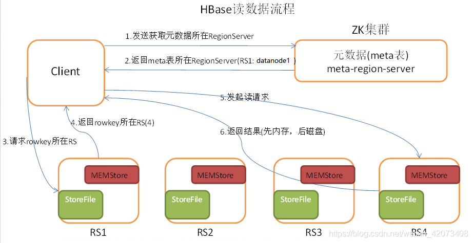
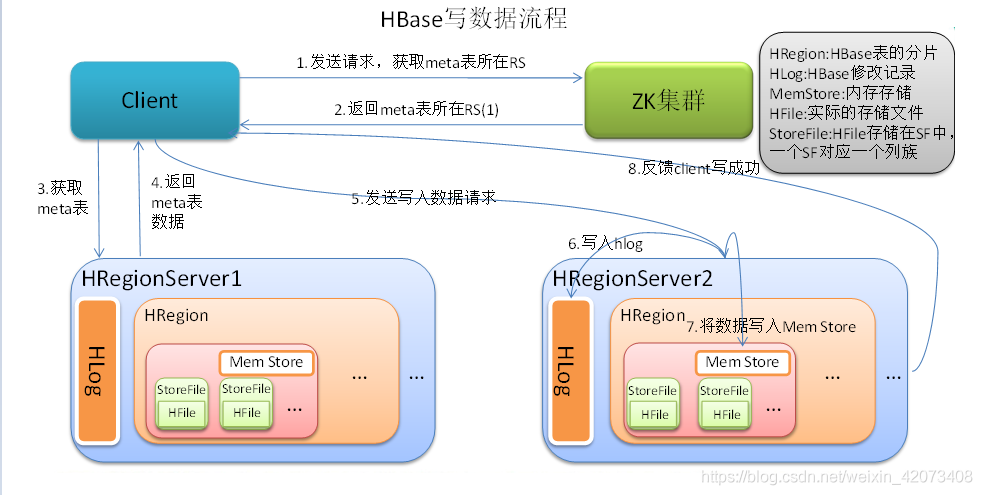

## Hbase数据模型
    RowKey：每行数据必须拥有一个唯一的行键，类似关系型数据库的主键
    Column Family：HBase的每个列都归属于一个列簇，类似于子表概念
    Column：数据属性字段，即表字段
    Version：每次新增或修改数据都会产生一个新版本
    总结：HBase的数据模型由行键、列簇，列名和版本号组成
    
## RowKey的特点
    类似于MySQL、Oracle中的主键，用于标示唯一的行；
    完全是由用户指定的一串不重复的字符串；
    HBase中的数据永远是根据Rowkey的字典排序来排序的。

## RowKey的作用
    读写数据时通过RowKey找到对应的Region；
    MemStore中的数据按RowKey字典顺序排序；
    HFile中的数据按RowKey字典顺序排序。
    
## RowKey的长度
    RowKey可以是任意的字符串，最大长度64KB（因为Rowlength占2字节）。建议越短越好，原因如下：
    1.数据的持久化文件HFile中是按照KeyValue存储的，如果rowkey过长，比如超过100字节，1000w行数据，光rowkey就要占用100*1000w=10亿个字节，将近1G数据，这样会极大影响HFile的存储效率；
    2.MemStore将缓存部分数据到内存，如果rowkey字段过长，内存的有效利用率就会降低，系统不能缓存更多的数据，这样会降低检索效率；
    3.目前操作系统都是64位系统，内存8字节对齐，控制在16个字节，8字节的整数倍利用了操作系统的最佳特性。
    
## RowKey设计技巧
    避免热点的方法 - Salting
    避免热点的方法 - Hashing
    避免热点的方法 - Reversing
    
    Salting加盐不是密码学中的加盐，而是在rowkey的前面增加随机数。
    优缺点：因为分配是随机的，所以如果你想要以字典序取回数据，需要做更多工作。加盐这种方式增加了写时的吞吐量，但是当读时有了额外代价。
    
    Hashing的原理是计算RowKey的hash值，然后取hash的部分字符串和原来的RowKey进行拼接。这里说的hash包含MD5、sha1、sha256或sha512等算法。
    优缺点：可以一定程度打散整个数据集，但是不利于Scan；比如我们使用md5算法，来计算Rowkey的md5值，然后截取前几位的字符串。subString(MD5(设备ID), 0, x) + 设备ID，其中x一般取5或6。
    
    Reversing的原理是反转一段固定长度或者全部的键。

## RowKey设计案例剖析
#### 交易类表Rowkey设计
    查询某个卖家某段时间内的交易记录
    sellerId + timestamp + orderId
    
    查询某个买家某段时间内的交易记录
    buyerId + timestamp ＋orderId
    
    根据订单号查询
    orderNo
    
    如果某个商家卖了很多商品，可以如下设计 Rowkey 实现快速搜索
    salt + sellerId + timestamp 其中，salt 是随机数。
    可以支持的场景：
    全表Scan
    按照sellerId查询
    按照sellerId + timestamp 查询
    
#### 金融风控Rowkey设计
    查询某个用户的用户画像数据
    prefix + uid
    prefix + idcard
    prefix + tele
    其中 prefix = substr(md5(uid),0 ,x)， x取5-6。uid、idcard以及tele分别表示用户唯一标识符、身份证、手机号码。
    
#### 车联网Rowkey设计
    查询某辆车在某个时间范围的交易记录
    carId + timestamp
    
    某批次的车太多，造成热点
    prefix + carId + timestamp 其中 prefix = substr(md5(uid),0 ,x)
    
#### 查询最近的数据
    查询用户最新的操作记录或者查询用户某段时间的操作记录，RowKey设计如下：
    uid + Long.Max_Value - timestamp
    
#### 支持的场景
    查询用户最新的操作记录
    Scan [uid] startRow [uid][000000000000] stopRow [uid][Long.Max_Value - timestamp]
    
    查询用户某段时间的操作记录
    Scan [uid] startRow [uid][Long.Max_Value – startTime] stopRow [uid][Long.Max_Value - endTime]
    
## Region和RegionServers
    Region被分配到的集群节点称为RegionServers，RegionServers负责提供HBase中数据的读写功能。一个RegionServers
    可以容纳大约1000个Region，每个Region包含一部分数据。
    
## HBase的存储
    为了提高数据写入时的吞吐量，HBase并不会实时的写入数据直接刷入磁盘，而是先将数据放入内存中进行保管。
    将数据直接放入内存读写虽然很快，但这样不安全，一旦服务器重启数据全部丢失。HBase采用预写日志结合MemStroe来解决。
    当客户端向HBase发起写入请求的时候，HBase首先会通过RegionServers将数据写入预写日志，之后在用MemStroe对象将数据
    保存到内存中。由于有了预写日志，当服务出现故障重启后，Region可以通过日志将数据复原到MemStroe。然后当一个MemStroe
    存储的数据达到某一个阈值时，HBase会将这个MemStroe的数据通过HFile的形式写入到磁盘并清空该MemStroe。
    
## Region
    HBase自动把表水平划分成多个区域(region)，每个region会保存一个表里面某段连续的数据；
    每个表一开始只有一个region，随着数据不断插入表，region不断增大，当增大到一个阀值的时候，
    region就会等分会两个新的region（裂变）；
       
    当table中的行不断增多，就会有越来越多的region。这样一张完整的表被保存在多个Regionserver上。

## HBase缓存机制
    HBase提供2种类型的缓存结构：MemStore和BlockCache。
    MemStore：HBase数据先写入HLog之中，并同时写入MemStore，待满足一定条件后将
    MemStore中数据刷到磁盘，能提升HBase的写性能和读性能。
    
    BlockCache：HBase会将一次文件查找的Block块缓存到Cache中，以便后续同一请求
    或者相邻数据查找请求，可以直接从内存中获取，避免IO操作。
    
    其中MemStore是写缓存，BlockCache是读缓存。
    
    一个HRegionServer只有一个BlockCache，在HRegionServer启动的时候完成
    BlockCache的初始化，常用的BlockCache包括LruBlockCache，以及 
    CombinedBlockCache（LruBlockCache + BucketCache）。

## 使用场景
#### 存储/查询
* 适合大数据的实时写入场景和毫秒级的查询
* 适合在流计算、用户行为数据存储等场景

## HBase的RowKey设计
    rowkey长度原则:
    rowkey是一个二进制码流，可以是任意字符串，最大长度64kb，实际应用中一般为10-100bytes，以byte[]形式保存，一般设计成定长。建议越短越好，不要超过16个字节，原因如下：
    数据的持久化文件HFile中是按照KeyValue存储的，如果rowkey过长，比如超过100字节，1000w行数据，光rowkey就要占用100*1000w=10亿个字节，将近1G数据，这样会极大影响HFile的存储效率； 
    MemStore将缓存部分数据到内存，如果rowkey字段过长，内存的有效利用率就会降低，系统不能缓存更多的数据，这样会降低检索效率。 
    目前操作系统都是64位系统，内存8字节对齐，控制在16个字节，8字节的整数倍利用了操作系统的最佳特性。
     
    rowkey散列原则:
    如果rowkey按照时间戳的方式递增，不要将时间放在二进制码的前面，
    建议将rowkey的高位作为散列字段，由程序随机生成，低位放时间字段，
    这样将提高数据均衡分布在每个RegionServer，以实现负载均衡的几率。
    如果没有散列字段，首字段直接是时间信息，所有的数据都会集中在一个RegionServer上，
    这样在数据检索的时候负载会集中在个别的RegionServer上，造成热点问题，会降低查询效率。
     
    rowkey唯一原则:
    必须在设计上保证其唯一性，rowkey是按照字典顺序排序存储的，因此，
    设计rowkey的时候，要充分利用这个排序的特点，将经常读取的数据存储到一块，
    将最近可能会被访问的数据放到一块。
    
## HBase的高并发和实时处理数据

## HBase读取数据流程

    
    Client先访问zookeeper，从meta表读取region的位置，然后读取meta表中的数据。meta中又存储了用户表的region信息；
    根据namespace、表名和rowkey在meta表中找到对应的region信息；
    找到这个region对应的regionserver；
    查找对应的region；
    先从MemStore找数据，如果没有，再到BlockCache里面读；
    BlockCache还没有，再到StoreFile上读(为了读取的效率)；
    如果是从StoreFile里面读取的数据，不是直接返回给客户端，而是先写入BlockCache，再返回给客户端。

## HBase写入数据流程

    
    Client向HregionServer发送写请求；
    HregionServer将数据写到HLog（write ahead log）。为了数据的持久化和恢复；
    HregionServer将数据写到内存（MemStore）；
    反馈Client写成功。

## 数据flush过程
    当MemStore数据达到阈值（默认是128M，老版本是64M），将数据刷到硬盘，将内存中的数据删除，同时删除HLog中的历史数据；
    并将数据存储到HDFS中
    
## 数据合并过程
    当数据块达到4块，Hmaster将数据块加载到本地，进行合并；
    当合并的数据超过256M，进行拆分，将拆分后的Region分配给不同的HregionServer管理；
    当HregionServer宕机后，将HregionServer上的hlog拆分，然后分配给不同的HregionServer加载，修改.META.；
    注意：HLog会同步到HDFS。

