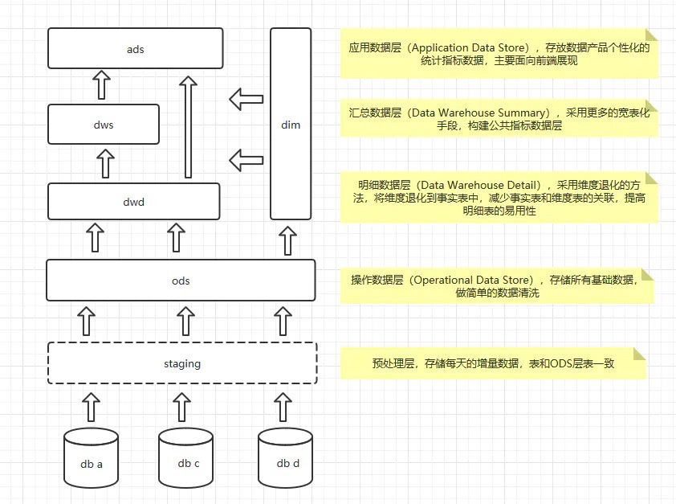
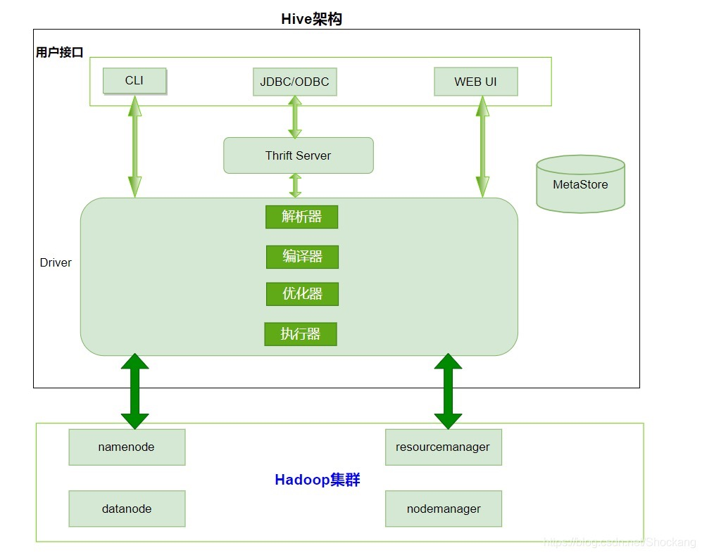
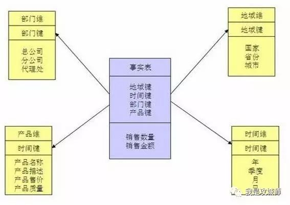
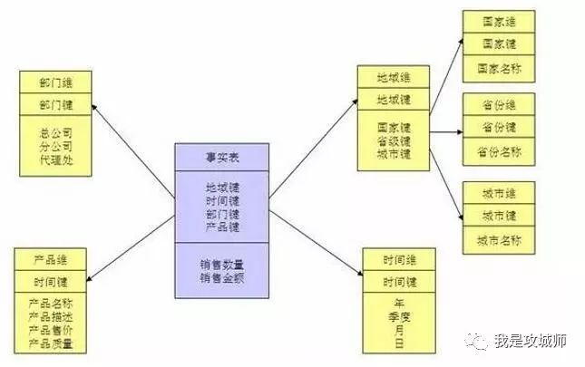
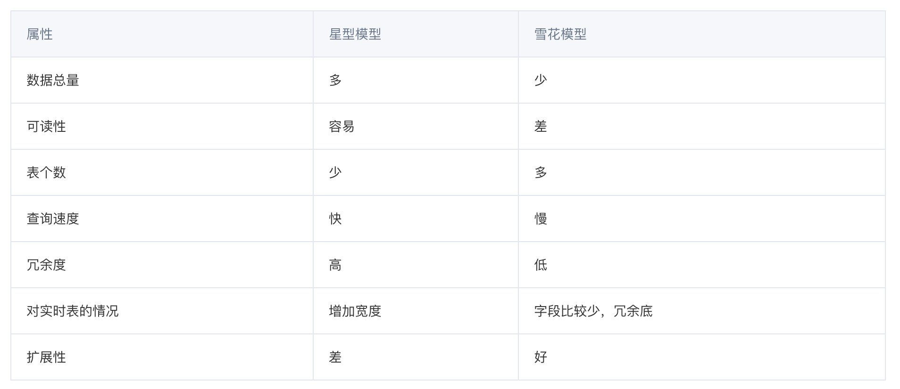

## 数据分层
    数据仓库的数据分层通常分为集市层、中间层、基础数据层上下三层结构

## 数仓建模流程
    业务模型->领域/概念模型->逻辑模型->物理模型

    业务建模: 生成业务模型，主要解决业务层面的分解和程序化。
    领域建模: 生成领域模型，主要是对业务模型进行抽象处理，生成领域概念模型。
    逻辑建模: 生成逻辑模型，主要是将领域模型的概念实体以及实体之间的关系进行数据库层次的逻辑化。
    物理建模: 生成物理模型，主要解决，逻辑模型针对不同关系型数据库的物理化以及性能等一些具体的技术问题。
    

    按照以上分层方式，开发重心就在DWD层，就是明细数据层，这里主要是一些宽表，存储的还是明细数据；
    DWS层，会针对不同的维度，对数据进行聚合了。DWS层算是集市层，这里一般按照主题进行划分，属于维度建模的范畴；
    ADS就是偏应用层，各种报表的输出。
    DIM层是数据仓库数据中，各层公用的维度数据。比如：省市县数据。
    
## 数据集市和数据仓库的主要区别
    数据仓库是企业级的，能为整个企业各个部门的运行提供决策支持手段；
    
    数据集市则是一种微型的数据仓库,它通常有更少的数据,更少的主题区域,
    以及更少的历史数据,因此是部门级的，一般只能为某个局部范围内的管理人员服务，因此也称之为部门级数据仓库。
    
## 数据倾斜概念
    由于数据分配不均匀，造成数据大量集中到一点，造成数据热点。
    数据倾斜主要表现在，map/reduce程序执行时，reduce节点大部分执行完毕，
    但是有一个或者几个reduce节点运行很慢，导致整个程序的处理时间很长，
    这是因为某一个key的条数比其他key多很多(有时是百倍或者千倍之多)，
    这条Key所在的reduce节点所处理的数据量比其他节点就大很多，从而导致某几个节点迟迟运行不完。
    
## 怎么判断数据有没有倾斜？
    1、分析节点资源管理器，如果大部分节点已经执行完成，而个别节点长时间执行不完，很可能发生了数据倾斜；
    2、分析执行日志，作业在reduce阶段停留在99%，很长时间完成不了，很可能发生了数据倾斜；
    
## 容易造成数据倾斜的原因
    基本业务逻辑是造成数据倾斜的主要原因：
    1、group by逻辑造成
    2、distinct count(distinct xx)
    3、小表join大表
    4、大表join大表
    
## 解决方案
    1、调优参数
    set hive.map.aggr=true；
    开启map端聚合，效率更高但需要更多的内存
    
    set hive.groupby.skewindata=true;
    开启group by数据倾斜时负载均衡，生成的查询计划会有两个MRJob。
    
    第一个MRJob中，Map的输出结果集合会随机分布到Reduce中，每个Reduce做部分聚合操作，并输出结果，这样处理的结果是相同的GroupBy Key有可能被分发到不同的Reduce中，从而达到负载均衡的目的；
    
    第二个MRJob再根据预处理的数据结果按照GroupBy Key分布到Reduce中（这个过程可以保证相同的GroupBy Key被分布到同一个Reduce中），最后完成最终的聚合操作。
      
> hive数据倾斜
>> 一般发生在SQL中，group by和join on上，并且和数据逻辑绑定比较深。

> spark中数据倾斜：包括spark streaming和spark SQL，主要表现：
>> 1)executor lost,OOM.shuffle过程出错
>> 2)Driver OOM
>> 3)单个executor执行时间特别久，整个任务卡在某个阶段不能结束
>> 4)正常运行的任务突然失败

> 常见的数据倾斜原因：
>> 1)key分布不均匀
>> 2)建表时考虑不周
>> 3)业务数据激增
>> 4)某些HQL语句本身就存在数据倾斜

## 数据仓库最显著的特点
    ETL - 它自己不产生数据，所以需要ETL操作；
    历史性 - 存储一切可追溯的历史信息；
    分析性 - 分析能力强。

### Hive整体架构
    Hive是底层封装了Hadoop的数据仓库处理工具，它运行在Hadoop基础上

    Hive中的元数据通常包含表名、列、分区及其相关属性，表数据所在目录的位置信息，Metastore默认存在自带的Derby数据库中。
    由于Derby数据库不适合多用户操作，并且数据存储目录不固定，不方便管理，因此，通常都将元数据存储在MySQL数据库。

### 理解数据仓库中星型模型和雪花模型
星型模型是一种多维的数据关系，它由一个事实表和一组维表组成。每个维表都有一个维作为主键，所有这些维的主键组合成事实表的主键。强调的是对维度进行预处理，将多个维度集合到一个事实表，形成一个宽表。这也是我们在使用hive时，经常会看到一些大宽表的原因，大宽表一般都是事实表，包含了维度关联的主键和一些度量信息，而维度表则是事实表里面维度的具体信息，使用时候一般通过join来组合数据，相对来说对OLAP的分析比较方便。

当有一个或多个维表没有直接连接到事实表上，而是通过其他维表连接到事实表上时，其图解就像多个雪花连接在一起，故称雪花模型。雪花模型是对星型模型的扩展。它对星型模型的维表进一步层次化，原有的各维表可能被扩展为小的事实表，形成一些局部的 "层次 " 区域，这些被分解的表都连接到主维度表而不是事实表。雪花模型更加符合数据库范式，减少数据冗余，但是在分析数据的时候，操作比较复杂，需要join的表比较多所以其性能并不一定比星型模型高。

星型模型和雪花模型的优劣对比

应用场景
星型模型的设计方式主要带来的好处是能够提升查询效率，因为生成的事实表已经经过预处理，主要的数据都在事实表里面，所以只要扫描实时表就能够进行大量的查询，而不必进行大量的join，其次维表数据一般比较少，在join可直接放入内存进行join以提升效率，除此之外，星型模型的事实表可读性比较好，不用关联多个表就能获取大部分核心信息，设计维护相对比较简答。
星型模型的设计方式是比较符合数据库范式的理念，设计方式比较正规，数据冗余少，但在查询的时候可能需要join多张表从而导致查询效率下降，此外规范化操作在后期维护比较复杂。

总结
通过上面的对比，我们可以发现数据仓库大多数时候是比较适合使用星型模型构建底层数据Hive表，通过大量的冗余来提升查询效率，星型模型对OLAP的分析引擎支持比较友好，这一点在Kylin中比较能体现。而雪花模型在关系型数据库中如MySQL，Oracle中非常常见，尤其像电商的数据库表。在数据仓库中雪花模型的应用场景比较少，但也不是没有，所以在具体设计的时候，可以考虑是不是能结合两者的优点参与设计，以此达到设计的最优化目的。

