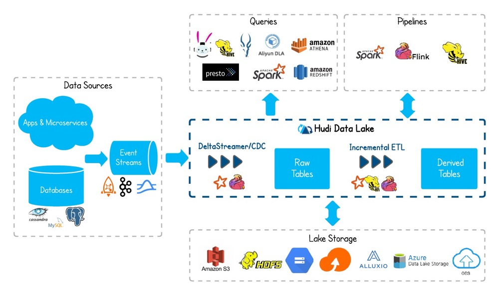

## Hudi简介
    Hudi是Hadoop Updates and Incrementals的简写，开源的Data Lakes解决方案

    Hudi实际上就是一个中间数据处理层,它的底层一定是要依赖分布式存储的，当然用的最多的就是HDFS。
    Hudi作为一个数据湖方案，他自己本身不产生任何业务数据，可以通过Spark、Flink等工具，接入关系型数据库、日志、
    消息队列的数据，进行大容量的存储，最终提供给上层查询引擎比如Presto、Hive等进行查询。

### Hudi的显著特性
    Hudi能够摄入（Ingest）和管理（Manage）基于HDFS之上的大型分析数据集，主要目的是高效的减少入库延时。
    Hudi基于Spark来对HDFS上的数据进行更新、插入、删除等。
    Hudi在HDFS数据集上提供如下流原语：插入更新（如何改变数据集）；增量拉取（如何获取变更的数据）。
    Hudi可以对HDFS上的parquet格式数据进行插入/更新操作。
    Hudi通过自定义InputFormat与Hadoop生态系统（Spark、Hive、Parquet）集成。
    Hudi通过Savepoint来实现数据恢复。
    目前，Hudi支持Spark和Flink构建一体化数据湖解决方案。

### 使用场景
#### 近实时写入
    减少碎片化工具的使用。
    CDC增量导入RDBMS数据。
    限制小文件的大小和数量。
    
#### 近实时分析
    相对于秒级存储（Druid, OpenTSDB），节省资源。
    提供分钟级别时效性，支撑更高效的查询。
    Hudi作为lib，非常轻量。
    
#### 增量pipeline
    区分arrivetime和event time处理延迟数据。
    更短的调度interval减少端到端延迟（小时 -> 分钟） => Incremental Processing。
    
#### 增量导出
    替代部分Kafka的场景，数据导出到在线服务存储

### 小结
    Apache Hudi本身不存储数据，仅仅管理数据，借助外部存储引擎存储数据，比如HDFS、S3；
    此外，Apache Hudi也不分析数据，需要使用计算分析引擎，查询和保存数据，比如Spark或Flink

### 什么是数据湖
    是一种将原始系统所产生的数据以原始格式统一保存的数据存储模式。通俗的说，就是把企业各类业务系统或业务过程中产生的各种数据，原封不动的汇聚到一起统一保存。

### 数据湖特点
    （1）不先考虑数据有没用、怎么用，先全部拿过来再说，因此需要支持海量数据存储；
    （2）以原始格式存储各类型数据，包括关系型数据库中的表、半结构化数据（如CSV、日志、Excel）和非结构化数据（如文档、图像、音视频）；
    （3）本质是一种数据存储模式，不关注数据开发利用，实现方式可以是HDFS、亚马逊的S3，甚至是结构化数据库+对象存储等。

### 数据湖和数据仓库的区别
    数据湖仅仅解决了数据存储的问题，不关心数据如何建模、加工和分析，而这些都是数据仓库要解决的问题，
    因此，二者的边界是清晰的。单从数据存储层面来说，数据湖可以作为数据仓库ODS层的一种底层存储架构，两者差异点是，
    数据仓库不存非结构化数据，同时完成了结构化数据存储格式的标准化转换。

