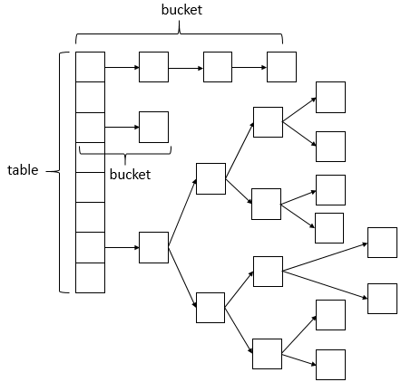
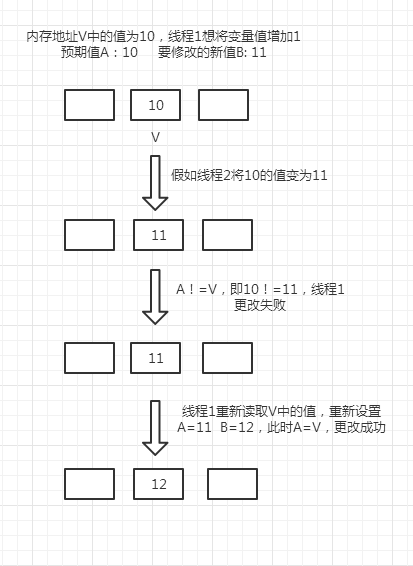

## concurrentHashMap
    Java并发包中提供的一个线程安全且高效的HashMap实现，可以完全替代HashTable，在并发编程的场景中使用频率非常之高。
    可能大多人只是知道它使用了多个锁代替HashTable中的单个锁，也就是锁分离技术（Lock Stripping）
## concurrentHashMap数据结构
    ConcurrentHashMap相比HashMap而言，是多线程安全的，其底层数据与HashMap的数据结构相同，数据结构如下:

## ConcurrentHashMap为什么高效？
    Hashtable低效主要是因为所有访问Hashtable的线程都争夺一把锁。如果容器有很多把锁，每一把锁控制容器中的一部分数据，那么当多个线程访问容器里的不同部分的数据时，线程之前就
    不会存在锁的竞争，这样就可以有效的提高并发的访问效率。
    这也正是ConcurrentHashMap使用的分段锁技术。将ConcurrentHashMap容器的数据分段存储，每一段数据分配一个Segment（锁），当线程占用其中一个Segment时，其他线程可正常访问
    其他段数据。

## CAS原理
    CAS（Compare and Swap）, 翻译成比较并交换。
    CAS有3个操作数，内存值V，旧的预期值A，要修改的新值B。当且仅当预期值A和内存值V相同时，将内存值V修改为B，否则什么都不做。
