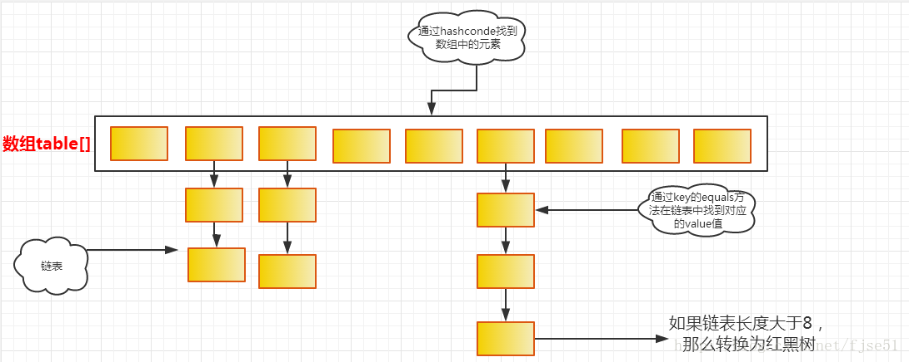
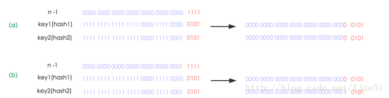
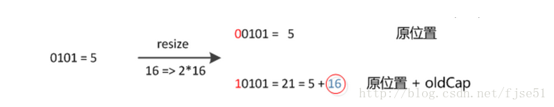
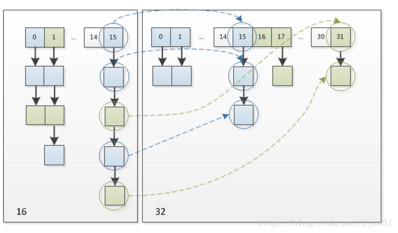

## hashMap 概述
    HashMap存储的是key-value的键值对，允许key为null，也允许value为null。HashMap内部为数组+链表的结构，会根据key的hashCode值来确定数组的索引(确认放在哪个桶里)，如果遇到索引相同的key，桶的大小是2，如果一个key的hashCode是7，一个key的hashCode是3，那么他们就会被分到一个桶中(hash冲突)，如果发生hash冲突，HashMap会将同一个桶中的数据以链表的形式存储，但是如果发生hash冲突的概率比较高，就会导致同一个桶中的链表长度过长，遍历效率降低，所以在JDK1.8中如果链表长度到达阀值(默认是8)，就会将链表转换成红黑二叉树。

## HashMap数据结构

## 存储结构key,value
### 确定哈希桶数据索引位置
    static final int hash(Object key) {
        int h;
	    // h = key.hashCode() 为第一步 取hashCode值
        // h ^ (h >>> 16)  为第二步 高位参与运算
        return (key == null) ? 0 : (h = key.hashCode()) ^ (h >>> 16);
    }
    
### put方法实现
     思路如下：
    1.table[]是否为空
    2.判断table[i]处是否插入过值
    3.判断链表长度是否大于8，如果大于就转换为红黑二叉树，并插入树中
    4.判断key是否和原有key相同，如果相同就覆盖原有key的value，并返回原有value
    5.如果key不相同，就插入一个key，记录结构变化一次
    
    final V putVal(int hash, K key, V value, boolean onlyIfAbsent,
                       boolean evict) {
            //判断table是否为空，如果是空的就创建一个table，并获取他的长度
            Node<K,V>[] tab; Node<K,V> p; int n, i;
            if ((tab = table) == null || (n = tab.length) == 0)
                n = (tab = resize()).length;
            //如果计算出来的索引位置之前没有放过数据，就直接放入
            if ((p = tab[i = (n - 1) & hash]) == null)
                tab[i] = newNode(hash, key, value, null);
            else {
            //进入这里说明索引位置已经放入过数据了
                Node<K,V> e; K k;
            //判断put的数据和之前的数据是否重复
                if (p.hash == hash &&
                    ((k = p.key) == key || (key != null && key.equals(k))))   //key的地址或key的equals()只要有一个相等就认为key重复了，就直接覆盖原来key的value
                    e = p;
            //判断是否是红黑树，如果是红黑树就直接插入树中
                else if (p instanceof TreeNode)
                    e = ((TreeNode<K,V>)p).putTreeVal(this, tab, hash, key, value);
                else {
            //如果不是红黑树，就遍历每个节点，判断链表长度是否大于8，如果大于就转换为红黑树
                    for (int binCount = 0; ; ++binCount) {
                        if ((e = p.next) == null) {
                            p.next = newNode(hash, key, value, null);
                            if (binCount >= TREEIFY_THRESHOLD - 1) // -1 for 1st
                                treeifyBin(tab, hash);
                            break;
                        }
            //判断索引每个元素的key是否可要插入的key相同，如果相同就直接覆盖
                        if (e.hash == hash &&
                            ((k = e.key) == key || (key != null && key.equals(k))))
                            break;
                        p = e;
                    }
                }
            //如果e不是null，说明没有迭代到最后就跳出了循环，说明链表中有相同的key，因此只需要将value覆盖，并将oldValue返回即可
                if (e != null) { // existing mapping for key
                    V oldValue = e.value;
                    if (!onlyIfAbsent || oldValue == null)
                        e.value = value;
                    afterNodeAccess(e);
                    return oldValue;
                }
            }
            //说明没有key相同，因此要插入一个key-value，并记录内部结构变化次数
            ++modCount;
            if (++size > threshold)
                resize();
            afterNodeInsertion(evict);
            return null;
        }
    
### get方法实现
    实现思路：
    1.判断表或key是否是null，如果是直接返回null
    2.判断索引处第一个key与传入key是否相等，如果相等直接返回
    3.如果不相等，判断链表是否是红黑二叉树，如果是，直接从树中取值
    4.如果不是树，就遍历链表查找
    
    final Node<K,V> getNode(int hash, Object key) {
            Node<K,V>[] tab; Node<K,V> first, e; int n; K k;
            //如果表不是空的，并且要查找索引处有值，就判断位于第一个的key是否是要查找的key
            if ((tab = table) != null && (n = tab.length) > 0 &&
                (first = tab[(n - 1) & hash]) != null) {
                if (first.hash == hash && // always check first node
                    ((k = first.key) == key || (key != null && key.equals(k))))
            //如果是，就直接返回
                    return first;
            //如果不是就判断链表是否是红黑二叉树，如果是，就从树中取值
                if ((e = first.next) != null) {
                    if (first instanceof TreeNode)
                        return ((TreeNode<K,V>)first).getTreeNode(hash, key);
            //如果不是树，就遍历链表
                    do {
                        if (e.hash == hash &&
                            ((k = e.key) == key || (key != null && key.equals(k))))
                            return e;
                    } while ((e = e.next) != null);
                }
            }
            return null;
        }
        
### 扩容
    我们使用的是2次幂的扩展(指长度扩为原来2倍)，所以，元素的位置要么是在原位置，要么是在原位置再移动2次幂的位置。看下图可以明白这句话的意思，n为table的长度，图（a）表示扩容前的key1和key2两种key确定索引位置的示例，图（b）表示扩容后key1和key2两种key确定索引位置的示例，其中hash1是key1对应的哈希与高位运算结果。

    元素在重新计算hash之后，因为n变为2倍，那么n-1的mask范围在高位多1bit(红色)，因此新的index就会发生这样的变化：

    因此，我们在扩充HashMap的时候，不需要像JDK1.7的实现那样重新计算hash，只需要看看原来的hash值新增的那个bit是1还是0就好了，是0的话索引没变，是1的话索引变成“原索引+oldCap”，可以看看下图为16扩充为32的resize示意图：

    这个设计确实非常的巧妙，既省去了重新计算hash值的时间，而且同时，由于新增的1bit是0还是1可以认为是随机的，因此resize的过程，均匀的把之前的冲突的节点分散到新的bucket了。这一块就是JDK1.8新增的优化点。有一点注意区别，JDK1.7中rehash的时候，旧链表迁移新链表的时候，如果在新表的数组索引位置相同，则链表元素会倒置，但是从上图可以看出，JDK1.8不会倒置。
    

### 总结
    (1) 扩容是一个特别耗性能的操作，所以当程序员在使用HashMap的时候，估算map的大小，初始化的时候给一个大致的数值，避免map进行频繁的扩容。
    (2) 负载因子是可以修改的，也可以大于1，但是建议不要轻易修改，除非情况非常特殊。
    (3) HashMap是线程不安全的，不要在并发的环境中同时操作HashMap，建议使用ConcurrentHashMap。
    (4) JDK1.8引入红黑树大程度优化了HashMap的性能，查找的时间复杂度从链表的O(n)优化到O（logn）

## 思考
    阈值为什么是8
    按照泊松分布的计算公式计算出了桶中元素个数和概率的对照表，可以看到链表中元素个数为8时的概率已经非常小，再多的就更少了，所以原作者在选择链表元素个数时选择了8，是根据概率统计而选择的。
    
    为什么默认桶16个
    太大和太小都不合适，所以16就作为一个比较合适的经验值被采用了。
    
    6的时候转化为链表
    为什么默认负载因子是0.75
    为什么初始化容量都是2的次幂