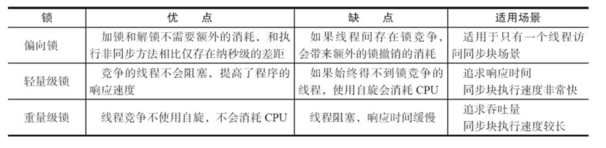

## synchronize
    Java虚拟机对synchronized的优化
    锁的状态总共有四种，无锁状态、偏向锁、轻量级锁和重量级锁。随着锁的竞争，锁可以从偏向锁升级到轻量级锁，
    再升级的重量级锁，但是锁的升级是单向的，也就是说只能从低到高升级，不会出现锁的降级，关于重量级锁，
    前面我们已详细分析过，下面我们将介绍偏向锁和轻量级锁以及JVM的其他优化手段，这里并不打算深入到每个锁的
    实现和转换过程更多地是阐述Java虚拟机所提供的每个锁的核心优化思想，毕竟涉及到具体过程比较繁琐，
    如需了解详细过程可以查阅《深入理解Java虚拟机原理》。

## 底层原理
    从JVM规范中可以看到Synchonized在JVM里的实现原理，JVM基于进入和退出Monitor对象来实现方法同步和代码块同步，
    但两者的实现细节不一样。代码块同步是使用monitorenter和monitorexit指令实现的，而方法同步是使用另外一种方式实现的，
    细节在JVM规范里并没有详细说明。但是，方法的同步同样可以使用这两个指令来实现。
    
    monitorenter指令是在编译后插入到同步代码块的开始位置，而monitorexit是插入到方法结束处和异常处，
    JVM要保证每个monitorenter必须有对应的monitorexit与之配对。任何对象都有一个monitor与之关联，
    当且一个monitor被持有后，它将处于锁定状态。线程执行到monitorenter指令时，将会尝试获取对象所对应的monitor的所有权，
    即尝试获得对象的锁。

## synchronized锁的实现
    synchronized有两种形式上锁，一个是对方法上锁，一个是构造同步代码块。
    他们的底层实现其实都一样，在进入同步代码之前先获取锁，获取到锁之后锁的计数器+1，
    同步代码执行完锁的计数器-1，如果获取失败就阻塞式等待锁的释放。只是他们在同步块识别方式上有所不一样，
    从class字节码文件可以表现出来，一个是通过方法flags标志，一个是monitorenter和monitorexit指令操作。

## synchronized的可重入性
    从互斥锁的设计上来说，当一个线程试图操作一个由其他线程持有的对象锁的临界资源时，将会处于阻塞状态，
    但当一个线程再次请求自己持有对象锁的临界资源时，这种情况属于重入锁，请求将会成功， 
    在java中synchronized是基于原子性的内部锁机制，是可重入的，因此在一个线程调用synchronized
    方法的同时在其方法体内部调用该对象另一个synchronized方法，也就是说一个线程得到一个对象锁后再次请求该对象锁，
    是允许的，这就是synchronized的可重入性。如下：
    public class AccountingSync implements Runnable{
        static AccountingSync instance=new AccountingSync();
        static int i=0;
        static int j=0;
        @Override
        public void run() {
            for(int j=0;j<1000000;j++){
    
                //this,当前实例对象锁
                synchronized(this){
                    i++;
                    increase();//synchronized的可重入性
                }
            }
        }
    
        public synchronized void increase(){
            j++;
        }
    
        public static void main(String[] args) throws InterruptedException {
            Thread t1=new Thread(instance);
            Thread t2=new Thread(instance);
            t1.start();
            t2.start();
            t1.join();
            t2.join();
            System.out.println(i);
        }
    }

    正如代码所演示的，在获取当前实例对象锁后进入synchronized代码块执行同步代码，
    并在代码块中调用了当前实例对象的另外一个synchronized方法，再次请求当前实例锁时，
    将被允许，进而执行方法体代码，这就是重入锁最直接的体现，需要特别注意另外一种情况，
    当子类继承父类时，子类也是可以通过可重入锁调用父类的同步方法。注意由于synchronized是基于monitor实现的，
    因此每次重入，monitor中的计数器仍会加1。
 

## 锁状态概述
    1.偏向锁
        HotSpot的作者经过研究发现，大多数情况下，锁不仅不存在多线程竞争，而且总是由同一线程多次获得，
        为了让线程获得锁的代价更低而引入了偏向锁。当一个线程访问同步块并获取锁时，会在对象头和栈帧中的锁记录里存储锁偏向的线程ID，
        以后该线程在进入和退出同步块时不需要进行CAS操作来加锁和解锁，只需简单地测试一下对象头的Mark Word里是否存储着指向
        当前线程的偏向锁。如果测试成功，表示线程已经获得了锁。如果测试失败，则需要再测试一下Mark Word中偏向锁的标识是否设置成1
        （表示当前是偏向锁）：如果没有设置，则使用CAS竞争锁；如果设置了，则尝试使用CAS将对象头的偏向锁指向当前线程。
    
    2.轻量级锁
        线程在执行同步块之前，JVM会先在当前线程的栈桢中创建用于存储锁记录的空间，并将对象头中的Mark Word复制到锁记录中，
        官方称为Displaced Mark Word。然后线程尝试使用CAS将对象头中的Mark Word替换为指向锁记录的指针。如果成功，
        当前线程获得锁，如果失败，表示其他线程竞争锁，当前线程便尝试使用自旋来获取锁。
    
    3.重量级锁
        内置锁在Java中被抽象为监视器锁（monitor）。在JDK 1.6之前，监视器锁可以认为直接对应底层操作系统中的互斥量（mutex）。
        这种同步方式的成本非常高，包括系统调用引起的内核态与用户态切换、线程阻塞造成的线程切换等。因此，后来称这种锁为“重量级锁”。
          

## synchronized与中断机制
    事实上线程的中断操作对于正在等待获取的锁对象的synchronized方法或者代码块并不起作用，
    也就是对于synchronized来说，如果一个线程在等待锁，那么结果只有两种，要么它获得这把锁继续执行，
    要么它就保存等待，即使调用中断线程的方法，也不会生效。

## Synchronized：保证可见性和原子性
    Synchronized能够实现原子性和可见性；在Java内存模型中，synchronized规定，线程在加锁时，
    先清空工作内存→在主内存中拷贝最新变量的副本到工作内存→执行完代码→将更改后的共享变量的值刷新到主内存中→释放互斥锁。

## 思考
    JVM对synchronized的优化? 锁消除,锁粗化,自旋锁与自适应自旋锁