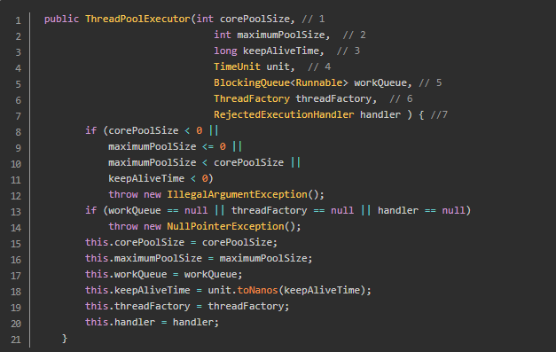
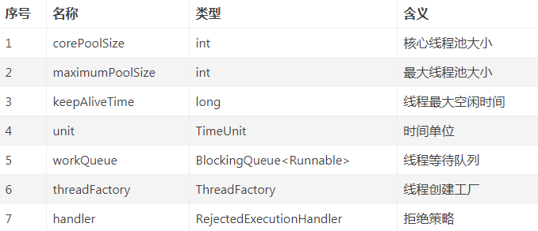

## ThreadPoolExecutor的重要参数

    1.corePoolSize：核心线程数
            * 核心线程会一直存活，及时没有任务需要执行
            * 当线程数小于核心线程数时，即使有线程空闲，线程池也会优先创建新线程处理
            * 设置allowCoreThreadTimeout=true（默认false）时，核心线程会超时关闭
    
    2.queueCapacity：任务队列容量（阻塞队列）
            * 当核心线程数达到最大时，新任务会放在队列中排队等待执行
    
    3.maxPoolSize：最大线程数
            * 当线程数>=corePoolSize，且任务队列已满时。线程池会创建新线程来处理任务
            * 当线程数=maxPoolSize，且任务队列已满时，线程池会拒绝处理任务而抛出异常
    
    4.keepAliveTime：线程空闲时间
            * 当线程空闲时间达到keepAliveTime时，线程会退出，直到线程数量=corePoolSize
            * 如果allowCoreThreadTimeout=true，则会直到线程数量=0
            
    5.allowCoreThreadTimeout：允许核心线程超时
    
    6.rejectedExecutionHandler：任务拒绝处理器
            * 两种情况会拒绝处理任务：
                - 当线程数已经达到maxPoolSize，切队列已满，会拒绝新任务
                - 当线程池被调用shutdown()后，会等待线程池里的任务执行完毕，再shutdown。如果在调用shutdown()和线程池真正shutdown之间提交任务，会拒绝新任务
            * 线程池会调用rejectedExecutionHandler来处理这个任务。如果没有设置默认是AbortPolicy，会抛出异常
            * ThreadPoolExecutor类有几个内部实现类来处理这类情况：
                - AbortPolicy 丢弃任务，抛运行时异常
                - CallerRunsPolicy 执行任务
                - DiscardPolicy 忽视，什么都不会发生
                - DiscardOldestPolicy 从队列中踢出最先进入队列（最后一个执行）的任务
            * 实现RejectedExecutionHandler接口，可自定义处理器
        
## ThreadPoolExecutor执行顺序
    线程池按以下行为执行任务
        1. 当线程数小于核心线程数时，创建线程。
        2. 当线程数大于等于核心线程数，且任务队列未满时，将任务放入任务队列。
        3. 当线程数大于等于核心线程数，且任务队列已满
            - 若线程数小于最大线程数，创建线程
            - 若线程数等于最大线程数，抛出异常，拒绝任务
        
## 预定义线程池
    FixedThreadPool 适用场景：可用于Web服务瞬时削峰，但需注意长时间持续高峰情况造成的队列阻塞。
    CachedThreadPool 适用场景：快速处理大量耗时较短的任务，如Netty的NIO接受请求时，可使用CachedThreadPool。
    SingleThreadExecutor 
    ScheduledThreadPool 

