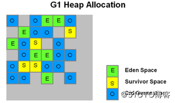
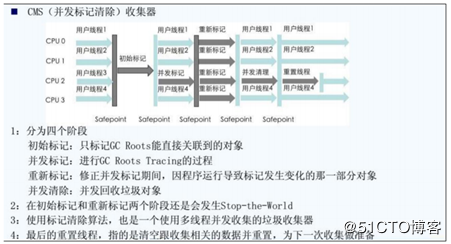

## G1收集器
    G1收集特性：
    G1结构：G1将heap划分为多个（2000左右）大小相等的region进行管理。region大小（1～32M）由jvm启动时决定
    不同region被映射为逻辑上的不同功能区域，不同区域region不需要连续。活跃数据在不同region复制和移动，region并行收集
    年轻代收集，STW，eden survivor大小根据存储的统计信息进行计算设置（为下一次收集使用）
    heap划分为多个region管理；yong区域，不连续，易于改变大小；引发暂停；多线程并行收集；复制或升级。
    
    特点：
       - 空间整合：G1收集器采用标记整理算法，不会产生内存空间碎片。分配大对象时不会因为无法找到连续空间而提前触发下一次GC。
       - 可预测的停顿：降低停顿时间是G1和CMS的共同关注点，但G1除了追求低停顿外，还能建立可预测的停顿时间模型，
    能让使用者明确指定在一个长度为N毫秒的时间片段内，消耗在垃圾收集上的时间不得超过M毫秒，这几乎已经是实时Java（RTSJ）
    的垃圾收集器的特征了。
       - G1收集器，Java堆的内存布局与其他收集器有很大差别，它将整个Java堆划分为多个大小相等的独立区域（Region），
    虽然还保留有新生代和老年代的概念，但新生代和老年代不再是物理隔阂了，它们都是一部分（可以不连续）Region的集合。

    G1的新生代收集跟ParNew类似，当新生代占用达到一定比例的时候，开始触发收集。这样一来可以做到，当达到一定的比例时，
    触发垃圾回收，那些没有使用region仍然可以对外提供使用，就有效的避免了stop the world。
      与CMS的比较：
       - 分代：CMS中，堆被分为PermGen，YoungGen，OldGen；而YoungGen又分了两个survivor区域。在G1中，
    堆被平均分成几个区域(region)，在每个区域中，虽然也保留了新老代的概念，但是收集器是以整个区域为单位收集的。
    
       - 算法：相对于CMS的“标记—清除”算法，G1会使用“标记-整理”算法，保证不产生多余的碎片。
       - 停顿时间可控制：缩短了停顿时间，G1建立可预测停顿模型，这样在用户设置的停顿时间范围内，G1会选择适当的
    区域进行收集，确保停顿时间不超过用户指定时间。
    
## CMS收集器
    CMS（Concurrent Mark Sweep）收集器是一种以获取最短回收停顿时间为目标的收集器。
    目前很大一部分的Java应用都集中在互联网站或B/S系统的服务端上，这类应用尤其重视服务的响应速度，
    希望系统停顿时间最短，以给用户带来较好的体验。

    优点：并发收集、低停顿
    缺点：产生大量的空间碎片，并发节点吞吐率低。
    参数配置：
    -XX:+UseConcMarkSweepGC 使用 CMS 收集器 
    -XX:+ UseCMSCompactAtFullCollection Full GC 后，进行一次碎片整理；整理过程是独占的，会引起停顿时间变长 
    -XX:+CMSFullGCsBeforeCompaction 设置进行几次Full GC后，进行一次碎片整理 
    -XX:ParallelCMSThreads 设定CMS的线程数量（一般情况约等于可用 CPU 数量）
    
## G1如何做到可预测的停顿
    G1中有一个Remembered Sets，简称RSets，每一个region都存在的一个RSets，用来记录哪一个区引用了
    该区(因此，在minor GC时，也可以根据RSets来扫描老年代中有引用哪些新生代的对象，避免扫描整个老年代)；
    还有一个Collection Sets，简称CSets，记录了等待回收的region区，GC时这些region区里面的对象会被回收。

## 停顿时间模型
    停顿时间模型（Pause Prediction Model）：指定在一个长度为M毫秒的时间片段内，消耗在垃圾收集上的时间大概率不超过N毫秒。
    G1收集器之所以能建立可预测的停顿时间模型，是因为它将Region作为单次回收的最小单元
    （每次收集到的内存空间都是Region大小的整数倍），这样可以有计划地避免整个Java堆进行全区域垃圾收集。
    更具体的处理思路：让G1收集器去跟踪各个Region中的垃圾堆积的“价值”大小，然后在后台维护一个优先级列表，
    每次根据用户设定的收集停顿时间，优先处理回收价值收益最大的那些Region（这就是“Garbage First”名字的由来）。
    
    * “价值”的衡量指标是：每次回收所获得的空间大小以及回收所需时间的经验值。