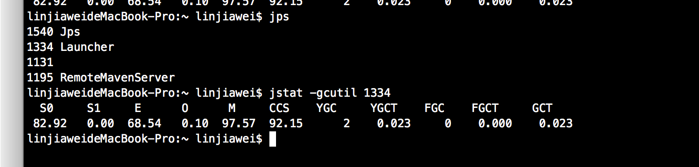

## GC概述
    GC(Garbage Collection)：即垃圾回收器，诞生于1960年MIT的Lisp语言，主要是用来回收，释放垃圾占用的空间。
    
### 三大垃圾收集算法
    1.标记/清除算法【最基础】
    2.复制算法
    3.标记/整理算法
    jvm采用`分代收集算法`对不同区域采用不同的回收算法

    新生代采用复制算法
    新生代中因为对象都是"朝生夕死的"，【深入理解JVM虚拟机上说98%的对象,不知道是不是这么多，总之就是存活率很低】，适用于复制算法【复制算法比较适合用于存活率低的内存区域】。
    它优化了标记/清除算法的效率和内存碎片问题，且JVM不以5:5分配内存【由于存活率低，不需要复制保留那么大的区域造成空间上的浪费，因此不需要按1:1【原有区域:保留空间】划分内存区域，
    而是将内存分为一块Eden空间和From Survivor、To Survivor【保留空间】，三者默认比例为8:1:1，优先使用Eden区，若Eden区满，则将对象复制到第二块内存区上。
    但是不能保证每次回收都只有不多于10%的对象存货，所以Survivor区不够的话，则会依赖老年代年存进行分配】。
    
    GC开始时，对象只会存于Eden和From Survivor区域，To Survivor【保留空间】为空。
    
    GC进行时，Eden区所有存活的对象都被复制到To Survivor区，而From Survivor区中，仍存活的对象会根据它们的年龄值决定去向，年龄值达到年龄阈值(默认15是因为对象头中年龄战4bit，
    新生代每熬过一次垃圾回收，年龄+1)，则移到老年代，没有达到则复制到To Survivor。
    
    老年代采用标记/清除算法或标记/整理算法
    由于老年代存活率高，没有额外空间给他做担保，必须使用这两种算法。

### jdk7、8、9默认垃圾回收器
    jdk1.7 默认垃圾收集器Parallel Scavenge（新生代）+Parallel Old（老年代）
    jdk1.8 默认垃圾收集器Parallel Scavenge（新生代）+Parallel Old（老年代）
    jdk1.9 默认垃圾收集器G1
    
    -XX:+PrintCommandLineFlagsjvm参数可查看默认设置收集器类型
    -XX:+PrintGCDetails亦可通过打印的GC日志的新生代、老年代名称判断

### 垃圾收集器(jdk1.8默认的是 UseParallelGC收集器,jdk1.9 默认垃圾收集器G1)
    年轻代收集器
    Serial、ParNew、Parallel Scavenge
    老年代收集器
    Serial Old、Parallel Old、CMS收集器
    特殊收集器
    G1收集器[新型，不在年轻、老年代范畴内]
    
    重点概述
#### CMS
    CMS收集器(Concurrent Mark Sweep)是以一种获取最短回收停顿时间为目标的收集器。【重视响应，可以带来好的用户体验，被sun称为并发低停顿收集器】
    启用CMS：-XX:+UseConcMarkSweepGC
    它的运作分为4个阶段
    
    1.初始标记:标记一下GC Roots能直接关联到的对象，速度很快
    2.并发标记:GC Roots Tarcing过程，即可达性分析
    3.重新标记:为了修正因并发标记期间用户程序运作而产生变动的那一部分对象的标记记录，会有些许停顿，时间上一般 初始标记 < 重新标记 < 并发标记
    4.并发清除
    以上初始标记和重新标记需要stw(停掉其它运行java线程)
    之所以说CMS的用户体验好，是因为CMS收集器的内存回收工作是可以和用户线程一起并发执行。
    
    缺点
    1.cms堆cpu特别敏感，cms运行线程和应用程序并发执行需要多核cpu，如果cpu核数多的话可以发挥它并发执行的优势，但是cms默认配置启动的时候垃圾线程数为 (cpu数量+3)/4，它的性能很容易受cpu核数影响，当cpu的数目少的时候比如说为为2核，如果这个时候cpu运算压力比较大，还要分一半给cms运作，这可能会很大程度的影响到计算机性能。
    2.cms无法处理浮动垃圾，可能导致Concurrent Mode Failure（并发模式故障）而触发full GC
    3.由于cms是采用"标记-清除“算法,因此就会存在垃圾碎片的问题，为了解决这个问题cms提供了 -XX:+UseCMSCompactAtFullCollection选项，这个选项相当于一个开关【默认开启】，用于CMS顶不住要进行full GC时开启内存碎片合并，内存整理的过程是无法并发的，且开启这个选项会影响性能(比如停顿时间变长)
    
    浮动垃圾:由于cms支持运行的时候用户线程也在运行，程序运行的时候会产生新的垃圾，这里产生的垃圾就是浮动垃圾，cms无法当次处理，得等下次才可以。
#### G1
    G1(garbage first:尽可能多收垃圾，避免full gc)收集器是当前最为前沿的收集器之一(1.7以后才开始有)，同cms一样也是关注降低延迟，是用于替代cms功能更为强大的新型收集器，因为它解决了cms产生空间碎片等一系列缺陷。
    摘自甲骨文:适用于 Java HotSpot VM 的低暂停、服务器风格的分代式垃圾回收器。G1 GC 使用并发和并行阶段实现其目标暂停时间，并保持良好的吞吐量。当 G1 GC 确定有必要进行垃圾回收时，它会先收集存活数据最少的区域（垃圾优先)
    
    g1的特别之处在于它强化了分区，弱化了分代的概念，是区域化、增量式的收集器，它不属于新生代也不属于老年代收集器。
    
    用到的算法为标记-清理、复制算法
    
    jdk1.7,1.8的都是默认关闭的，更高版本的还不知道
    开启选项 -XX:+UseG1GC 
    比如在tomcat的catania.sh启动参数加上
    
    
    g1是区域化的，它将java堆内存划分为若干个大小相同的区域【region】，jvm可以设置每个region的大小(1-32m,大小得看堆内存大小，必须是2的幂),它会根据当前的堆内存分配合理的region大小。
    
    g1通过并发(并行)标记阶段查找老年代存活对象，通过并行复制压缩存活对象【这样可以省出连续空间供大对象使用】。
    
    g1将一组或多组区域中存活对象以增量并行的方式复制到不同区域进行压缩，从而减少堆碎片，目标是尽可能多回收堆空间【垃圾优先】，且尽可能不超出暂停目标以达到低延迟的目的。
    
    g1提供三种垃圾回收模式 young gc、mixed gc 和 full gc,不像其它的收集器，根据区域而不是分代，新生代老年代的对象它都能回收。
    
    几个重要的默认值，更多的查看官方文档oracle官方g1中文文档
    g1是自适应的回收器，提供了若干个默认值，无需修改就可高效运作
    -XX:G1HeapRegionSize=n  设置g1 region大小，不设置的话自己会根据堆大小算，目标是根据最小堆内存划分2048个区域
    -XX:MaxGCPauseMillis=200 最大停顿时间 默认200毫秒

##### Minor GC
    在年轻代Young space(包括Eden区和Survivor区)中的垃圾回收称之为 Minor GC,Minor GC只会清理年轻代.
##### Major GC
    Major GC清理老年代(old GC)，但是通常也可以指和Full GC是等价，因为收集老年代的时候往往也会伴随着升级年轻代，收集整个Java堆。所以有人问的时候需问清楚它指的是full GC还是old GC。
##### FULL GC
    full gc是对新生代、老年代、永久代【jdk1.8后没有这个概念了】统一的回收。
    【知乎R大的回答:收集整个堆，包括young gen、old gen、perm gen（如果存在的话)、元空间(1.8及以上)等所有部分的模式】
##### mixed gc
    混合GC
    收集整个young gen以及部分old gen的GC。只有G1有这个模式

## GC日志
    1.简单日志查看
    在idea配置参数(-XX:+PrintGCDetails)即可
    
    2.离线工具查看
    比如sun的gchisto，gcviewer离线分析工具，做个笔记先了解下还没用过，可视化好像很好用的样子。
    
    3.自带的jconsole工具、jstat命令
    使用：jps获取进程号pid-》jstat -gcutil pid

    s0: 新生代survivor space0简称 就是准备复制的那块 单位为%
    s1:指新生代s1已使用百分比，为0的话说明没有存活对象到这边
    e:新生代eden(伊甸园)区域(%)
    o:老年代(%)
    ygc:新生代  次数
    ygct:minor gc耗时
    fgct:full gc耗时(秒)
    GCT: ygct+fgct 耗时

## 什么时候触发GC
    minor GC(young GC):当年轻代中eden区分配满的时候触发[值得一提的是因为young GC后部分存活的对象会已到老年代(比如对象熬过15轮)，所以过后old gen的占用量通常会变高]
    
    full GC:
    ①手动调用System.gc()方法 [增加了full GC频率，不建议使用而是让jvm自己管理内存，可以设置-XX:+ DisableExplicitGC来禁止RMI调用System.gc]
    ②发现perm gen（如果存在永久代的话)需分配空间但已经没有足够空间
    ③老年代空间不足，比如说新生代的大对象大数组晋升到老年代就可能导致老年代空间不足。
    ④CMS GC时出现Promotion Faield[pf]
    ⑤统计得到的Minor GC晋升到旧生代的平均大小大于老年代的剩余空间。
    这个比较难理解，这是HotSpot为了避免由于新生代晋升到老年代导致老年代空间不足而触发的FUll GC。
    比如程序第一次触发Minor GC后，有5m的对象晋升到老年代，姑且现在平均算5m，那么下次Minor GC发生时，先判断现在老年代剩余空间大小是否超过5m，如果小于5m，则HotSpot则会触发full GC(这点挺智能的)

## 怎么理解g1，适用于什么场景
    g1不再区分老年代、年轻代这样的内存空间，这是较以往收集器很大的差异，所有的内存空间就是一块划分为不同子区域，每个区域大小为1m-32m，最多支持的内存为64g左右，且由于它为了的特性适用于大内存机器。
    
    适用场景:
    1.像cms能与应用程序并发执行，GC停顿短【短而且可控】，用户体验好的场景。
    2.面向服务端，大内存，高cpu的应用机器。【网上说差不多是6g或更大】
    3.应用在运行过程中经常会产生大量内存碎片，需要压缩空间【比cms好的地方之一，g1具备压缩功能】。

## 堆溢出和栈溢出
    如果线程请求的栈深度大于虚拟机所允许的最大深度，将抛出StackOverflowError异常。
    如果虚拟机在扩展栈时无法申请到足够的空间，抛出OutOfMemoryError异常。

### 内存溢出和内存泄露区别
    内存溢出：申请内存空间,超出最大堆内存空间。
    内存泄露：其实包含内存溢出,堆内存空间被无用对象占用没有及时释放，导致占用内存，最终导致内存泄露。