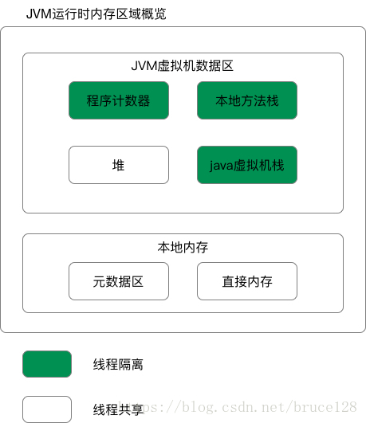
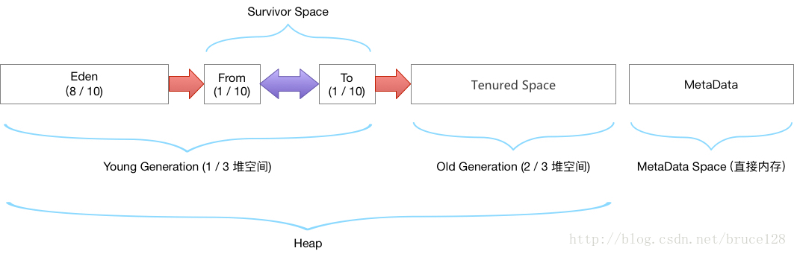

## JVM概述(JDK1.8)

## 堆

    堆是JVM内存占用最大，管理最复杂的一个区域。其唯一的用途就是存放对象实例：几乎所有的对象实例及数组都在堆上进行分配。
    1.7后，字符串常量池从永久代中剥离出来，存放在堆中。堆有自己进一步的内存分块划分，按照GC分代收集角度的划分请参见上图。

### 堆空间内存分配（默认情况下）
    老年代 ： 三分之二的堆空间
    年轻代 ： 三分之一的堆空间
        eden区： 8/10 的年轻代空间
        survivor0 : 1/10 的年轻代空间
        survivor1 : 1/10 的年轻代空间

## 双亲委派模型      
    双亲委派模式的工作原理的是;如果一个类加载器收到了类加载请求，它并不会自己先去加载，
    而是把这个请求委托给父类的加载器去执行，如果父类加载器还存在其父类加载器，则进一步向上委托，依次递归，
    请求最终将到达顶层的启动类加载器，如果父类加载器可以完成类加载任务，就成功返回，倘若父类加载器无法完成此加载任务，
    子加载器才会尝试自己去加载，这就是双亲委派模式，即每个儿子都不愿意干活，每次有活就丢给父亲去干，
    直到父亲说这件事我也干不了时，儿子自己想办法去完成，这不就是传说中的双亲委派模式.那么这种模式有什么作用呢?
    
    采用双亲委派模式的是好处是Java类随着它的类加载器一起具备了一种带有优先级的层次关系，
    通过这种层级关可以避免类的重复加载，当父亲已经加载了该类时，就没有必要子ClassLoader再加载一次。
    其次是考虑到安全因素，java核心api中定义类型不会被随意替换，假设通过网络传递一个名为java.lang.Integer的类，
    通过双亲委托模式传递到启动类加载器，而启动类加载器在核心Java API发现这个名字的类，发现该类已被加载，
    并不会重新加载网络传递的过来的java.lang.Integer，而直接返回已加载过的Integer.class，
    这样便可以防止核心API库被随意篡改。
    
    这种双亲委派模式的好处，一个可以避免类的重复加载，另外也避免了java的核心API被篡改

## tomcat为什么要打破双亲委派
    在某些情况下，Tomcat（Apache Tomcat）需要打破双亲委派机制，主要是为了解决类加载的灵活性和可定制性的需求。
    Tomcat引入了类加载器的分级机制，打破了双亲委派机制。在Tomcat中，每个Web应用程序都有自己的Web应用类加载器（WebAppClassLoader），
    它负责加载应用程序的类和资源。Web应用类加载器在加载类时会先检查自己是否已加载，如果未加载则尝试加载，而不委派给父加载器。

    通过打破双亲委派机制，Tomcat能够实现以下优势：
    隔离性：每个Web应用程序拥有独立的类加载器，可以隔离类加载的命名空间，避免类冲突问题。
    动态更新：每个Web应用程序的类加载器可以独立加载和重新加载类定义，实现应用程序的热部署和动态更新。
    可定制性：Tomcat的类加载器机制允许开发人员自定义类加载器，实现特定的类加载策略，满足应用程序的特殊需求。
    需要注意的是，打破双亲委派机制也带来了一些潜在的风险和问题，例如可能引入类加载的混乱和不确定性，增加应用程序开发和维护的复杂性。
    因此，在开发和部署Web应用程序时，需要谨慎处理类加载器的使用，避免引入潜在的问题。

### jvm栈帧介绍
    栈帧定义：当线程执行到某个方法时就会往方法线程栈中压入一个帧，称为栈帧，栈帧中包含了方法的局部变量表、操作数栈、返回地址、动态连接、一些附加信息
    |.局部变量表 包含boolean、byte、char、short、int、float、reference和returnAddress八种
    ||.操作数栈 表示函数表达式
    |||.动态链接 表示对常量池常量的引用
    ||||.方法返回地址 表示方法正常返回的地址以及异常返回

    栈帧的大小主要由函数的参数和局部变量决定，参数和局部变量越多，使得局部变量表膨胀，它的栈帧就越大，以满足方法调用所需传递的信息增大的需求。

### 常见的jvm参数
    -XX:MaxTenuringThreshold：对象晋升老年代的阈值，默认值15（并不是绝对的，如果在Survivor空间中相同年龄所有对象大小的综合大于Survivor空间的一半，年龄大于或等于该年龄的对象就可以直接进入老年代）
    -XX:MaxPermSize~~：永久代大小
    -XX:MaxDirectMemorySize：直接内存大小，默认与-Xmx一致
    -XX:+/-UseTLAB：是否开启TLAB
    -XX:MaxMetaspace=256m：元数据区，默认为无限大，受Java进程所使用的内存影响
    -XX:FieldsAllocationStyle：对象内存分布中的实例数据区域的存储顺序
    -XX:CompactFields=true：由于HotSpot在分配对象实例数据时相同大小的字段总是被分配到一起存储，在满足这个条件下因此父类中定义的变量会出现在子类之前，开启此参数那子类中较小的变量也允许插入父类变量的空隙中，以节省一点空间
    -XX:+UseCondCardMark：是否开启JVM卡表条件判断，尽量减少伪共享带来的性能损耗
    -XX:MaxGCPauseMillis（毫秒 >0）：控制最大垃圾收集停顿时间，默认值200
    -XX:ParallelGCThreads=NUM：垃圾收集并行执行线程数，默认为CPU的核数
    -XX：+UseAdaptiveSizePolicy：是否开启自适应调节策略，JDK8默认开启
    -XX：SurvivorRatio：Eden和Survivor区的比例
    -XX：PretenureSizeThreshold：晋升老年代对象大小，超过指定大小直接在老年代分配，默认为0
    -XX:+PrintGCDetails：打印GC详细日志
    -XX:+PrintHeapAtGC：打印每次GC前后堆、方法区可用容量变化
    -XX:+PrintGCApplicationConcurrentTime ：查看GC过程中用户线程并发时间
    -XX:+PrintGCApplicationStoppedTime：查看GC过程中用户线程停顿时间
    -XX:+PrintFlagsFinal：查看JVM参数的默认值

