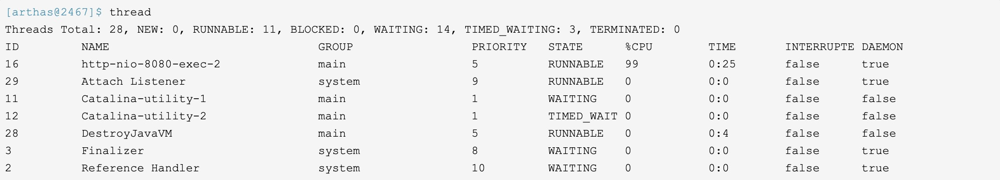
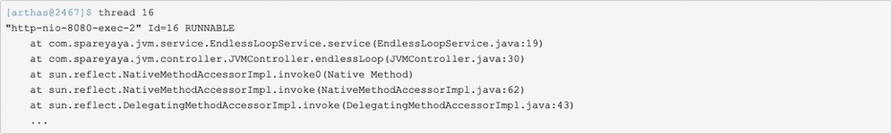
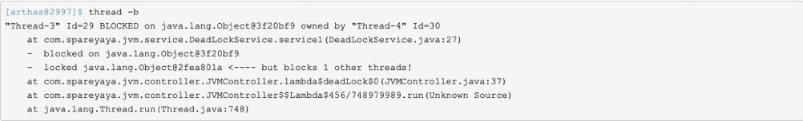
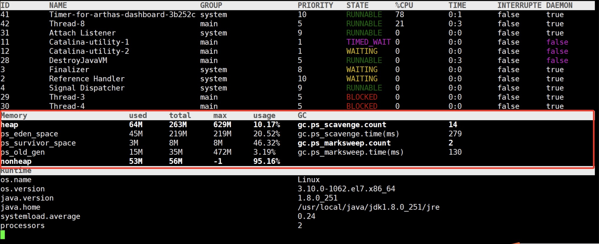
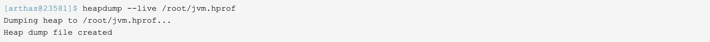

## JVM调优神器-arthas
    介绍一个jvm工具，它是阿里巴巴开源的一个工具——arthas（阿尔萨斯）。
    
### 安装
    arthas在github上有个page，地址是https://alibaba.github.io/arthas/。
    直接下载一个可以启动的jar包然后用java -jar的方式启动
    
### 启动
    java -jar arthas-boot.jar 一定要基于java应用启动，否则失败
    
### help命令
    在arthas交互环境中，可以输入help命令，然后会出现所有arthas支持的命令（略）
    
### 用arthas解决实际问题
> cpu占用过高
>> 用thread命令列出线程的信息

>> 这个命令会把所有线程按照cpu占用率从高到低列出来，如果线程太多，可以通过-n参数指定输出的行数。
>> 上面的输出结果可以看到id为16的这个线程cpu占用率很过，然后再通过thread加线程id输出改线程的栈信息

>> 两步就定位到了问题

> 死锁
>> 还是用thread命令，参数是-b

>> 这个命令和jstack工具检测死锁同样简单，不过个人认为jstack工具检测死锁其实要比这个更直观一些。

> 内存泄漏
>> 这个我们可以用dashboard命令来动态查看内存情况

>> 如果内容使用率在不断上升，而且gc后也不下降，后面还发现gc越来越频繁，很可能就是内存泄漏了。
>> 这个时候我们可以直接用heapdump命令把内存快照dump出来，作用和jmap工具一样

>> 然后把得到的dump文件导入eclipse，用MAT插件分析就行了。