## 服务器线上问题排查研究
    线上问题诸如：
    　　1、线上服务器CPU占用率高如何排查？
    　　2、线上服务器Load飙高如何排查？ 
    　　3、线上服务器频繁发生Full GC如何排查？ 
    　　4、线上服务器发生死锁如何排查？

### 线上服务器CPU占用率高如何排查？

#### 问题发现：
    　在每次大促之前，我们的测试人员都会对网站进行压力测试，这个时候会查看服务的cpu、内存、load、rt、qps等指标。
    　在一次压测过程中，测试人员发现我们的某一个接口，在qps上升到500以后，CPU使用率急剧升高。
#### 问题定位：
##### 定位进程：登录服务器，执行top命令，查看CPU占用情况：
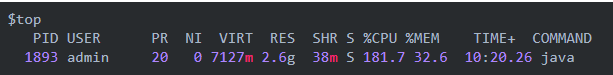

    top命令是Linux下常用的性能分析工具，能够实时显示系统中各个进程的资源占用状况，类似于Windows的任务管理器。
    通过以上命令，我们可以看到，进程ID为1893的Java进程的CPU占用率达到了181%，基本可以定位到是我们的Java应用导致整个服务器的CPU占用率飙升。

##### 定位线程
    我们知道，Java是单进程多线程的，那么，我们接下来看看PID=1893的这个Java进程中的各个线程的CPU使用情况，同样是用top命令： 
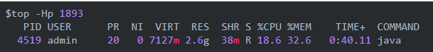

    通过top -Hp 1893命令，我们可以发现，当前1893这个进程中，ID为4519的线程占用CPU最高。

##### 定位代码
    通过top命令，我们目前已经定位到导致CPU使用率较高的具体线程， 那么我么接下来就定位下到底是哪一行代码存在问题。

    首先，我们需要把4519这个线程转成16进制：
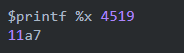

    接下来，通过jstack命令，查看栈信息：
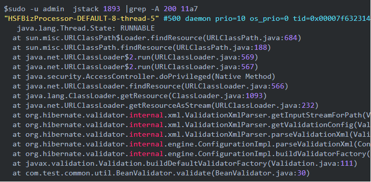

    通过以上代码，我们可以清楚的看到，BeanValidator.java的第30行是有可能存在问题的。

#### 问题解决
    接下来就是通过查看代码来解决问题了，我们发现，我们自定义了一个BeanValidator，封装了Hibernate的Validator，然后在validate方法中，通过Validation.buildDefaultValidatorFactory().getValidator()初始化一个Validator实例，通过分析发现这个实例化的过程比较耗时。
    我们重构了一下代码，把Validator实例的初始化提到方法外，在类初始化的时候创建一次就解决了问题。

#### 总结 
    以上，展示了一次比较完成的线上问题定位过程。主要用到的命令有:top 、printf 和 jstack
    另外，线上问题排查还可以使用Alibaba开源的工具Arthas进行排查，以上问题，可以使用一下命令定位：
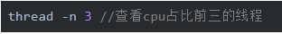

    以上，本文介绍了如何排查线上服务器CPU使用率过高的问题，如果大家感兴趣，后面可以再介绍一些关于LOAD飙高、频繁GC等问题的排查手段。
    jstack(查看线程)、jmap(查看内存)和jstat(性能分析)  
  
  
### 线上服务器Load(负载)飙高如何排查？ 
    Linux的负载高，主要是由于CPU使用、内存使用、IO消耗三部分构成。任意一项使用过多，都将导致服务器负载的急剧攀升。
    
    1、使用uptime查看当前load，发现load飙高。
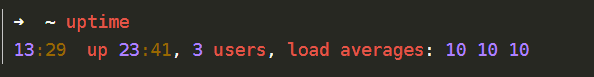

    uptime命令能够打印系统总共运行了多长时间和系统的平均负载。uptime命令可以显示的信息显示依次为：现在时间、系统已经运行了多长时间、目前有多少登陆用户、系统在过去的1分钟、5分钟和15分钟内的平均负载。
    这行信息的后半部分，显示”load average”，它的意思是”系统的平均负荷”，里面有三个数字，我们可以从中判断系统负荷是大还是小。
    10 10 10 这三个数字的意思分别是1分钟、5分钟、15分钟内系统的平均负荷。我们一般表示为load1、load5、load15。　
    
    2、使用top命令，查看占用CPU较高的进程ID。
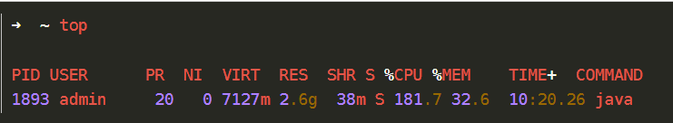

    发现PID为1893的进程占用CPU 181%。而且是一个Java进程，基本断定是软件问题。
    
    3、使用 top命令 （top -Hp 进程id），查看具体是哪个线程占用率较高
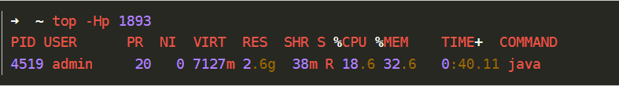

    4、使用printf命令查看这个线程的16进制
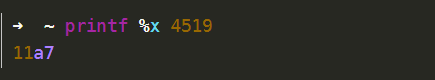

    5、使用jstack命令查看当前线程正在执行的方法 (jstack 进程id | grep 线程id的16进制)。
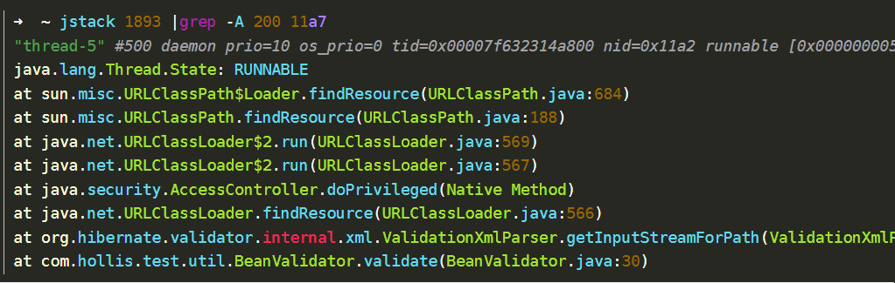

    从上面的线程的栈日志中，可以发现，当前占用CPU较高的线程正在执行我代码的com.hollis.test.util.BeanValidator.validate(BeanValidator.java:30)类。那么就可以去排查这个类是否用法有问题了。
    
### 线上服务器频繁发生Full GC如何排查？ 
    1：查看JVM堆配置参数
    2：linux下查看java虚拟机（JVM）GC情况
    3：导出堆栈的dump信息分析
    
    jstat命令命令格式：
    jstat [Options] vmid [interval] [count]
     
    参数说明：
    　　Options，选项，我们一般使用 -gcutil 查看gc情况
    　　vmid，VM的进程号，即当前运行的java进程号
    　　interval，间隔时间，单位为秒或者毫秒
    　　count，打印次数，如果缺省则打印无数次
    实例说明
    示例
    通常运行命令如下：
    　　jstat -gc 12538 5000
    即会每5秒一次显示进程号为12538的java进成的GC情况，
    显示内容如下图：
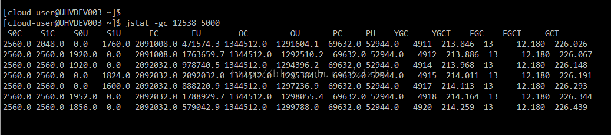

    结果说明
    　显示内容说明如下（部分结果是通过其他其他参数显示的，暂不说明）：
             S0C：年轻代中第一个survivor（幸存区）的容量 (字节) 
             S1C：年轻代中第二个survivor（幸存区）的容量 (字节) 
             S0U：年轻代中第一个survivor（幸存区）目前已使用空间 (字节) 
             S1U：年轻代中第二个survivor（幸存区）目前已使用空间 (字节) 
             EC：年轻代中Eden（伊甸园）的容量 (字节) 
             EU：年轻代中Eden（伊甸园）目前已使用空间 (字节) 
             OC：Old代的容量 (字节) 
             OU：Old代目前已使用空间 (字节) 
             PC：Perm(持久代)的容量 (字节) 
             PU：Perm(持久代)目前已使用空间 (字节) 
             YGC：从应用程序启动到采样时年轻代中gc次数 
             YGCT：从应用程序启动到采样时年轻代中gc所用时间(s) 
             FGC：从应用程序启动到采样时old代(全gc)gc次数 
             FGCT：从应用程序启动到采样时old代(全gc)gc所用时间(s) 
             GCT：从应用程序启动到采样时gc用的总时间(s) 
             NGCMN：年轻代(young)中初始化(最小)的大小 (字节) 
             NGCMX：年轻代(young)的最大容量 (字节) 
             NGC：年轻代(young)中当前的容量 (字节) 
             OGCMN：old代中初始化(最小)的大小 (字节) 
             OGCMX：old代的最大容量 (字节) 
             OGC：old代当前新生成的容量 (字节) 
             PGCMN：perm代中初始化(最小)的大小 (字节) 
             PGCMX：perm代的最大容量 (字节)   
             PGC：perm代当前新生成的容量 (字节) 
             S0：年轻代中第一个survivor（幸存区）已使用的占当前容量百分比 
             S1：年轻代中第二个survivor（幸存区）已使用的占当前容量百分比 
             E：年轻代中Eden（伊甸园）已使用的占当前容量百分比 
             O：old代已使用的占当前容量百分比 
             P：perm代已使用的占当前容量百分比 
             S0CMX：年轻代中第一个survivor（幸存区）的最大容量 (字节) 
             S1CMX ：年轻代中第二个survivor（幸存区）的最大容量 (字节) 
             ECMX：年轻代中Eden（伊甸园）的最大容量 (字节) 
             DSS：当前需要survivor（幸存区）的容量 (字节)（Eden区已满） 
             TT： 持有次数限制 
             MTT ： 最大持有次数限制
     若发现GC频繁则可能是内存泄露等情况
     
#### 进一步内存泄漏排查
##### 场景 
    业务系统消费MQ中消息速度变慢，积压了200多万条消息，通过jstat观察到业务系统fullgc比较频繁,到最后干脆OOM了：
    JVM如果出现内存泄露，典型的现象就是系统FullGC比较频繁。到最后干脆OOM(Out of Memory)了。
    
    当发现应用内存溢出或长时间使用内存很高的情况下，通过内存dump进行分析可找到原因。
    
    当发现cpu使用率很高时，通过线程dump定位具体哪个线程在做哪个工作占用了过多的资源。
    
    内存dump是指通过jmap -dump <pid>输出的文件，而线程dump是指通过jstack <pid>输出的信息。
    
    使用top查看目前正在运行的进程使用系统资源情况。
    
    首先是内存dump： jmap –dump:live,format=b,file=heap.bin <pid>
    其次是线程dump，比如说： jstack -m <pid> >jvm_deadlocks.txt 或 jstack -l <pid> >jvm_listlocks.txt
    
    dump堆要花较长的时间，并且文件巨大，再从服务器上拖回本地导入工具MAT。

##### 场景1
    原因分析
    系统中有一个调用频繁的接口会调用下面这个方法，目的是获取图片的宽高信息，但是Image这个对象用完不会自动释放，需要手动调用 flush()方法；以前没有调用这个方法，就导致一有请求就会有大对象进入old区，在业务高峰期old区一会就被打满，所以一直进行fgc 
    public static Image getImage(String path) { 
    ImageIcon icon = new ImageIcon(path); 
    Image img = icon.getImage(); 
    return img; 
    }
    
    解决办法
    其实不管是用Image还是BufferedImage，读取图片的宽高不用把图片全部加载到内存，在图片的宽高信息其实是存储在文件头中的，只 要按不同的格式读取文件的头信息就可以拿到宽高信息 
    使用ImageReader代码如下
    
    Iterator readers = ImageIO.getImageReadersByFormatName(StringUtil.getFileSuffix(filePath)); 
    ImageReader reader = (ImageReader)readers.next(); 
    iis = ImageIO.createImageInputStream(is); 
    reader.setInput(iis, true); 
    return Pair.of(reader.getWidth(0),reader.getHeight(0));
    
##### 场景2
    采用的是本地缓存的形式，有个定时器类会从lion配置定时读取信息，缓存过期时间设置的是3600000s
    查到原因这个服务没有人重新发布部署过，所以经过四十一天后缓存过期后，再初始化缓存时会重新读数据库获取所有分类和城市的数据，两次查询分别获取了六十多万分类与城市对应关系的对象，由于数量多，申请堆空间过大，所以大量对象直接进入了老年代，触发了fullGC
    
    解决办法
    去掉了本地缓存和直接读取数据库的方法，改为分页调用不是直接查缓存
     
### 四、线上服务器发生死锁如何排查？
    问题描述：
    线上一个服务的突然挂了，无法被调用，查看该服务日志发现Dubbo的线程池全满了：
    
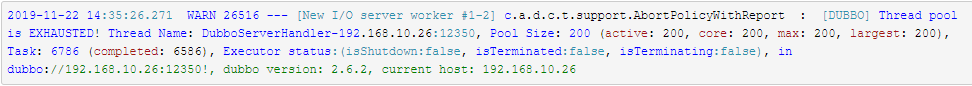

    没有多少访问量，但是线程却猛增，猜测可能是哪里出现了死循环或者哪里发生了死锁。
    首先，检测一下服务器的CPU使用量，发现在正常范围内，基本上可以排除哪里出现了死循环。
    先找出该服务的进程，用jstack命令dump线程在分析。
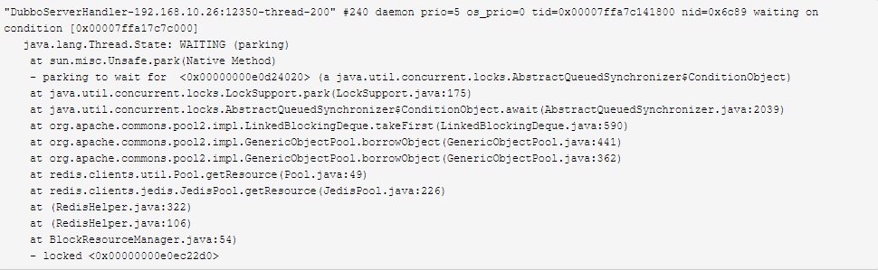

    可以看到最后一条线程locked <0x00000000e0ec22d0>，说明它持有着这个锁，而其他线程状态都是waiting to lock <0x00000000e0ec22d0>。
    看来就是这条线程导致了其他线程被阻塞。
    
    那么又是什么导致这条线程不能快速释放锁呢？
    继续看上面的信息，应该是从JedisPool中获取JedisClient，但是池中一直没有可用的客户端，所以被阻塞。
    
    最后的原因是一个方法中使用完客户端没有返回给池，导致客户端资源被耗尽。
