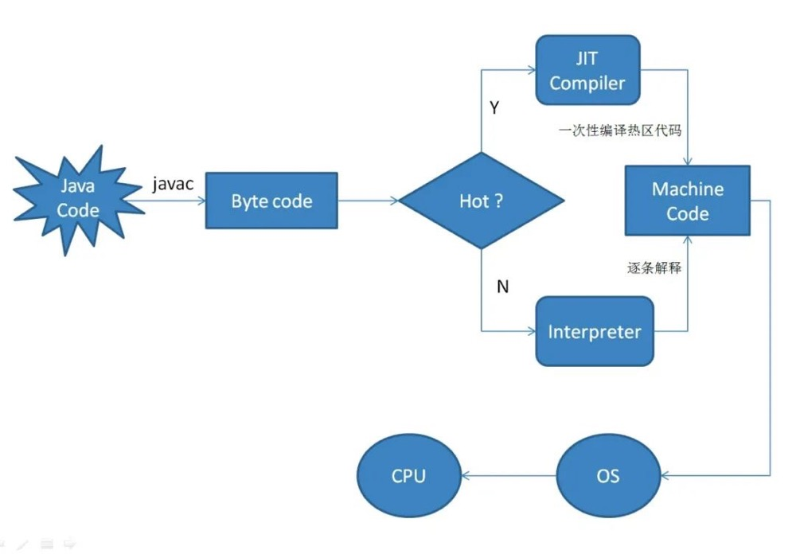

## 为什么应用刚启动的时候比较卡，过一会就好了？

    应用在刚刚启动之后，前几次访问都会比较卡顿，RT都会比极高，在运行一段时间之后，就会顺畅很多了。
    
    这背后的原因是什么呢？
    今天给大家介绍一种可能的原因，也是一种经常被别人忽略的原因，也是我们线上环境遇到过很多次的问题，那就是和JIT有关的。

### JIT编译

    我们知道，想要把高级语言转变成计算机认识的机器语言有两种方式，分别是编译和解释，虽然Java转成机器语言的过程中有一个步骤是要编译成字节码，但是，这里的字节码并不能在机器上直接执行。
    
    所以，JVM中内置了解释器(interpreter)，在运行时对字节码进行解释翻译成机器码，然后再执行。
    
    解释器的执行方式是一边翻译，一边执行，因此执行效率很低。为了解决这样的低效问题，HotSpot引入了JIT技术（Just-In-Time）。
    
    有了JIT技术之后，JVM还是通过解释器进行解释执行。但是，当JVM发现某个方法或代码块运行时执行的特别频繁的时候，就会认为这是“热点代码”（Hot Spot Code)。然后JIT会把部分“热点代码”翻译成本地机器相关的机器码，并进行优化，然后再把翻译后的机器码缓存起来，以备下次使用。
    
    这也是HotSpot虚拟机的名字的由来
    那么，这和我们今天要讲的问题有啥关系呢？
    大家理解了JIT编译的原理之后，其实可以知道，JIT优化是在运行期进行的，并且也不是Java进程刚一启动就能优化的，是需要先执行一段时间的，因为他需要先知道哪些是热点代码。
    所以，在JIT优化开始之前，我们的所有请求，都是要经过解释执行的，这个过程就会相对慢一些。
    而且，如果你们的应用的请求量比较大的的话，这种问题就会更加明显，在应用启动过程中，会有大量的请求过来，这就会导致解释器持续的在努力工作。
    一旦解释器对CPU资源占用比较大的话，就会间接的导致CPU、LOAD等飙高，导致应用的性能进一步下降。
    这也是为什么很多应用在发布过程中，会出现刚刚重启好的应用会发生大量的超时问题了。
    而随着请求的不断增多，JIT优化就会被触发，这就是使得后续的热点请求的执行可能就不需要在通过解释执行了，直接运行JIT优化后缓存的机器码就行了。

### 如何解决
    那么，怎么解决这样的问题呢？
    
    主要有两种思路：
    1、提升JIT优化的效率
    2、降低瞬时请求量
    在提升JIT优化效率的设计上，大家可以了解一下阿里研发的JDK——Dragonwell。
    这个相比OpenJDK提供了一些专有特性，其中一项叫做JwarmUp的技术就是解决JIT优化效率的问题的。
    这个技术主要是通过记录Java应用上一次运行时候的编译信息到文件中，在下次应用启动时，读取该文件，从而在流量进来之前，提前完成类的加载、初始化和方法编译，从而跳过解释阶段，直接执行编译好的机器码。
    除了针对JDK做优化之外，还可以采用另外一种方式来解决这个问题，那就是做预热。
    很多人都听说过缓存预热，其实思想是类似的。
    就是说在应用刚刚启动的时候，通过调节负载均衡，不要很快的把大流量分发给他，而是先分给他一小部分流量，通过这部分流量来触发JIT优化，等优化好了之后，再把流量调大。

### 总结
    本文介绍了一下JIT优化的时机以及原理，我们今天讨论的问题不是JIT优化导致的，而JIT优化的出现恰恰是要解决这样的问题的。
    但是这个知识点却和JIT优化息息相关。或者说有些问题JIT优化并没办法彻底解决，我们可以帮助JIT优化做一些优化。

## 如何打通SpringCloud与HSF的调用？
