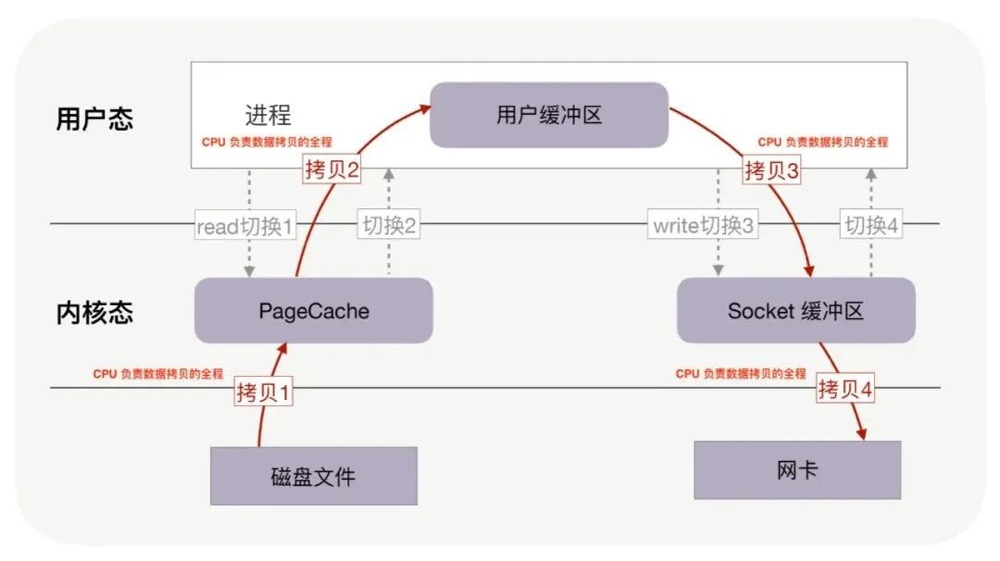
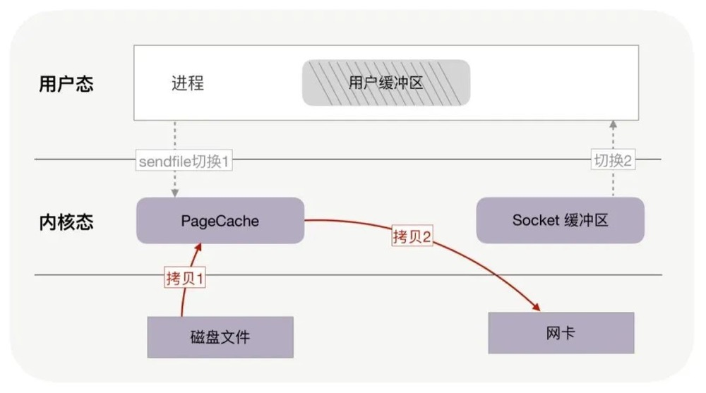

## 为什么kafka速度那么快

## kafka的架构设计
### Kafka架构分为以下几个部分
    Producer ：消息生产者，就是向kafka broker发消息的客户端。
    Consumer ：消息消费者，向kafka broker取消息的客户端。
    Topic ：可以理解为一个队列，一个Topic又分为一个或多个分区，
    Consumer Group：这是kafka用来实现一个topic消息的广播（发给所有的consumer）和单播（发给任意一个consumer）的手段。
    一个topic可以有多个Consumer Group。
    
    Broker ：一台kafka服务器就是一个broker。一个集群由多个broker组成。一个broker可以容纳多个topic。
    Partition：为了实现扩展性，一个非常大的topic可以分布到多个broker上，每个partition是一个有序的队列。
    partition中的每条消息都会被分配一个有序的id（offset）。将消息发给consumer，kafka只保证按一个partition中的消息的顺序，
    不保证一个topic的整体（多个partition间）的顺序。
    
    Offset：kafka的存储文件都是按照offset.kafka来命名，用offset做名字的好处是方便查找。
    例如你想找位于2049的位置，只要找到2048.kafka的文件即可。当然the first offset就是00000000000.kafka。

### kafka分区的目的
    分区对于Kafka集群的好处是：实现负载均衡。分区对于消费者来说，可以提高并发度，提高效率。
    
### Kafka是如何做到消息的有序性？
    kafka中的每个partition中的消息在写入时都是有序的，而且单独一个partition只能由一个消费者去消费，
    可以在里面保证消息的顺序性。但是分区之间的消息是不保证有序的。
    
### 数据传输的事务有几种？
    最多一次: 消息不会被重复发送，最多被传输一次，但也有可能一次不传输
    最少一次: 消息不会被漏发送，最少被传输一次，但也有可能被重复传输.
    精确的一次（Exactly once）: 不会漏传输也不会重复传输,每个消息都被传输
    
### Kafka是如何实现高吞吐率的？
    Kafka是分布式消息系统，需要处理海量的消息，Kafka的设计是把所有的消息都写入速度低容量大的硬盘，
    以此来换取更强的存储能力，但实际上，使用硬盘并没有带来过多的性能损失。kafka主要使用了以下几个方式实现了超高的吞吐率：
    顺序读写；
    零拷贝
    文件分段
    批量发送
    数据压缩。
    
### 关于kafka中的零拷贝

    当消费者从broker中拉取消息时，实际上kafka需要将消息从磁盘读取然后再给消费者，
    我们都知道传统的这一个过程需要经历4次数据copy和4次操作系统上下文切换，但是kafka利用了零拷贝技术，
    避免了磁盘数据复制到应用程序的过程，kafka中的模型为，先看os cache中是否有数据，如果有直接从os cache拷贝到网卡设备
    （如果有DMA的支持，可只将描述符拷贝到socket缓冲区。操作系统缓冲区的内存地址和内存偏移量），
    否则从磁盘拷贝到os cache再拷贝到网卡设备，可以看出如果生产者和消费者参数配置的合理，
    消息可以全部通过os cache获取，经历一次copy即可完成数据的传输，相当于在内存中完成了数据的读写。
    
    所谓的零拷贝是指将数据直接从磁盘文件复制到网卡设备中，而不需要经由应用程序之手。
    零拷贝大大提高了应用程序的性能，减少了内核和用户模式之间的上下文切换。
    对Linux操作系统而言，零拷贝技术依赖于底层的sendfile()方法实现。 
    对应于Java语言，FileChannal.transferTo()方法的底层实现就是sendfile()方法。

 

### kafka生产者ACK配置
    akc有三个参数：0、1、all(-1)
    0:生产者只要把消息发送出去即可，不用等待broker的处理结果，吞吐量最高，同样消息的丢失率也最高。
    1:生成者需要等分区leader将消息写入成功后 才认为此消息发送成功，1是ack的默认配置，
    兼顾了吞吐量和消息丢失的问题，但是同样有消息丢失的风险，比如当leader写入成功后突然挂了，
    其他分区跟随者并未能够将此消息同步，则此消息丢失。
    
    all:生产者会等待所有的副本都写入成功后才认为此消息发送成功，此方法保证了消息不丢失，但也是吞吐量最低的。
    
### 消费者与消费者组概念

### kafka提供的序列化器和反序列化器

### 死信队列和延时队列

### kafka分区数和副本因子管理

### 选主机制

### Kafka提供了日志清理策略
    1)日志删除(LogRetention): 按照一定的保留策略直接删除不符合条件的日志分段。
    2)日志压缩 (Log Compaction): 针对每个消息的key进行整合，对千有相同key的不同value值，只保留最后一个版本。

### 消费滞后场景整理

## kafka数据迁移
#### 场景：某台机器下线；需将数据迁移到新机器上
https://zhuanlan.zhihu.com/p/143492186