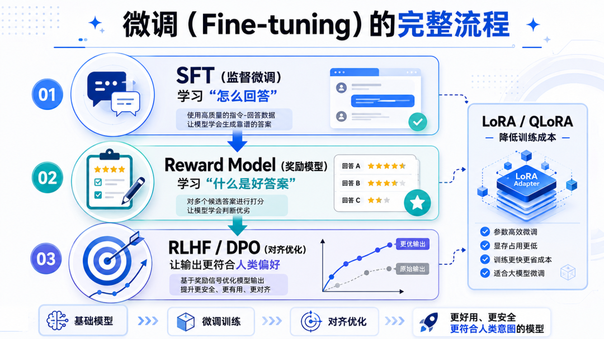

## 大模型微调
### 为什么要微调
    让模型学会你的私有术语/API/业务规则(场景:公司内部框架叫 createBizOrder，模型总写成 createOrder)
    让模型输出格式固定（JSON / YAML / 特定 schema）(场景:要求输出 {"code":200,"data":...})
    让模型执行多步骤任务（如代码审查→重构→写测试）(场景:模仿你们团队的代码规范和工作流)
    
    总结:微调是为了 改变模型的行为与输出结构，而不是喂新知识。

### 微调解决的是什么问题
    很多人以为微调是在教模型“新知识”，但实际情况完全不是。预训练模型的能力很强，这是公认的。
    但它有一个天然局限——它是通用的。
    你让它写代码、做翻译、总结文章都没问题，但一旦涉及你公司内部的格式规范、业务流程、行业术语，它就开始自由发挥了。
    这不是模型的错，是预训练阶段根本没接触过这些内容。
    微调做的事情，就是在预训练模型已有的通用能力之上，注入特定领域的知识和规则。
    模型还是那个模型，参数没变多少，但它开始按你的规矩办事了。

### 微调的标准流程
    第一阶段：SFT(Supervised Fine-Tuning，有监督微调),SFT 解决的是"模型知道该怎么回答"
    第二阶段：RM(Reward Model，奖励模型),可以把它理解为一个裁判，专门负责给模型的输出打分。
    第三阶段：对齐,两种主流做法：RLHF 和 DPO
    RLHF（基于人类反馈的强化学习）的流程相对复杂，模型生成回答 → 裁判打分 → 根据分数反向更新模型参数。
    DPO（直接偏好优化）则简化了这个过程，把奖励模型的学习直接整合到了微调目标函数里，省去了单独的 RL 训练阶段。
    两种方式效果接近，DPO 因为实现更简单，近年来使用越来越广泛。
    不管选哪种，目的都一样：让模型的回答更安全、更符合人类预期，减少胡说八道的情况。

### 技术路线选择（3 条主流路线）
    路线 1：全量微调（Full Fine-tuning）
    适用：你有充足算力 + 高质量数据（10万+ 条）+ 需要最大灵活性
    成本：7B 模型全量微调约需 40GB+ 显存（单卡 A100 勉强）
    不推荐：除非你是大厂或专门做模型的公司
    
    路线 2：LoRA / QLoRA（最推荐 👍）
    原理：在原模型旁挂小矩阵训练，原模型冻结
    显存：7B 模型 + QLoRA（4bit）最低 ~6-10GB（消费级 4090 / 3090 可跑）
    效果：达到全量微调 90%+ 效果
    工具：peft + bitsandbytes + transformers
    选择:
        显存够用-直接选LoRA‌，训练更快，省事。
        显存紧张‌-必须选 QLoRA‌，它是显存不够时的救命稻草，能跑起来比跑得快更重要。
        追求极致‌：如果是个人开发者或资源有限，主流工具现在默认都推荐 QLoRA。‌
    
    路线 3：前缀微调 / P-tuning v2
    适用：多任务、少样本、快速切换
    不推荐：对代码生成任务普遍不如 LoRA

### 低秩自适应LoRA(Low-Rank Adaptation) / QLoRA(Quantized LoRA 量化版LoRA)
    低秩适应LoRA是一种无需重新训练整个模型即可让大型机器学习模型适应特定用途的方法。
    低秩自适应 (LoRA) 是一种让机器学习模型快速适应新环境的技术。LoRA 有助于使庞大而复杂的机器学习模型更适合特定用途。它的工作原理是向原始模型添加轻量级部分，
    而不是更改整个模型。LoRA 可帮助开发人员快速扩展他们构建的机器学习模型的用例。
    
    LoRA 的优点
    高效性：LoRA 通过低秩矩阵来更新模型权重，显著减少了训练参数的数量，从而降低了计算和存储成本。
    灵活性：LoRA 可以应用于不同类型的神经网络，包括卷积神经网络（CNNs）和 Transformer 等，从而具备广泛的适用性。
    易于集成：由于 LoRA 不需要修改原始模型的架构，因此它可以很容易地集成到现有的深度学习框架中，如 TensorFlow 和 PyTorch。
    
    LORA 的核心思想是: 在不修改模型参数的情况下，通过添加一个额外的可训练模块，对模型行为进行小范围、有针对性的调整。
    
    技术选择（QLoRA vs LoRA）：
    直接选 QLoRA。它在效果上几乎无损，但显存占用比 LoRA 低 60% 以上，7B 模型只需要 6-10GB 显存就能跑。
    经验总结:90% 的代码微调场景，直接上 QLoRA。除非你有企业级 A100/H100 集群，否则没必要用 LoRA。

### 微调标准
    SFT 教格式，RM 立标准，对齐做收敛，LoRA 降门槛。
    真正难的是数据准备和超参调试，这部分没有捷径，只能一遍遍试。
    但好消息是，随着 QLoRA 这类方案的普及，试错的边际成本已经低了很多。

### 可视化微调工具
    LLaMA-Factory（Web界面最友好）
    Unsloth Studio（性能最强）

## 优化模型推理性能
    Harness和Prompt，Context关系
    • Prompt Engineering：你对模型说什么（写实习生的任务书）
    • Context Engineering：模型能看到什么（给实习生准备资料）
    • Harness Engineering：实习生在了解哪些信息的情况下干活、有哪些权限、什么时候 review、谁能拍板上线
    
    Hermes Agent 看板是一个多智能体任务编排系统，本质是一个持久化的 SQLite 任务队列 + 调度器。
    核心思路:
    不是一个 agent 干所有事，而是把大任务拆成小任务，分派给不同的「专业 agent 角色」，各司其职、串并行执行,搭建完以后就是以下的流程:

## 驾驭工程（Harness Engineering）

## 大模型多次询问答案不一致的原因与处理方案
    这是一个非常实际的问题。大模型本质上具有随机性，同一问题多次询问得到不同答案是正常现象，而非缺陷

    解决方案:设置温度为 0（最常用、最有效） temperature: 0.0 # 关闭随机性，使用贪婪解码
    温度=0 时，模型每次都选择概率最高的 token，保证确定性输出。

## Vibe Coding
    Vibe Coding 代表了一种编程范式的转变：从「程序员手动实现」走向「程序员描述需求，AI 负责实现」。
    它不会让程序员失业，但它会改变程序员的工作方式。
    未来的核心竞争力不再是写代码的速度，而是：拆解问题的能力、验证结果的能力、以及判断什么值得做的眼光。

## 模型蒸馏（Model Distillation）
    大语言模型蒸馏（LLM Distillation）是一种旨在复制大型语言模型性能的技术，同时显著减少其规模和计算需求。
