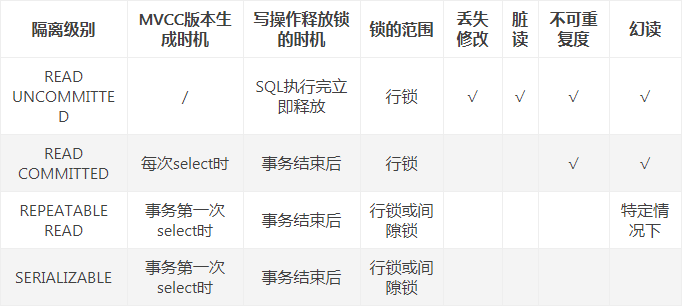

## MVCC概述
    多版本并发控制（Multi-Version Concurrency Control, MVCC），顾名思义，在并发访问的时候，数据存在版本的概念，可以有效地提升数据库并发能力，常见的数据库如MySQL、MS SQL Server、IBM DB2、Hbase、MongoDB等等都在使用。
    简单讲，如果没有MVCC，当想要读取的数据被其他事务用排它锁锁住时，只能互斥等待；而这时MVCC可以通过提供历史版本从而实现读取被锁的数据(的历史版本)，避免了互斥等待。
    
    在MySQL中，多版本并发控制是 的 InnoDB 存储引擎实现隔离级别的一种具体方式，用于实现提交读和可重复读这两种隔离级别。而未提交读隔离级别总是读取最新的数据行，无需使用 MVCC；可串行化隔离级别需要对所有读取的行都加锁，单纯使用 MVCC 无法实现。
    
    MVCC一般有两种实现方式，本文所讲的InnoDB采用的是后者:
    实时保留数据的一个或多个历史版本
    在需要时通过undo日志构造出历史版本

## 数据库的锁
    2.1 数据库的锁加在哪里？
    在学习之前，我一直想当然地认为锁是加在数据行上的，然而，数据库的锁是加在数据行对应的索引上的，这个概念在后续理解锁的范围时至关重要。机智如你可能会问，没有索引怎么办？答案是，不管你建或不建，总有索引在那里！下面简单过一下
    InnoDB有两类索引:
    
    Clustered Index: 聚集索引(聚簇索引)，通过聚集索引可以直接定位到数据的物理存储位置，从而进行IO读写，它是接触到数据的必经之路。每张表都会默默地建立聚集索引，具体的建立规则戳链接
    Secondary Index: 辅助索引(非聚集索引)，除了Clustered Index，其他都是Secondary Index(所以我们自己建的都叫辅助索引)。通过辅助索引，可以查到数据的主键或者数据行id，然后再通过主键或者数据行id查聚集索引获取数据的物理存储位置，才能进行IO读写。
    讲了这么多想说什么呢？综上所述！在真正接触到数据之前，任何数据库操作都会先走索引，这也就不难理解为什么锁是加在索引上的了
    
    2.2 什么时候会加锁？
    在数据库增删改查四种操作中，insert、delete和update都是会加排它锁(即下文中的Exclusive Lock)的，而select只有显式声明才会加锁:
    
    select: 即最常用的查询，是不加任何锁的
    select ... lock in share mode: 会加共享锁(即下文中的Shared Lock)
    select ... for update: 会加排它锁

## 隔离级别
    READ UNCOMMITTED
    READ COMMITTED
    REPEATABLE READ
    SERIALISABLE
