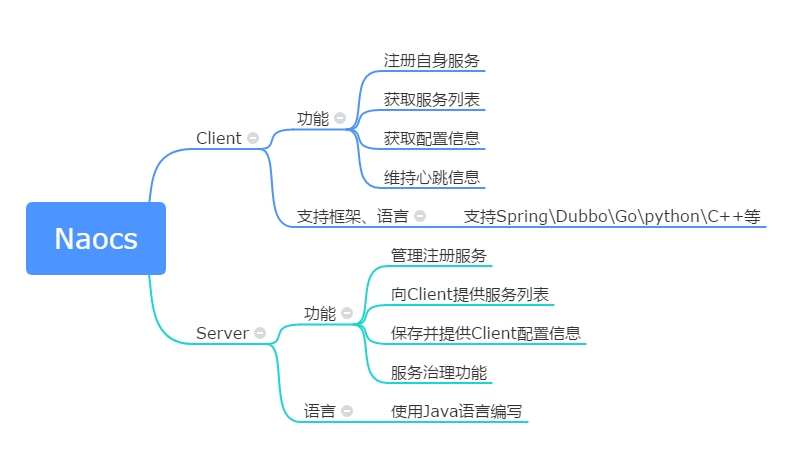
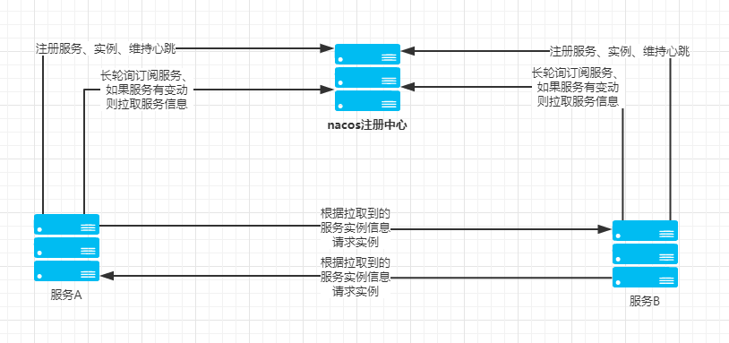
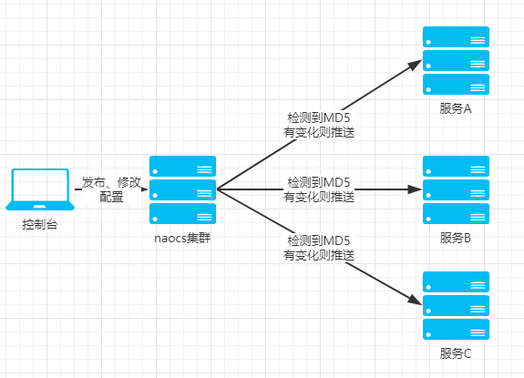

## Nacos原理

### 注册中心原理

> 服务注册原理

    服务注册方法：以Java nacos client v1.0.1 为例子，服务注册的策略的是每5秒向nacos server发送一次心跳，心跳带上了服务名，服务ip，服务端口等信息。同时 nacos server也会向client 主动发起健康检查，支持tcp/http检查。如果15秒内无心跳且健康检查失败则认为实例不健康，如果30秒内健康检查失败则剔除实例。
### 配置中心原理

