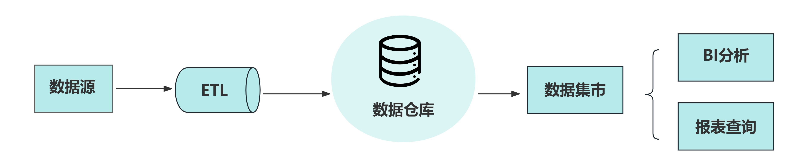
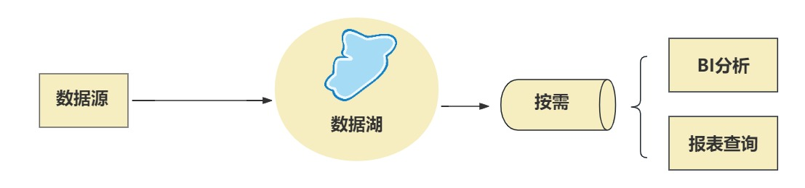
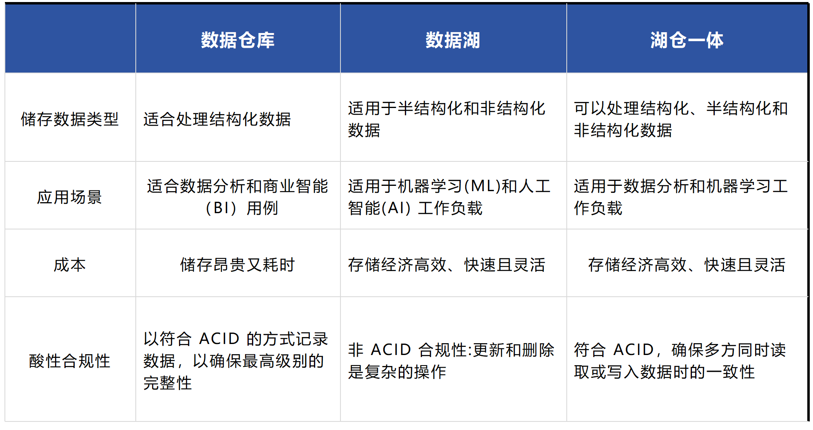
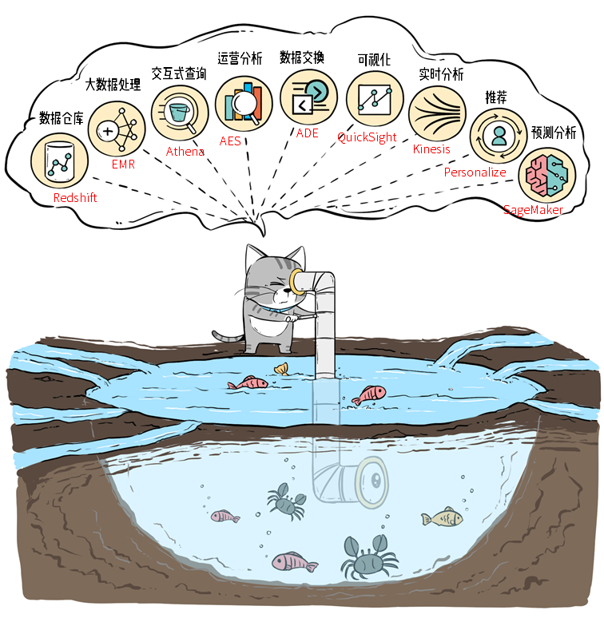

## 什么是湖仓一体？湖仓一体解决了什么问题？
### 数据仓库（Data Warehouse）
是传统的数据存储方式，其核心概念是将不同来源的数据抽取、转化和加载到一个中心化的存储系统中，供企业进行决策分析使用。

### 数据湖（Data Lake）
是近年来兴起的一种新兴数据存储模式，它以原始、未处理的大量数据为基础，存储在云端或本地存储系统中。数据湖无需事先定义数据结构，可以灵活存储各种类型的数据，包括结构化、半结构化和非结构化数据。

### 湖仓一体（Lakehouse）
是一种新兴的数据管理和分析架构，它结合了数据仓库和数据湖的优点，旨在提供一个统一、灵活且高性能的数据存储和处理平台。在传统的数据处理架构中，数据仓库通常用于存储结构化数据，以便进行快速查询和分析，而数据湖则用于存储大量原始的、非结构化的或半结构化的数据。在湖仓一体模式中，数据被原样加载到数据湖中，同时进行一定程度的模式定义和质量控制，以便更好地支持企业的数据分析和决策。湖仓一体的模式适用于数据量较大、多种数据类型混合存储的场景，提供了更好的查询性能和数据探索能力。

## 湖仓一体的优点
1.统一的数据平台：减少了数据移动的需要，简化了数据治理和管理。
2.灵活性：可以处理各种类型的数据，包括结构化、半结构化和非结构化数据。
3.性能：利用现代的并行处理技术，如Apache Spark，提供快速的数据读写和查询能力。
4.成本效益：通过使用云存储服务，可以根据实际需求动态扩展存储和计算资源，避免了传统数据仓库的固定成本。

## 湖仓一体要解决什么问题?
湖仓一体是通过一套架构，满足所有的分析需求，抽象化的描述，要能实现 One Data、All Analytics 的业务价值。
1.统一数据存储：在湖仓一体架构下，数据要统一存储管理，一份数据作为 Single source of truth，避免导来导去，造成数据冗余，分析口径不一致等问题；存储层通常采用 S3/HDFS 作为数据存储底层，并采用开放数据湖或者私有的数据格式去管理数据。
2.极速查询引擎：基于统一的数据存储，湖仓一体架构要能满足所有的业务分析场景的诉求，包括 BI 报表、交互式分析、实时分析、ETL 数据加工等场景，这就要求必须要有一个足够强大的分析引擎，能同时满足这些场景的查询需求。
3.按需查询加速：对于部分业务场景特别复杂的查询，数据源数据组织未针对分析优化，直接分析不一定能满足查询延时的需求，湖仓一体架构要具备通用的数据查询加速的能力，并且不破坏 Single source of truth 的原则。

## 总结
数据仓库和数据湖的结合就是湖仓一体，湖仓一体可以理解为把数据湖这个大杂间分了很多的区，每个区是一个应用站点，有的站点做BI，有的站点做大数据处理。
湖仓一体的架构，最终想要实现的，就是通过把数据湖作为中央存储库，围绕数据湖建立各种提供服务的站点，比如数据仓库，供业务分析和接入BI使用；再比如供机器学习用的站点；供大数据处理的站点等等，最终实现随心所欲地使用数据湖中的数据。
