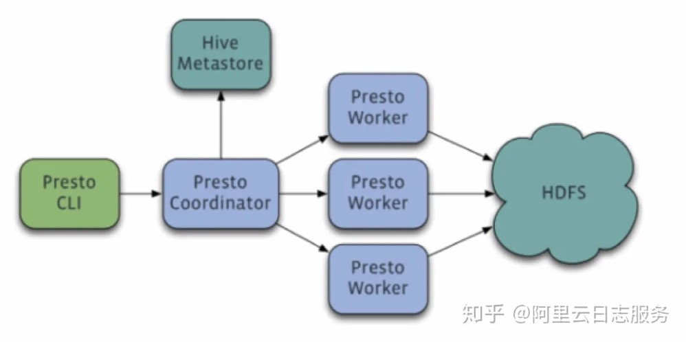
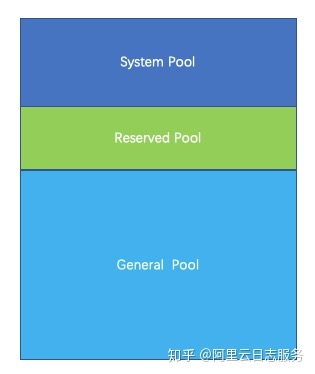

## Presto简介
    Presto是一个facebook开源的分布式SQL查询引擎，适用于交互式分析查询，数据量支持GB到PB字节。presto的架构由关系型数据库的架构演化而来。presto之所以能在各个内存计算型数据库中脱颖而出，在于以下几点：
    清晰的架构，是一个能够独立运行的系统，不依赖于任何其他外部系统。例如调度，presto自身提供了对集群的监控，可以根据监控信息完成调度。
    简单的数据结构，列式存储，逻辑行，大部分数据都可以轻易的转化成presto所需要的这种数据结构。
    丰富的插件接口，完美对接外部存储系统，或者添加自定义的函数。
    完全基于内存的并⾏计算，分布式SQL交互式查询引擎

### Presto架构

    Presto采用典型的master-slave模型：
    1.coordinator(master)负责meta管理,worker管理，query的解析和调度
    2.worker则负责计算和读写。
    3.discovery server，通常内嵌于coordinator节点中，也可以单独部署，用于节点心跳。在下文中，默认discovery和coordinator共享一台机器。

### 数据模型
    presto采取三层表结构：
    1.catalog 对应某一类数据源，例如hive的数据，或mysql的数据
    2.schema 对应mysql中的数据库
    3.table 对应mysql中的表

### 内存管理
    Presto是一款内存计算型的引擎，所以对于内存管理必须做到精细，才能保证query有序、顺利的执行，部分发生饿死、死锁等情况

### 内存池
    Presto采用逻辑的内存池，来管理不同类型的内存需求。

    Presto把整个内存划分成三个内存池，分别是System Pool ,Reserved Pool, General Pool。
    1.System Pool 是用来保留给系统使用的，默认为40%的内存空间留给系统使用。
    2.Reserved Pool和General Pool 是用来分配query运行时内存的。
    3.其中大部分的query使用general Pool。 而最大的一个query，使用Reserved Pool， 所以Reserved Pool的空间等同于一个query在一个机器上运行使用的最大空间大小，默认是10%的空间。
    4.General则享有除了System Pool和General Pool之外的其他内存空间。

### 使用场景
    适合：PB级海量数据复杂分析，交互式SQL查询，⽀持跨数据源查询
    不适合：多个大表的join操作，因为presto是基于内存的，多张大表在内存里可能放不下

### presto VS hive
    hive是一个数据仓库，是一个交互式比较弱一点的查询引擎，交互式没有presto那么强，而且只能访问hdfs的数据
    presto是一个交互式查询引擎，可以在很短的时间内返回查询结果，秒级，分钟级，能访问很多数据源

### 大数据OLAP引擎对比
    Presto：内存计算，mpp架构
    Druid：时序，数据放内存，索引，预计算
    Spark SQL：基于Spark Core，mpp架构
