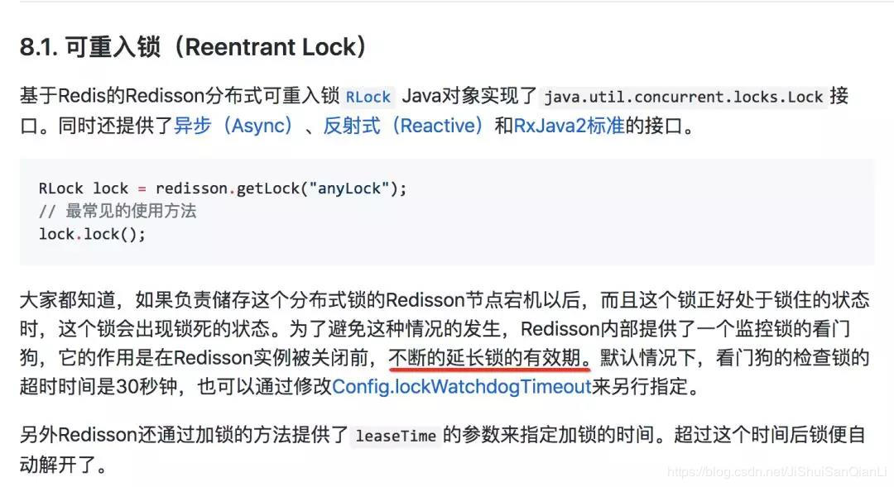
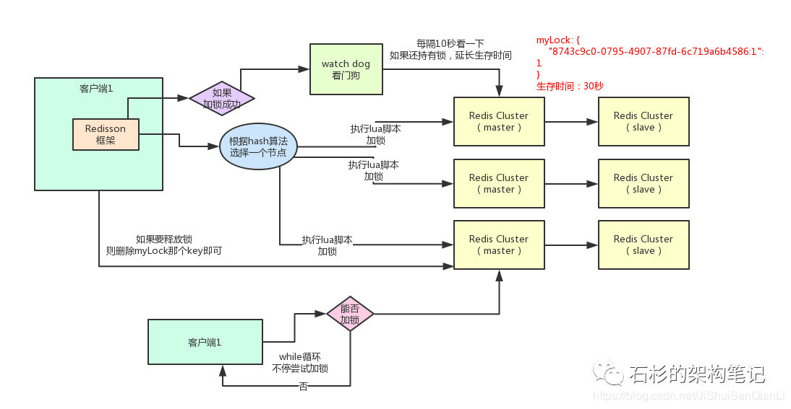

## redis分布式锁过期时间到了业务没执行完问题
    Redis锁的过期时间小于业务的执行时间该如何续期？
    Redis分布式锁比较正确的姿势是采用redisson这个客户端工具
    

    默认情况下,加锁的时间是30秒.如果加锁的业务没有执行完,那么到30-10=20秒的时候,就会进行一次续期,
    把锁重置成30秒.那这个时候可能又有同学问了,那业务的机器万一宕机了呢?宕机了定时任务跑不了,就续不了期,
    那自然30秒之后锁就解开了呗.

    
    
## redis使用jedis和redisssion实现分布式锁
    1.使用jedis客户端操作redis,实现分布式锁
    2.使用redission框架操作redis,实现分布式锁
    这两种方式其原理是一致的，都是使用lua脚本进行redis操作
    加锁的本质是将key-value键值对存入redis,如果redis已经有了则加锁失败；如果没有则新增一个key-value则加锁成功。
    释放锁的本质的将加锁时存入redis的key-value进行删除。
    
    但是redisson框架实现了java的Lock，操作更加简单且功能更加强大。
    使用jedis时必须将SETNX 和 SETEXPIRE一起执行（保证原子性）
    
    在实现分布式锁时，必须考虑的一些异常情况：
    Jedis加入的过期时间设置，到达这个时间后，jedis会自动删除key.保证了系统宕机后，能正常释放锁，
    保证一定时间后其他线程可以获取到锁。但是如果到达过期时间后，业务还没有执行完，锁自动释放
    （所以锁的过期时间通常设置为业务代码执行锁需要的时间再长一点）。导致线程2获取锁后执行业务，
    这个时候线程1执行结束后释放了锁2，这是就会产生问题。针对与这种情况，jedis加锁方法还有一个requestId的参数
    （可以UUID生成，为了区分该锁时哪一个请求的），这个时候就解决了上述问题。即实现了解铃还须系铃人（谁上锁谁解锁）

## 缺点
    最大的问题，就是如果你对某个redis master实例，写入了myLock这种锁key的value，此时会异步复制给对应的master slave实例。
    但是这个过程中一旦发生redis master宕机，主备切换，redis slave变为了redis master。
    接着就会导致，客户端2来尝试加锁的时候，在新的redis master上完成了加锁，而客户端1也以为自己成功加了锁。
    此时就会导致多个客户端对一个分布式锁完成了加锁。
    这时系统在业务语义上一定会出现问题，导致脏数据的产生。
    所以这个就是redis cluster，或者是redis master-slave架构的主从异步复制导致的redis分布式锁的最大缺陷：
    在redis master实例宕机的时候，可能导致多个客户端同时完成加锁。
    
## 简单教程
### 依赖
    <dependency>
       <groupId>org.redisson</groupId>
       <artifactId>redisson</artifactId>
       <version>2.7.0</version>
     </dependency>
     
### 锁的获取和释放
    public class DistributedRedisLock {
        //从配置类中获取redisson对象
        private static Redisson redisson = RedissonManager.getRedisson();
        private static final String LOCK_TITLE = "redisLock_";
    
        //加锁
        public static boolean acquire(String lockName) {
            //声明key对象
            String key = LOCK_TITLE + lockName;
            //获取锁对象
            RLock mylock = redisson.getLock(key);
            //加锁，并且设置锁过期时间，防止死锁的产生
            mylock.lock(2, TimeUnit.MINUTES);
            System.err.println("======lock======" + Thread.currentThread().getName());
            //加锁成功
            return true;
        }
    
        //锁的释放
        public static void release(String lockName) {
            //必须是和加锁时的同一个key
            String key = LOCK_TITLE + lockName;
            //获取所对象
            RLock mylock = redisson.getLock(key);
            //释放锁（解锁）
            mylock.unlock();
            System.err.println("======unlock======" + Thread.currentThread().getName());
        }
    }
    
### 业务逻辑中使用分布式锁
     @RequestMapping("/redder")
     @ResponseBody
     public String redder() throws IOException {
         String key = "test123";
         //加锁
         DistributedRedisLock.acquire(key);
         //执行具体业务逻辑
         dosoming
         //释放锁
         DistributedRedisLock.release(key);
         //返回结果
         return soming;
     }
     
## 区别
    jedis：提供了比较全面的 Redis 命令的支持。
    Redisson：实现了分布式和可扩展的 Java 数据结构，与jedis相比Redisson的功能相对简单，
    不支持排序、事务、管道、分区等 Redis 特性。