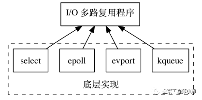
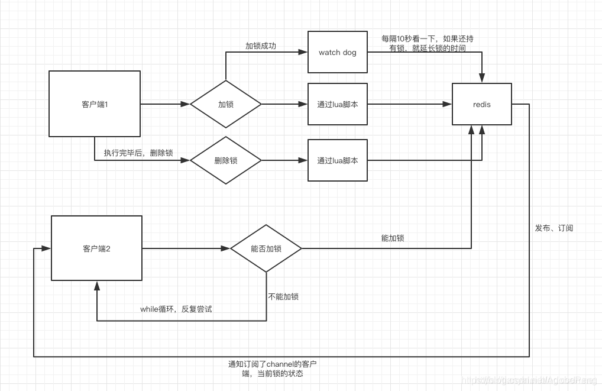

## redis特性
    redis是一个单线程程序，也就说同一时刻它只能处理一个客户端请求；
    redis是通过IO多路复用（select，epoll, kqueue，依据不同的平台，采取不同的实现）来处理多个客户端请求的

## Redis 为什么是单线程的
    官方FAQ表示，因为Redis是基于内存的操作，CPU不是Redis的瓶颈，Redis的瓶颈最有可能是机器内存的大小或者网络带宽。既然单线程容易实现，而且CPU不会成为瓶颈，那就顺理成章地采用单线程的方案了（毕竟采用多线程会有很多麻烦！）Redis利用队列技术将并发访问变为串行访问
    1）绝大部分请求是纯粹的内存操作（非常快速）
    2）采用单线程,避免了不必要的上下文切换和竞争条件
    3）非阻塞IO优点：
    1.速度快，因为数据存在内存中，类似于HashMap，HashMap的优势就是查找和操作的时间复杂度都是O(1)
    2.支持丰富数据类型，支持string，list，set，sorted set，hash
    3.支持事务，操作都是原子性，所谓的原子性就是对数据的更改要么全部执行，要么全部不执行
    4.丰富的特性：可用于缓存，消息，按key设置过期时间，过期后将会自动删除如何解决redis的并发竞争key问题

## redis为什么那么快
    (一)纯内存操作
    (二)单线程操作，避免了频繁的上下文切换
    (三)采用了非阻塞I/O多路复用机制
    
## redis持久化方案
    1、rdb方式：属于默认方式
    介绍：这种方式属于快照方式，根据配置把内存数据一次保存到硬盘
    配置方式：在redis.conf里面修改配置
    save 900 1
    save 300 10
    如图意思是：数据900秒内有1次改动，就触发一次保存；300秒内有10次改动就触发一次保存。可以配置多条方案，好处是更精细化管理配置触发条件
    rdb的优点：在备份的时候会fork出一个子进程，尽量降低对redis的性能影响，备份文件也是一个紧凑的文件，一旦系统出问题就可以直接拿来进行恢复，而且恢复速度快
    rdb的缺点：缺点也很明显，因为是定时触发的，所以会出现数据不完整的情况，对于要完全保证数据不丢失的场景是不适用的
    
    2、aof方式
    介绍：以日志方式持久化每一个增删改的操作，执行方式有三种：awalys每次更新都记录日志；每秒更新一次；交给操作系统处理，快但是不安全
    配置方式：将redis.conf中的appendonly改为yes
    appendonly yes
    aof的优点：因为是记录所有的操作，所以可以记录完整的操作过程，保证数据不会丢失；该模式采用的是append方式，
    所有的日志都是在同一个文件里面进行追加操作，如果日志只记录一半就宕机了，启动时候可以采用check-aof机制来检查判断
    日志是否完整；如果文件过大，会自动触发rewrite来重写日志，进行压缩日志文件，重启的时候可以恢复rewrite后的
    数据来提高性能
    
    aof的缺点：缺点也很明显，虽然做了rewrite，但是数据量也比rdb大很多，所以在恢复数据的时候性能不如rdb

    两则比较：
    1、aof文件比rdb更新频率高，优先使用aof还原数据。
    2、aof比rdb更安全也更大
    3、rdb性能比aof好
    4、如果两个都配了优先加载AOF
    
## redis实现分布式锁
    业务场景
    场景一：分布式项目多节点部署要同步mysql的数据到ES中（每个节点都有定时同步任务）
    场景二：MQ消息消费，多节点会造成重复消费
    如果不设置锁处理将会出现各个节点都会去重复同步，这无疑是一种资源的浪费，同时也不利于数据的安全性和一致性。

## redis的过期策略
    redis采用的是定期删除+惰性删除策略。
    为什么不用定时删除策略?
    定时删除,用一个定时器来负责监视key,过期则自动删除。虽然内存及时释放，但是十分消耗CPU资源。在大并发请求下，CPU要将时间应用在处理请求，而不是删除key,因此没有采用这一策略.
    定期删除+惰性删除是如何工作的呢?
    
    定期删除，redis默认每个100ms检查，是否有过期的key,有过期key则删除。需要说明的是，redis不是每个100ms将
    所有的key检查一次，而是随机抽取进行检查(如果每隔100ms,全部key进行检查，redis岂不是卡死)。因此，
    如果只采用定期删除策略，会导致很多key到时间没有删除。
    
    于是，惰性删除派上用场。也就是说在你获取某个key的时候，redis会检查一下，这个key如果设置了过期时间那么是否过期了？
    如果过期了此时就会删除。
    
    采用定期删除+惰性删除就没其他问题了么?
    不是的，如果定期删除没删除key。然后你也没即时去请求key，也就是说惰性删除也没生效。这样，redis的内存会越来越高。
    那么就应该采用内存淘汰机制。
    
    在redis.conf中有一行配置 maxmemory-policy volatile-lru

## redis的内存淘汰策略
    volatile-lru：从已设置过期时间的数据集（server.db[i].expires）中挑选最近最少使用的数据淘汰
    volatile-ttl：从已设置过期时间的数据集（server.db[i].expires）中挑选将要过期的数据淘汰
    volatile-random：从已设置过期时间的数据集（server.db[i].expires）中任意选择数据淘汰
    allkeys-lru：从数据集（server.db[i].dict）中挑选最近最少使用的数据淘汰
    allkeys-random：从数据集（server.db[i].dict）中任意选择数据淘汰
    no-enviction（驱逐）：禁止驱逐数据，新写入操作会报错
    ps：如果没有设置 expire 的key, 不满足先决条件(prerequisites); 那么 volatile-lru, volatile-random 和 volatile-ttl 策略的行为, 和 noeviction(不删除) 基本上一致。

## I/O多路复用原理
    Redis的I/O多路复用程序的所有功能是通过包装select、epoll、evport和kqueue这些I/O多路复用函数库来实现的，
    每个I/O多路复用函数库在Redis源码中都对应一个单独的文件，比如ae_select.c、ae_epoll.c、ae_kqueue.c等。
    
    因为Redis为每个I/O多路复用函数库都实现了相同的API，所以I/O多路复用程序的底层实现是可以互换的，如下图所示。

    IO多路复用技术详解
    　　IO多路复用：I/O是指网络I/O,多路指多个TCP连接(即socket或者channel）,复用指复用一个或几个线程。
    意思说一个或一组线程处理多个TCP连接。最大优势是减少系统开销小，不必创建过多的进程/线程，也不必维护这些进程/线程。
    
    　　IO多路复用使用两个系统调用(select/poll/epoll和recvfrom)，blocking IO只调用了recvfrom；select/poll/epoll
    核心是可以同时处理多个connection，而不是更快，所以连接数不高的话，性能不一定比多线程+阻塞IO好,多路复用模型中，每一个socket，
    设置为non-blocking,阻塞是被select这个函数block，而不是被socket阻塞的。
    
    select机制
    基本原理：
    　　客户端操作服务器时就会产生这三种文件描述符(简称fd)：writefds(写)、readfds(读)、和exceptfds(异常)。select会阻塞住监视3类文件描述符，等有数据、可读、可写、出异常 或超时、就会返回；返回后通过遍历fdset整个数组来找到就绪的描述符fd，然后进行对应的IO操作。
    优点：
    　　几乎在所有的平台上支持，跨平台支持性好
    缺点：
    　　由于是采用轮询方式全盘扫描，会随着文件描述符FD数量增多而性能下降。
    　　每次调用 select()，需要把 fd 集合从用户态拷贝到内核态，并进行遍历(消息传递都是从内核到用户空间)
    　　默认单个进程打开的FD有限制是1024个，可修改宏定义，但是效率仍然慢。
    
    poll机制:
    　　基本原理与select一致，也是轮询+遍历；唯一的区别就是poll没有最大文件描述符限制（使用链表的方式存储fd）。
    epoll机制：
    基本原理：
    　　没有fd个数限制，用户态拷贝到内核态只需要一次，使用时间通知机制来触发。通过epoll_ctl注册fd，一旦fd就绪就会通过callback回调机制来激活对应fd，进行相关的io操作。
    epoll之所以高性能是得益于它的三个函数
    　　1)epoll_create()系统启动时，在Linux内核里面申请一个B+树结构文件系统，返回epoll对象，也是一个fd
    　　2)epoll_ctl() 每新建一个连接，都通过该函数操作epoll对象，在这个对象里面修改添加删除对应的链接fd, 绑定一个callback函数
    　　3)epoll_wait() 轮训所有的callback集合，并完成对应的IO操作
    优点：
    　　没fd这个限制，所支持的FD上限是操作系统的最大文件句柄数，1G内存大概支持10万个句柄
    　　效率提高，使用回调通知而不是轮询的方式，不会随着FD数目的增加效率下降
    　　内核和用户空间mmap同一块内存实现(mmap是一种内存映射文件的方法，即将一个文件或者其它对象映射到进程的地址空间)
    
    例子：100万个连接，里面有1万个连接是活跃，我们可以对比select、poll、epoll 的性能表现
    　　select：不修改宏定义默认是1024,l则需要100w/1024=977个进程才可以支持 100万连接，会使得CPU性能特别的差。
    　　poll：没有最大文件描述符限制,100万个链接则需要100w个fd，遍历都响应不过来了，还有空间的拷贝消耗大量的资源。
    　　epoll: 请求进来时就创建fd并绑定一个callback，主需要遍历1w个活跃连接的callback即可，即高效又不用内存拷贝。

## 缓存击穿，缓存穿透，缓存雪崩？何如避免？
    缓存穿透
    一般的缓存系统，都是按照key去缓存查询，如果不存在对应的value，就应该去后端系统查找（比如DB）。一些恶意的请求会故意查询不存在的key,请求量很大，就会对后端系统造成很大的压力。这就叫做缓存穿透。
    
    如何避免？
    1：对查询结果为空的情况也进行缓存，缓存时间设置短一点，或者该key对应的数据insert了之后清理缓存。
    2：对一定不存在的key进行过滤。可以把所有的可能存在的key放到一个大的Bitmap中，查询时通过该bitmap过滤。
    
    缓存雪崩
    当缓存服务器重启或者大量缓存集中在某一个时间段失效，这样在失效的时候，会给后端系统带来很大压力。导致系统崩溃。
    
    如何避免？
    1：在缓存失效后，通过加锁或者队列来控制读数据库写缓存的线程数量。比如对某个key只允许一个线程查询数据和写缓存，其他线程等待。
    2：做二级缓存，A1为原始缓存，A2为拷贝缓存，A1失效时，可以访问A2，A1缓存失效时间设置为短期，A2设置为长期
    3：不同的key，设置不同的过期时间，让缓存失效的时间点尽量均匀。
    
## I/O多路复用技术（multiplexing）是什么？
    下面举一个例子，模拟一个tcp服务器处理30个客户socket。假设你是一个老师，让30个学生解答一道题目，然后检查学生做的是否正确，你有下面几个选择：
    
    第一种选择：按顺序逐个检查，先检查A，然后是B，之后是C、D。。。这中间如果有一个学生卡主，全班都会被耽误。这种模式就好比，你用循环挨个处理socket，根本不具有并发能力。
    第二种选择：你创建30个分身，每个分身检查一个学生的答案是否正确。 这种类似于为每一个用户创建一个进程或者线程处理连接。
    第三种选择，你站在讲台上等，谁解答完谁举手。这时C、D举手，表示他们解答问题完毕，你下去依次检查C、D的答案，然后继续回到讲台上等。此时E、A又举手，然后去处理E和A。。。
    这种就是IO复用模型，Linux下的select、poll和epoll就是干这个的。将用户socket对应的fd注册进epoll，然后epoll帮你监听哪些socket上有消息到达，这样就避免了大量的无用操作。此时的socket应该采用非阻塞模式。
    这样，整个过程只在调用select、poll、epoll这些调用的时候才会阻塞，收发客户消息是不会阻塞的，整个进程或者线程就被充分利用起来，这就是事件驱动，所谓的reactor模式。
    
    ================
    自己的理解：
    Redis是采用TCP连接的，连接TCP的socket在所有数据准备好之前，socket不可用。请求是进来了，数据包还不完整，所以还不能处理这个请求。
    那么对于已经准备数据包的socket，Redis线程可以一次性这些请求都接收来，然后去内存处理。
    都处理完后，将结果再都带回到socket。接下来再去处理准备好的socket。
    所以redis的多路复用，不是每一个请求处理一次，而是一次处理多个请求。所以纯内存操作的单线程，效率也很高。

## Q&A
    如果一个线程获得了分布式锁，但service还没执行完，这个时候分布式锁在redis中过期了，这种情况解决有什么思路？
    分布式锁过期了，解决方案当然就是续期啦。那么应该怎么续期呢？
    
    思路一：任务执行的时候，开辟一个守护线程，在守护线程中每隔一段时间重新设置过期时间。
    思路二：通过Redisson中的看门狗来实现。
    
    @Component
    public class RedisTool {
        @Autowired
        private StringRedisTemplate stringRedisTemplate;
        @Autowired
        private RedissonClient redisson;
        /**
         * 模拟购买场景，购买一个，将redis中对应的数量减少一个
         */
        public void reduceOne(){
            String key = "num";
            String lockKey = "lockKey";
            RLock lock = redisson.getLock( lockKey );
            try{
                lock.lock();
                //获取redis中的数量
                String value = stringRedisTemplate.opsForValue().get( key );
                //如果当前数量>0,则能够购买，并且将减一后的结果塞回redis
                if(Integer.valueOf( value )>0){
                    int num = Integer.valueOf( value ) - 1;
                    System.out.println("消费1个商品，还剩："+num+"个");
                    stringRedisTemplate.opsForValue().set( key,String.valueOf( num ) );
                }else {
                    System.out.println("商品已经卖完...");
                }
            }finally {
                lock.unlock();
            }
        }
    }
    
## Redisson的工作原理

## redis分布式锁和zk分布式锁的对比
    1.redis分布式锁，其实需要自己不断去尝试获取锁，比较消耗性能。
    2.zk分布式锁，获取不到锁，注册个监听器即可，不需要不断主动尝试获取锁，性能开销较小。
    3.另外一点就是，如果是redis获取锁的那个客户端出现bug挂了，那
    么只能等待超时时间之后才能释放锁；而zk的话，因为创建的是临时
    znode，只要客户端挂了，znode就没了，此时就自动释放锁。
    
## redis的事件模型

## redis通信协议RESP
    Redis服务器与客户端通过RESP（REdis Serialization Protocol，即Redis序列化协议）协议通信。它是一种直观的文本协议，优势在于实现异常简单，解析性能极好。
    该协议是用于与Redis服务器通信的，用的较多的是Redis-cli通过pipe与Redis服务器联系；
    协议如下：
    客户端以规定格式的形式发送命令给服务器；
    服务器在执行最后一条命令后，返回结果。

### redis为何要设计这种浪费流量的文本协议？
    Redis 的设计者认为数据库的瓶颈一般不在于网络流量，而是数据库自身内部逻辑处理上。Redis将所有数据都放在内存，用一个单线程对外提供服务，单个节点在跑满一个CPU核心的情况下可以达到了10w/s的超高QPS。

## redis事务
    MULTI：开启事务，redis会将后续的命令逐个放入队列中，然后使用EXEC命令来原子化执行这个命令系列。
    EXEC：执行事务中的所有操作命令。
    DISCARD：取消事务，放弃执行事务块中的所有命令。
    WATCH：监视一个或多个key,如果事务在执行前，这个key(或多个key)被其他命令修改，则事务被中断，不会执行事务中的任何命令。
    UNWATCH：取消WATCH对所有key的监视。
    
    总结：redis事务不支持回滚。