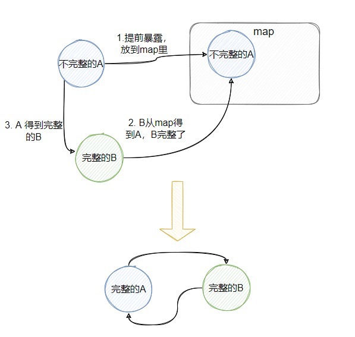
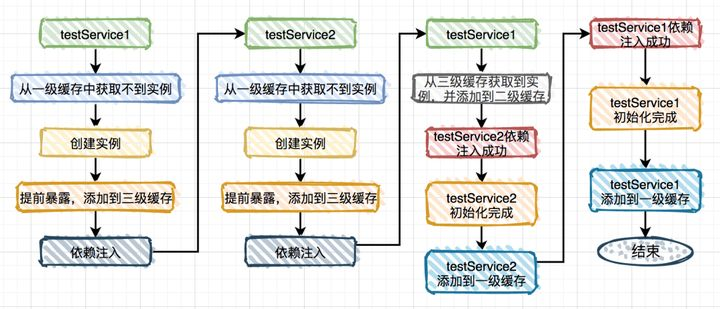

## spring中BeanFactory和FactoryBean的区别
    BeanFactory是个Factory，也就是IOC容器或对象工厂，
    FactoryBean是个Bean。
    在Spring中，所有的Bean都是由BeanFactory(也就是IOC容器)来进行管理的。
    但对FactoryBean而言，这个Bean不是简单的Bean，而是一个能生产或者修饰对象生成的工厂Bean,它的实现与设计模式中的工厂模式和修饰器模式类似

## spring中的前置处理器和后置处理器区别
    前置处理器
    BeanFactoryPostProcess
    前置：实例化对象之前
    这个机制允许我们在实例化相应对象之前对注册到容器中的BeanDefinition的存储信息进行修改。可以根据这个机制对Bean增加其它信息。修改Bean定义的某些属性值。
    想自定义前置处理器需要实现BeanFactoryPostProcess接口。当一个容器存在多种前置处理的时候，可以让前置处理器的实现类同时继承Ordered接口。
    Spring容器提供了数种现成的前置处理器，常见的如：
    PropertyPlaceholderConfigurer：允许在xml文件中使用占位符。将占位符代表的资源单独配置到简单的Properties文件中加载
    PropertyOverrideConfigurer：不同于PropertyPlaceholderConfigurer的是，该类用于处理容器中的默认值覆为新值的场景
    CustomEditorConfigurer：此前的两个前置处理器处理的均是BeanDefinition.通过把BeanDefinition的数据修改达到目的。CustomEditorConfigurer没有对BeanDefinition做任何变动。负责的是将后期会用到的信息注册到容器之中。例如将类型转换器注册到BeanDefinition中。供BeanDefinition将获取到的String类型参数转换为需要的类型。

    后置处理器
    BeanPostProcessor
    后置：实例化对象之后
    实例后的对象，初始化之前BeanBeforePostProcessor
    实例后的对象，初始化之后BeanBeforePostProcessor
    
    实例化和初始化的区别？
    1、实例化----实例化的过程是一个创建Bean的过程，即调用Bean的构造函数，单例的Bean放入单例池中。
    2、初始化----初始化的过程是一个赋值的过程，即调用Bean的setter，设置Bean的属性。
    
## Spring Bean的生命周期
    Spring Bean的生命周期分为四个阶段和多个扩展点。扩展点又可以分为影响多个Bean和影响单个Bean。整理如下：
    四个阶段
    实例化 Instantiation
    属性赋值 Populate
    初始化 Initialization
    销毁 Destruction
    
>> 多个扩展点
    
    影响多个Bean
    BeanPostProcessor
    InstantiationAwareBeanPostProcessor
    
    影响单个Bean
    Aware
    Aware Group1
    BeanNameAware
    BeanClassLoaderAware
    BeanFactoryAware
    Aware Group2
    EnvironmentAware
    EmbeddedValueResolverAware
    ApplicationContextAware(ResourceLoaderAware\ApplicationEventPublisherAware\MessageSourceAware)
    
    生命周期
    InitializingBean
    DisposableBean

## 循环依赖
#### 循环依赖示例

    @Service
    public class A {
        @Autowired
        private B b;
    }
    
    @Service
    public class B {
        @Autowired
        private A a;
    }
    
    //或者自己依赖自己
    @Service
    public class A {
        @Autowired
        private A a;
    }
    
#### 如何解决循环依赖
    在Spring中，只有同时满足以下两点才能解决循环依赖的问题：
    依赖的Bean必须都是单例
    依赖注入的方式，必须不全是构造器注入，且beanName字母序在前的不能是构造器注入
    
    具体做法就是：先创建A，此时的A是不完整的（没有注入B），用个map保存这个不完整的A，再创建B，B需要A。
    所以从那个map得到“不完整”的A，此时的B就完整了，然后A就可以注入B，然后A就完整了，B也完整了，且它们是相互依赖的。

    spring内部有三级缓存：
    singletonObjects 一级缓存，用于保存实例化、注入、初始化完成的bean实例
    earlySingletonObjects 二级缓存，用于保存实例化完成的bean实例
    singletonFactories 三级缓存，用于保存bean创建工厂，以便于后面扩展有机会创建代理对象。
    
    @Service
    public class TestService1 {
     
        @Autowired
        private TestService2 testService2;
     
        public void test1() {
        }
    }
     
    @Service
    public class TestService2 {
     
        @Autowired
        private TestService1 testService1;
     
        public void test2() {
        }
    }

    
### spring懒加载机制
对于创建对象而言
1.如果Spring容器创建,对象立即创建,则该加载方式为"立即创建" 容器启动创建
2.如果Spring容器创建,对象在使用时才创建,则称为"懒加载"  用时才创建
@lazy注解:表示改为懒加载

单例和多例时的懒加载
说明:在单例模式中需要手动设置懒加载,而多例模式中全都是懒加载
规则:
单例模式:
多例模式:

懒加载的应用场景
1.服务器启动时,如果加载太多的资源,则必然导致服务器启动慢, 将不重要的资源设置为懒加载.
2.有时用户会需要一些特殊的"链接",而这些链接的创建需要很长的时间.可以使用懒加载.

