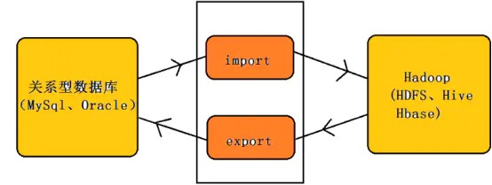
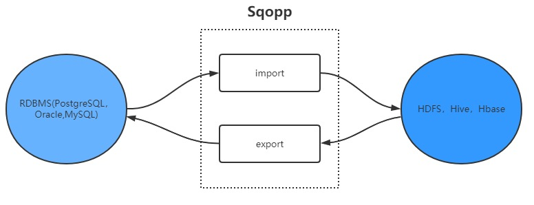
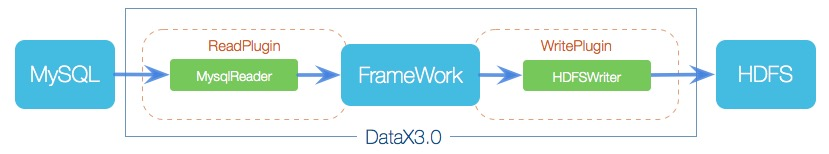
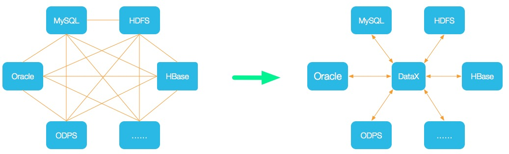
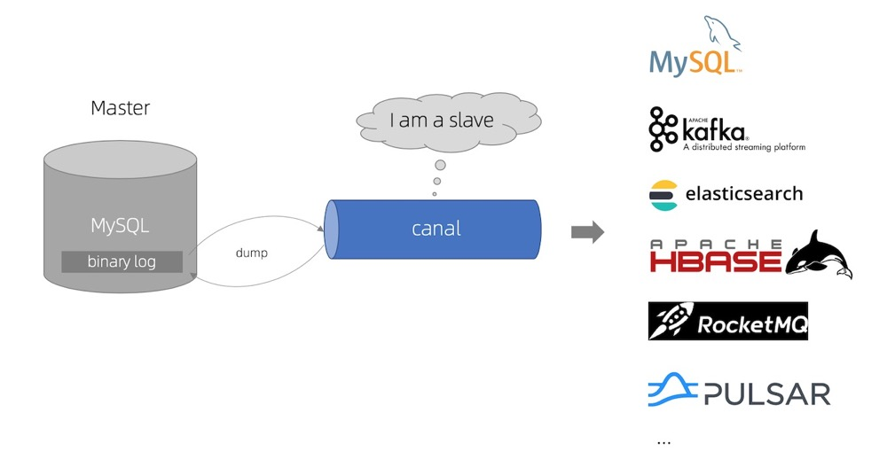

## sqoop简介 
    Sqoop是一款开源的工具，主要用于在Hadoop(Hive)与传统的数据库(mysql、postgresql...)间进行数据的传递，
    可以将一个关系型数据库（例如：MySQL ,Oracle ,Postgres等）中的数据导进到Hadoop的HDFS中，
    也可以将HDFS的数据导进到关系型数据库中。
    
    sqoop是连接关系型数据库和hadoop的桥梁，主要有两个方面(导入和导出)：
    A. 将关系型数据库的数据导入到Hadoop及其相关的系统中，如Hive和HBase
    B. 将数据从Hadoop系统里抽取并导出到关系型数据库

## sqoop工作的机制
    将导入或导出命令翻译成MapReduce程序来实现,MapReduce中主要是对InputFormat和OutputFormat进行定制
    
## 大数据同步工具DataX、Sqoop、Canal之比较
> 1.Sqoop与DataX
    
    Sqoop依赖于Hadoop生态，充分利用了map-reduce计算框架，在Hadoop的框架中运行，对HDFS、Hive支持友善，
    在处理数仓大表的速度相对较快，但不具备统计和校验能力。

    DataX无法分布式部署，需要依赖调度系统实现多客户端，可以在传输过程中进行过滤，并且可以统计传输数据的信息，
    因此在业务场景复杂(表结构变更)更适用，同时对于不同的数据源支持更好，同时不支持自动创建表和分区。
    支持流量控制，支持运行信息收集，及时跟踪数据同步情况。
    DataX框架设计：

    Sqoop采用命令行的方式调用，比如容易与我们的现有的调度监控方案相结合，DataX采用xml配置文件的方式，
    在开发运维上还是有点不方便。
    
    Sqoop只可以在关系型数据库和Hadoop组件之间进行数据迁移，而在Hadoop相关组件之间，
    比如hive和hbase之间就无法使用sqoop互相导入导出数据，同时在关系型数据库之间，
    比如mysql和oracle之间也无法通过sqoop导入导出数据。与之相反，
    DataX能够分别实现关系型数据库Hadoop组件之间、关系型数据库之间、Hadoop组件之间的数据迁移。

> 2.Sqoop与Canal

    Sqoop: 同步全量数据，能够实现对关系型数据的全量同步，但在很多业务场景下，由于数据量非常大，
    每天全量同步，对于Hadoop的压力较大，因此要慎用。
    
    Canal: 主要用途是基于MySQL数据库增量日志解析，提供增量数据订阅和消费，只同步更新的数据。
    也可以配置MQ模式，配合RocketMQ或者Kafka，Canal会把数据发送到MQ的topic中，然后通过消息队列的消费者进行处理。
    
    Canal的工作原理就是把自己伪装成MySQL slave，基于监听binlog日志去进行同步数据的。
