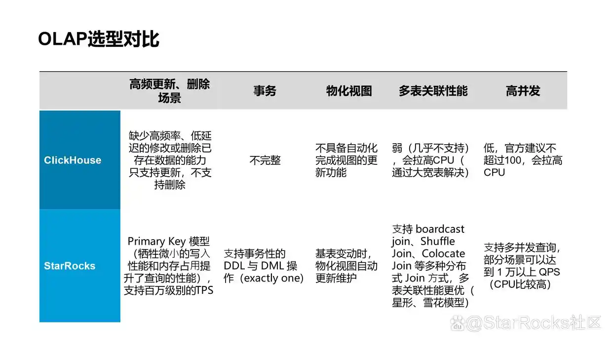
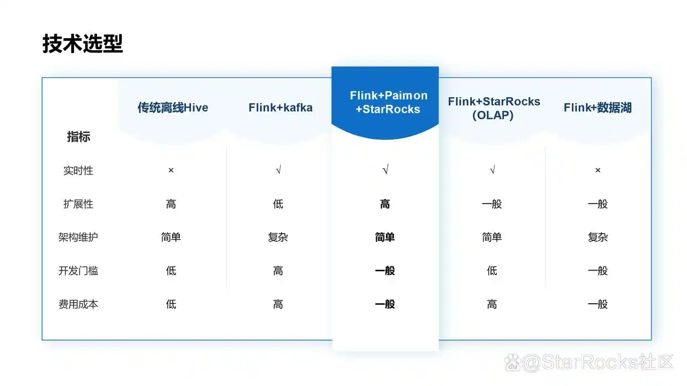

### Starrocks 和 Clickhouse 选型对比

### Flink+Paimon+Starrocks选型优势

### Starrocks 架构和功能
    StarRocks 的架构设计融合了 MPP 数据库和分布式系统的设计思想，具有极简的架构特点。
    整个系统由前端节点（FE）、后端节点（BE 和 CN）组成。这种设计使得 StarRocks 在部署和维护上更为简单，
    同时提升了系统的可靠性和扩展性。

    功能特性
    向量化引擎：StarRocks 采用向量化查询引擎，通过并行执行和减少数据访问次数，极大提升了数据处理速度。
    CBO（基于代价的优化器）：StarRocks 利用 CBO 智能选择最优的查询执行计划，通过精确的成本估算优化查询性能。
    高并发查询：通过优化查询调度和资源分配，确保在多用户同时访问时，系统能够稳定运行并快速响应每个查询请求。
    灵活数据建模：允许用户根据业务需求构建复杂的数据模型，如星型模型和雪花模型。这种灵活性支持了复杂的数据分析流程，提高了数据的组织和查询效率。
    智能物化视图：用户可以预定义和存储复杂的查询结果，通过预聚合数据提高查询速度、降低存储成本。StarRocks 同步和异步物化视图均支持智能的透明改写，可以按需灵活创建和删除，在查询时无需修改 SQL，自动进行改写，性能及体验俱佳。
    湖仓一体能力：结合了数据湖的灵活性和数据仓库的分析能力，提供了一个统一的数据平台，简化了数据存储、处理和分析的流程，无需在不同系统间迁移数据。
    存算分离：StarRocks3.0 版本引入存算分离架构，实现计算与存储的完全解耦，计算节点可以实现秒级的动态扩缩容。实现更灵活的数据分享、资源弹性伸缩、资源隔离，总体性能追平存算一体。
    兼容性：提供 MySQL 协议接口，支持标准 SQL 语法，用户可以通过 MySQL 客户端方便地查询和分析 StarRocks 中的数据

### Paimon 介绍
    Apache Paimon，始于Flink Table Store，发展为独立的Apache顶级项目，专注流式数据湖存储。
    它提供统一存储底座，支持流、批、OLAP，优化了CDC入湖、流式链路构建和极速OLAP查询。
### Paimon和Hudi比较
#### Paimon
    Paimon 是一个新兴的数据湖存储引擎，旨在支持流批一体的数据处理和管理。Paimon 的设计目标是
    提供高性能的数据写入和读取，同时支持高效的表管理，具有事务支持和版本控制能力。
    它提供了一种混合的数据湖解决方案，支持批流一体、事务操作以及版本管理。
#### Hudi
    Hudi 专注于高效的数据管理和更新，特别适合数据插入、更新和删除操作较频繁的场景。Hudi 能够实
    现对数据湖中表的增量拉链更新、变更捕获（CDC），并提供了文件级别的索引以加速数据查询。
    Hudi 主要应用在流数据的实时处理，适合数据的不断更新和流式数据的管理。

### Hudi、lceberg、Paimon谁才是最佳选择
#### Apache Hudi

    ACID支持：支持ACID事务，确保数据的原子性、一致性、隔离性和持久性。
    Schema变更：支持向后兼容的DDL操作，如添加可选列和删除列。
    性能：在某些场景下，Hudi的读写性能优于Iceberg和Paimon。
    企业支持：得到阿里巴巴、腾讯、字节跳动等大厂的支持。
    适用场景：适用于需要增量数据处理的场景，以及需要高并发写入的场景。
#### Apache Iceberg

    ACID支持：同样支持ACID事务，保证数据的可靠性和一致性。
    Schema变更：支持更广泛的Schema演变，包括添加列、重命名列等。
    性能：虽然在批处理查询性能上可能不如Hudi，但其扩展性强，对其他计算引擎提供了较多的优化空间。
    企业支持：得到了Netflix、Apple等国际大厂的支持，国内也有腾讯、字节等公司的贡献。
    适用场景：更适合于离线数据处理，以及需要高度扩展性和灵活性的场景。
#### Apache Paimon

    ACID支持：也支持ACID事务，确保数据的完整性。
    Schema变更：支持有限的schema变更，如添加新列，但不支持删除列。
    性能：在流处理场景下的读写性能优于Hudi和Iceberg。
    企业支持：得到了阿里云、字节跳动等公司的支持。
    适用场景：面向实时更新设计的数据湖格式，适合需要高吞吐、低延迟的数据摄入和流式订阅的场景。

#### 总结:
    就目前来说，Apache Hudi、Apache Iceberg和Apache Paimon各有优势，选择哪一个作为最佳方案取决于
    具体的业务需求和技术栈。
    如果需要一个能够提供高并发写入和增量数据处理的解决方案，Apache Hudi可能是一个好的选择。
    如果需要一个具有高度扩展性和灵活性的数据湖解决方案，Apache Iceberg可能更为合适。
    而如果应用场景主要是实时更新和流式订阅，Apache Paimon则可能是最佳选择。

### 遇到的问题总结
#### 小文件问题导致的反压/阻塞
    小文件问题基本是所有的大数据存储和计算框架都会遇到的问题，Paimon也不例外。
    我们以Flink写Paimon举例，在小文件场景中，产生小文件主要有两方面导致，一是进行Checkpoint的时候会强制把当前的WriteBuffer的数据刷到磁盘上，二是WriteBuffer本身满了也会刷到磁盘上。
    所以如果Checkpoint Interval过小，或是WriteBuffer容量设置的过小，数据就会更频繁的被刷到磁盘上，而产生过量的小文件。
    此外Bucket key设置的不合理也会导致过多的小文件，根据阿里和字节分享的多篇实践文章来看，小文件参数设置：
    Checkpoint interval：推荐在1-2min比较合适(这是很多公司的场景给出的推荐参数，但是根据个人实践情况来看，这个频率有些高，实际上3-5min或者更长一点时间更为合理);
    WriteBuffer大小：推荐使用默认值，如果你的数据规模比较大，那么可以适当增加增加write-buffer-size或开启write-buffer-spillable选项，这样溢写到HDFS上生成的文件更大。
    业务数据量：根据业务数据量调节Bucket数，调整依据为单个Bucket大小在1G左右合适(可以稍高一点)；
    Key的设置：根据实际的业务Key特点设置合适的Bucket-key、Partition，防止热Key倾斜问题；
    Compaction相关参数：优先使用默认值。这里有一个注意的点，生产环境是比较推荐开启异步Compaction的，可以通过下面三个参数开启：
    'num-sorted-run.stop-trigger' = '2147483647',  -- 极大值，减少写入暂停
    'sort-spill-threshold' = '10',                  -- 防止内存溢出
    'changelog-producer.lookup-wait' = 'false' ``     -- 禁用同步等待，实现异步

#### 写入性能不足，导致任务反压
    Flink+Paimon的写优化是一个比较庞大的话题，涉及参数很多，可以优化的点非常多。
    但是我们有一个大致的思路，除了解决小文件过程中的compaction优化。还可以从下面几个方面优化：
    并行度设置上，Paimon的写入并行度与桶数量密切相关，所以sink的并行度最好等于bucket的数量；
    开启本地合并（Local Merging），在数据按桶分区之前对输入记录进行缓冲和合并，可以从从64MB开始调整，逐步优化；
    选择合适的文件编码和压缩格式。

#### 内存不足OOM或者GC频繁
    内存不足从日志表现上来看可能是：Caused by: java.lang.OutOfMemoryError: Java heap space 或者 GC overhead limit exceeded，解决办法就是增加TM的堆内存。
    此外还有一种情况是，Paimon表的单个Bucket数据量过大，原因大概率是分桶键选择不合理，致大量数据集中在少数分桶中，引起OOM。
    如果是分桶数量过少可以，重新增加分桶，并且对存量数据进行rescale。

#### File deletion conflicts detected! Give up committing.
    快照或者文件冲突。
    这是一个经典的多任务写同一张表的问题，这个问题机制比较复杂（感兴趣可以看github对应的issue），我们不做过多讨论，社区目前正在修复这个问题。
    我们大致解释一下场景，在很多情况下，我们需要离线和实时任务写同一个Paimon表，这时候就出现一个问题，离线和实时任务同时会进行compaction+commit，然后就会出现文件冲突。
    比较推荐的解决方案是，离线和实时任务同时开启write-only=true,单独启动一个任务只执行compaction。

#### 维度表关联性能问题
    Paimon的主键表是可以作为维度表进行look up关联的，但是在大流量场景也会成为瓶颈。
    有几个常用的优化手段可以参考：
    (异步)延迟重试
    重试是一把双刃剑，可以根据实际情况酌情考虑；
    动态分区
    Paimon有max_pt函数可以只读最新分区数据，在性能上帮助有限；

    缓存
    Paimon给我们提供了部分缓存('lookup.cache'='auto')和全部缓存('lookup.cache'='full')两种策略。如果你的参数满足下面的条件
    关联表为固定分桶模式的主键表
    关联表表的主键和Join Key一致
    如果满足上面条件，Paimon会自动选择部分缓存（Partial Cache）模式。不满足会选择全部缓存(Full Cache)模式。当然full cache会带来冷启动问题。
    
    此外，在很多云平台产品上都提供了Bucket Shuffle功能，原理是在开启Bucket Shuffle后，会根据Join Key进行Hash分组处理，每个分组中只要缓存对应Bucket 数据，可以极大减少内存用量，减少了缓存淘汰的概率，就可以支持更大规模的维表。

#### FileNotFoundException
    在读取Paimon表的过程中经常出现的问题之一，原理是Paimon表的Snapshot、Changelog默认过期时间是1小时，如果下游流读的作业延迟超过1小时或者断流超过1 小时，则会有上述报错。可以通过修改snapshot.time-retained增大这个时间。

#### 写入和查询性能trade off，性能问题
    这是Paimon新版本中解决的一个问题。
    在Paimon这个框架中(其实不只Paimon，很多框架都有这个问题)，提供了两种模式MOR和COW，MergeOnRead 模式下，更新速度很快，但查询速度较慢；而CopyOnWrite 模式下，更新速度较慢，但查询速度较快。
    这时候问题就来了，如果用户期望写入更新速度快，查询速度也不慢。那该怎么做呢？
    从Paimon的0.8版本开始，引入了Deletion Vectors。一句话总结就是MOR模式下通过写时标记老文件哪些行被删除，实现快速更新，且不影响查询性能。
    如果你同时都写入和查询性能要求都比较高，那么就可以考虑Deletion Vectors了。

#### Flink+Paimon场景中，出现快照或者文件冲突怎么办？报错提示：
    File deletion conflicts detected! Give up committing.
    在很多情况下，我们需要离线和实时任务写同一个Paimon表，这时候就出现一个问题，离线和实时任务同时会进行compaction+commit，然后就会出现文件冲突。比较推荐的解决方案是，离线和实时任务同时开启write-only=true,单独启动一个任务只执行compaction。

#### 写入Paimon时常见技术问题：如何优化Paimon数据写入性能？
    在写入Paimon时，如何优化数据写入性能是一个常见技术问题。主要挑战包括数据分片不均、写放大和并发控制。当数据分布不均匀时，可能导致某些分区负载过高，影响整体写入速度。此外，频繁的小批量写入会引发写放大问题，增加磁盘I/O负担。为解决这些问题，可以采取以下措施：调整数据分片策略，确保更均匀的数据分布；通过批量写入减少写操作次数，降低写放大效应；合理设置并发参数，避免因线程竞争导致的性能瓶颈。同时，根据实际业务场景选择合适的压缩算法和存储格式，进一步提升写入效率。这些优化手段能够显著改善Paimon的数据写入性能，满足高吞吐量需求。

### Paimon特性
    Paimon 支持两种表模式：Primary key 和 Append Only。Append Only 表为仅追加，数据没有版本概念，因此它的流读实现起来比较简单，仅需对比两个快照读取新增文件即可。Primary key 表中同一主键可能有多条数据版本，这多条数据可能存在于不同层级的多个文件中，因此无法通过简单对比快照差异来感知数据在两个相邻快照之间的完整变更。为了解决这个问题 Paimon 的 Primary key 表在写入时支持为 Paimon 表复写一份 Changelog ，下游系统再订阅 Changelog 数据。这很类似数据库的 Binlog 机制。

### 湖仓写入性能问题总结
    Apache Hudi 提供了两种写入模式 COW 和 MOR（Merge On Read），COW 天然存在写入瓶颈，主要使用 MOR 类型。
    MOR 类型表写入任务并行度和资源资源配置过高，造成资源浪费

### RoaringBitmap 去重原理
参考 https://cloud.tencent.com/developer/article/2564564

