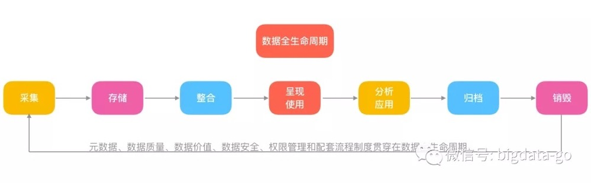
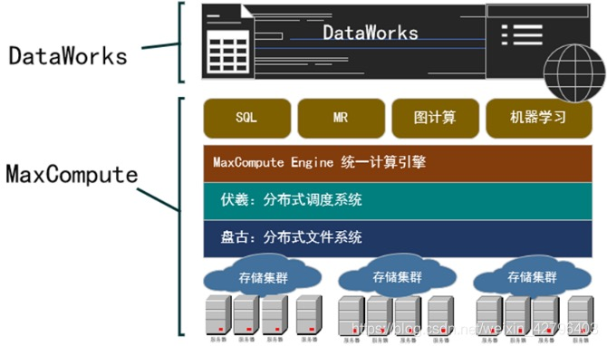

## 大数据平台
分布式计算引擎-MapReduce/Spark/Flink

分布式存储引擎-HDFS

## 大数据中台

### 大数据开发中心
离线开发
实时开发
租户管理
调度管理

### 数据治理中心
数据地图
数据质量
数据资产
数仓设计

### 数据服务中心
服务创建
服务测试
服务发布
服务管理

### 可视化建模
数据源管理
免编码拖拽建模
模型/数据市场
自定义算子

### 数据资产化
元数据
数据标准
数据质量
数据地图
血缘分析
资产目录
资产采集
资产分析
资产运营
资产开放

### 主数据和元数据
    元数据是关于数据的数据，当人们描述现实世界的现象时，就会产生抽象信息，这些抽象信息便可以看作是元数据，
    元数据主要用来描述数据的上下文信息。通俗的来讲，假若图书馆的每本书中的内容是数据的话，那么找到每本书的索引则是元数据，
    元数据之所以有其它方法无法比拟的优势，就在于它可以帮助人们更好的理解数据，发现和描述数据的来龙去脉，
    特别是那些即将要从OLTP系统上升到DW/BI体系建设的企业，元数据可以帮他们形成清晰直观的数据流图，元数据是数据管控的基本手段。

    主数据则定义企业核心业务对象，如客户、产品、地址等，与交易流水信息不同，主数据一旦被记录到数据库中，
    需要经常对其进行维护，从而确保其时效性和准确性；主数据还包括关系数据，用以描述主数据之间的关系，
    如客户与产品的关系、产品与地域的关系、客户与客户的关系、产品与产品的关系等。

### 数据全生命周期
    数据的生命周期是指某个集合的数据从产生或获取到销毁的过程。数据全生命周期分为：采集、存储、整合、呈现与使用、分析与应用、归档和销毁几个阶段。

### 产品模块
    元数据管理
    元数据是描述数据特征的数据，是数据治理的基础。元数据管理内置丰富的采集适配器，端到端的自动化采集，一键元数据分析，
    快速理清数据资源，了解数据来龙去脉，构建数据地图，为数据标准建设和数据质量提供基础支撑。

    数据标准管理
    数据标准建设提供全面完整的数据标准管理流程及办法，用于决定和建立单一、准确、权威的事实来源，实现大数据平台数据的完整性、
    有效性、一致性、规范性、开放性和共享性管理，并为数据质量检查、数据安全管理提供标准依据。
    
    数据质量管理
    数据质量管理以数据标准为数据检核依据，以元数据为数据检核对象，通过向导化、可视化等简易操作手段，将质量评估、质量检核、
    质量整改与质量报告等工作环节进行流程整合，形成完整的数据质量管理闭环。
    
    主数据管理
    主数据管理提供主数据采集、申请、变更、校验、审批、生效、失效、分发等全生命周期管理。实现主数据统一标准、规范流程、及时分发、
    高效共享，保障信息系统互联互通，全面提升企业数据治理和数据服务水平，为业务提供全面、可靠、及时、准确的主数据服务。
    
    数据资产管理
    数据资产管理汇总、存储所有参与数据治理平台的各个系统的数据资产，对外提供数据服务，支撑数据资产的多渠道应用，如数据共享、决策支持等，
    进行不同角色的目录化管理，获知资产访问方式、利用情况等，实现数据资产价值最大化。
    
    数据生命周期管理
    数据生命周期记录数据从创建和初始存储，到它过时被删除的整个流动过程，对数据进行近线归档、离线归档、销毁和全生命周期监控。
    
    数据集成
    数据集成管理可实现跨部门数据的传输、加载、清洗、转换和整合，支持自定义调度和图形化监控，实现统一调度、统一监控，满足运维可视化需求，
    提高运维管理工作效率。
    
    数据交换管理
    数据交换服务将若干个业务子系统之间进行数据或者文字的传输和共享，提高信息资源的利用率，集数据采集、处理分发、交换传输于一体，
    轻松玩转企业级数据交换作业。
    
    实时计算存储
    PetaBase-s是亿信华辰重磅推出的企业级实时大数据平台，它基于开源Hadoop框架开发，融合MPP、SQL on Hadoop、流处理等大数据技术，
    支持海量数据的高效储存和统一管理，为企业决策提供实时的数据支撑。
    
    数据安全管理
    数据安全管理是以数据的安全使用为目的的综合管理，贯穿于数据治理全过程，提供对隐私数据的加密、脱敏、模糊化处理、
    数据库授权监控等多种数据安全管理措施，全方位保障数据的安全运作。

### 名词解释
    1)元数据：元数据是关于描述数据的数据，即关于数据的内容、质量、状况和其他特性的信息。也可译为描述数据或诠释数据，提供了相应数据的上下文环境的描述信息；元数据是业务数据中心、数据仓库和数据分析等大型应用的基础设施。
    2)元模型：定义元数据的属性、关系的模型，元数据的采集需要依赖元模型。
    3)父子关系：子类元模型可继承父类元模型所有的属性，是将所有一类元模型将相同的属性抽取出来，形成一个父类元模型。例如：父类为哺乳动物，而人、猫、狗都是子类。
    4)组合关系：描述组合端模型由被组合端模型所组成，如：物理表模型是由字段模型组成，报表是由报表字段组成，主题域由维表和主题集组成。在元数据采集的过程中会根据采集挂载点的元数据对应元模型的组合关系来将所有元模型对应的元数据都采集过来。在元数据分析时，元数据节点展开后显示的元数据时由元模型的组合关系决定。
    5)依赖关系：描述模型与模型之间的引用关联关系，如：报表用到了主题表，则报表依赖主题表；视图用户到表，则视图依赖于表。各种分析出来的效果会根据元数据之间的依赖关系来进行连线。
    6)血缘分析：血缘分析是从某一个元数据作为起点，往回追溯数据处理过程。
    7)影响分析：影响分析是从某一个元数据出发，寻找依赖该元数据处理过程的元数据或者实体。
    8)全链分析：全链分析是以某个元数据为目标节点，其前后与其有关系的所有元数据，其前反应数据的来源，其后反应数据的处理过程。
    9)数据地图：以拓扑图的形式展现各类元数据或实体、数据处理过程元数据进行分层次的的图形化展现。

### 影响分析&血缘分析&全链分析
    血缘分析是分析元数据的上游数据信息，用于追溯元数据的来源和加工过程。
    影响分析是分析元数据的下游数据信息，用于掌握元数据变更可能造成的影响。
    全链分析是血缘分析+影响分析，用于展现数据的来龙去脉。

### 数据采集适配器

### ODPS
    开放数据处理服务(Open Data Processing Service,简称ODPS),2016年后更名MaxComputer

### DataWorks和MaxCompute关系
    DataWorks和MaxCompute关系紧密：DataWorks为MaxCompute提供一站式的数据同步、业务流程设计、数据开发、管理和运维功能。
    DataWorks是基于MaxCompute计算和存储，提供工作流可视化开发、调度运维托管的一站式海量数据离线加工分析平台。在数加（一站式大数据平台）中，DataWorks控制台即为MaxCompute控制台。
    可以将DataWorks理解成MaxCompute的一种Web客户端。MaxCompute是DataWorks的一种计算引擎。

### 阿里云DataWorks和MaxCompute简介
    MaxCompute（大数据计算服务）是阿里巴巴自主研发的海量数据处理平台，主要提供数据上传和下载通道，提供SQL及MapReduce等多种计算分析服务，同时还提供完善的安全解决方案。
    DataWorks（数据工场，原大数据开发套件）是基于MaxCompute计算引擎的一站式大数据工场，它能帮助您快速完成数据集成、开发、治理、服务、质量、安全等全套数据研发工作。

    盘古：相当于Hadoop中的HDFS
    伏羲：相当于Hadoop中的YARN
    MaxCompute Engine：相当于MR、Tez等计算引擎
    MaxCompute和DataWorks一起向用户提供完善的ETL和数仓管理能力，以及SQL、MR、Graph等多种经典的分布式计算模型，能够更快速地解决用户海量数据计算问题，有效降低企业成本，保障数据安全。

