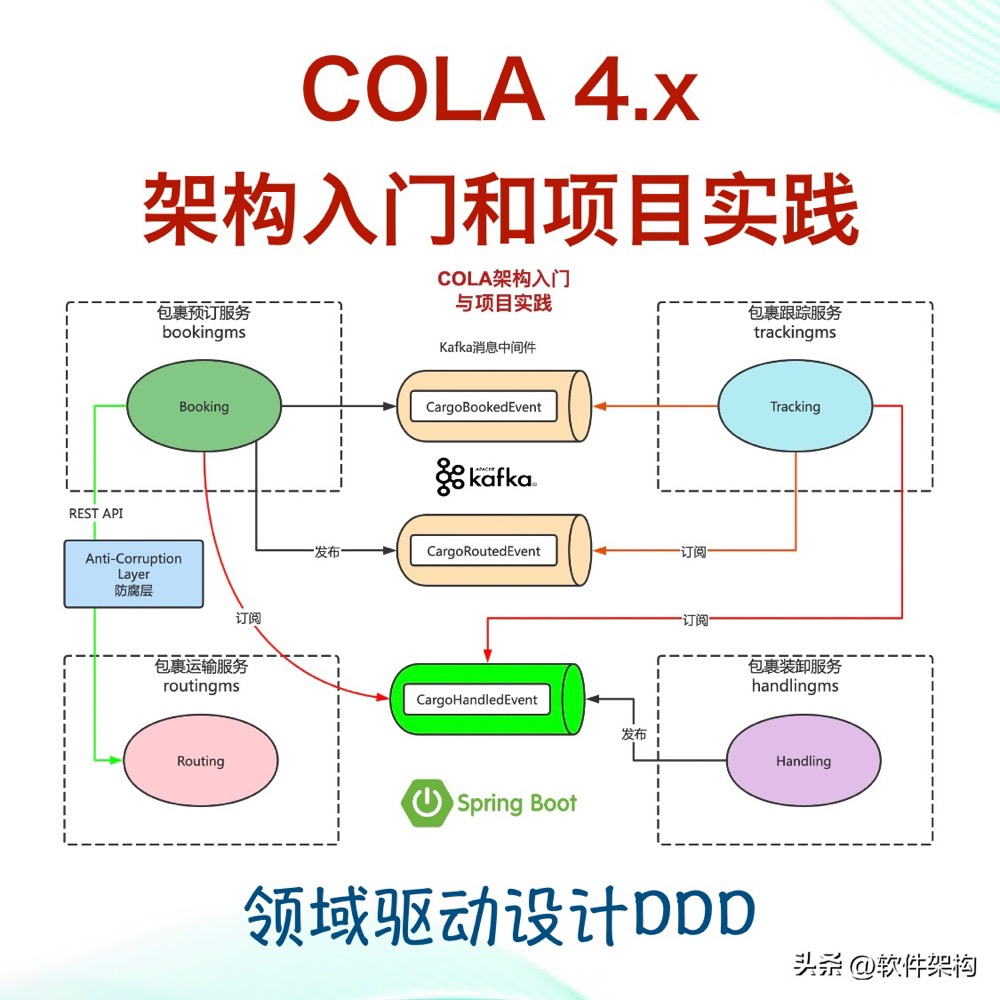

## 领域模型
### 什么是领域模型？为什么要建模？
    领域模型是指在软件开发过程中，对特定领域的业务规则、概念和流程进行抽象和描述的模型。
    它描述了系统中的实体、属性、关系和行为，帮助开发人员更好地理解和解决问题。

### 建立领域模型的目的有以下几点：
    理清业务逻辑：领域模型可以帮助开发人员深入了解业务领域，理清业务逻辑和流程。通过建模，可以更好地捕捉和表达业务需求，减少沟通误差。
    明确需求：通过建模，可以将抽象的业务需求转化为具体的模型，使需求更加明确和可视化。这有助于开发人员和业务人员之间的共享理解，减少需求理解上的偏差。
    支持系统设计：领域模型为系统设计提供了基础和指导。它可以帮助开发人员确定系统的边界、组件和接口，并提供设计决策的依据。
    促进团队协作：领域模型是一种通用的语言和工具，可以促进开发团队之间的协作和沟通。通过共享和讨论模型，团队成员可以更好地理解和讨论系统的各个方面。

    建立领域模型是为了更好地理解和解决业务问题，促进开发团队之间的协作，并支持系统设计和需求明确化。

    