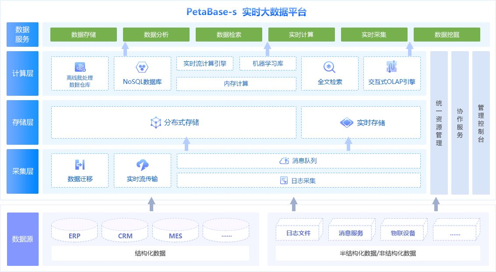

## 项目总结

    大数据分析平台的搭建有利于帮助企业构建统一的数据存储和数据处理资源，围绕企业业务开展大数据应用建设，最终形成面向服务化的数据资产。而今天我们就来了解一下，常见的大数据平台都包含哪些层次？
    1、数据采集层：分3个层面的采集技术进行支持，一是传统业务系统数据库和半结构化、结构化数据的采集和集成，如采用Sqoop技术进行关系数据库和Hadoop系统之间的数据抽取和交换;
    二是交通实时流数据的采集，包括实时传感器数据、定位轨迹数据和其他实时流数据;三是交通公共数据的采集，包括公网的数据爬取、开放平台的数据接口、行业公共数据库的数据交换等。
    对采集到的数据需进行提取、转换和加载(extract-transform-load，ETL)处理，包括数据抽取、转换、清洗和隐私脱敏等预处理工作，预处理集成后的数据进入交通大数据云存储中心。
    
    2、数据存储层：交通领域数据规模巨大，数据存储层需设计基于云计算的分布式云存储系统，以支持海量数据的存储扩展。提供基于云的列式存储、NoSQL存储或数据仓库存储能力;
    根据业务需求和快速配置，可切换相应的分布式存储模式，还可根据需要对传统BI系统的数据仓库和数据集市进行集成。利用Hadoop集群提供PB级存储能力扩展，同时
    Hadoop YARN和Spark Mesos等集群资源管理框架可支持多种存储模式和计算模式在此基础上，对各类存储数据进行多粒度信息融合，构建统一数据处理单元，为计算服务层提供标准化的分析数据集。
    
    3、数据计算层：针对交通大数据多源、异构、海量等特征，传统的计算模型难以直接处理。数据计算层需满足主流大数据处理框架的各种计算模型与方法实现，如基于云计算并行框架，
    实现基于Hadoop批处理、Storm流处理、Spark内存处理的高效数据挖掘与机器学习。数据计算层采用基于统一数据处理单元和计算模式、模型微服务化的大数据分析框架，通过构建多种微服务簇网络，
    为应用层提供支持MapReduce、Storm、Spark等多种计算模式下的多种数据挖掘模型与方法(如分类、聚类、序列等);根据大数据分析需求和数据特征，可基于组件配置和服务治理技术进行各类服务的快速切换和灵活管理。
    
    4、数据应用层：数据应用层首先要满足智慧交通各类大数据分析需求，包括基本的可视化与查询、展示、探索等，分析结果能结合知识库应用于决策支持。另外，大数据系统本身管理方面，
    针对构件化和微服务设计，需对相关中间件进行设计，实现服务治理、组件配置、安全、接口等功能，以支撑存储层和计算层各类微服务的敏捷管理。
    
    平台的每个子系统都包含不同的功能，不同功能的模块组合成一个具有实际应用价值的大数据分析平台，实现对各种业务的前瞻性预测和分析，为用户提供统一的决策分析支持，从而更好地突出平台本身的价值。

